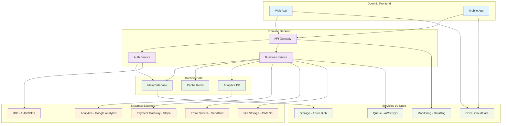
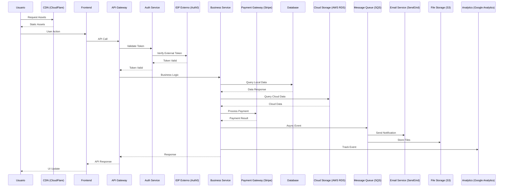

# /documentar-arquitectura-base Task

When this command is used, execute the following task:

<!-- Powered by Método ZNS -->

# Generar Arquitectura Base - Proyectos Multi-Repositorio

## Propósito

Documentar proyectos complejos con múltiples repositorios, creando una "arquitectura de alto nivel" que guíe el desarrollo cuando llegan historias de usuario. Esta tarea está optimizada para ecosistemas empresariales con múltiples repositorios y sistemas distribuidos.

## Cuándo Usar Esta Tarea

**Usa esta tarea cuando:**

- Tienes un proyecto con múltiples repositorios
- Coexisten diferentes stacks tecnológicos
- Necesitas documentar la realidad actual del sistema
- Buscas crear un "GPS" arquitectónico para guiar el desarrollo y toda la documentación del sistema
- Existen reglas de negocio complejas distribuidas en múltiples sistemas

**Prerequisites:**

- Acceso al código fuente de todos los repositorios
- Conocimiento del arquitecto responsable del sistema
- Documentación existente (si está disponible)
- Acceso a configuraciones de infraestructura

## Instrucciones de Ejecución de la Tarea

### 0. CONFIGURACIÓN Y CONTEXTO INICIAL

#### 0.1 Cargar Configuración del Proyecto

- Verificar que existe `.ZNS-metodo/core-config.yaml`
- Confirmar configuración de `architectureShardedLocation: docs/architecture`
- Si no existe, crear estructura base de documentación

#### 0.2 Elicitación de Contexto del Proyecto

**Realizar las siguientes preguntas obligatorias al usuario:**

1. **Contexto General:**
   - "¿Cuál es el propósito principal de este ecosistema?"
   - "¿Cuántos repositorios aproximadamente tiene el proyecto?"
   - "¿Cuáles son los 3-5 repositorios más críticos?"

2. **Organización:**
   - "¿Cómo están organizados los componentes (por dominio, función, etc.)?"
   - "¿Hay documentación de arquitectura existente que deba revisar? Si tienes documentos .md, carpetas de documentación, o archivos específicos de arquitectura, por favor especifícalos para realizar un análisis exhaustivo."

3. **Tecnología e Integraciones:**
   - "¿Qué tecnologías principales usa cada módulo?"
   - "¿Cómo se comunican entre sí los sistemas?"
   - "¿Qué sistemas externos usa la solución? (IDPs como Auth0, IAM, payment gateways como Stripe/PayPal, servicios de email como SendGrid, storage como AWS S3, CDNs como CloudFlare, etc.)"

4. **Desarrollo:**
   - "¿Qué tipos de historias de usuario llegan más frecuentemente?"
   - "¿Qué componentes suelen verse afectados juntos?"

**🔗 CONSIDERACIÓN CRÍTICA - SISTEMAS EXTERNOS:**
Durante todo el análisis, **prestar especial atención** a las integraciones con sistemas externos y servicios de la nube. Estos son fundamentales para entender la arquitectura completa y DEBEN ser prominentemente incluidos en todos los diagramas generados.

### 1. ANÁLISIS PROFUNDO DEL ECOSISTEMA

#### 1.1 Análisis de Documentación Existente - PASO PRIORITARIO

**🚨 ANÁLISIS EXHAUSTIVO DE DOCUMENTACIÓN EXISTENTE - PASO CRÍTICO**

**Si el usuario especifica documentos de arquitectura o carpetas con documentación .md:**

**PASO OBLIGATORIO 1.1.1: Análisis Completo de Documentación Proporcionada**

1. **Inventario completo de archivos:**
   - Si es una carpeta: localizar todos los archivos .md dentro de la carpeta y subcarpetas
   - Si es un documento específico: agregar a lista de análisis
   - **NO omitir ningún archivo .md encontrado**

2. **Lectura sistemática archivo por archivo:**
   - Leer cada documento encontrado **COMPLETO** (no solo primeras líneas)
   - **Extraer información relevante** de cada documento:
     - Componentes mencionados
     - Tecnologías especificadas
     - Integraciones descritas
     - Diagramas de arquitectura
     - Patrones arquitectónicos
     - Reglas de negocio
     - Flujos de datos
     - Apis y servicios
     - toda la documentación que consideres necesaria e importante para este objetivo

3. **Seguimiento de referencias cruzadas:**
   - Buscar en cada documento **referencias a otros archivos** (ej: "ver documento X", "como se describe en Y")
   - Localizar archivos referenciados
   - Leer **TODOS los archivos referenciados** encontrados completamente
   - **Repetir proceso** hasta que no haya más referencias

4. **Síntesis de documentación analizada:**
   - Crear mapa consolidado de toda la información arquitectónica encontrada
   - Identificar inconsistencias entre documentos
   - Detectar gaps de información no documentada
   - Marcar información que necesita validación con código

**REGLA CRÍTICA:** No avanzar al siguiente paso hasta completar el análisis de TODA la documentación existente y sus referencias.

**Continuación del análisis general:**

- Identificar motores de reglas o sistemas de validación
- Mapear dónde residen las reglas de negocio críticas
- Documentar procesos de validación y workflows

#### 1.2 Exploración de Estructura de Repositorios

**Ejecutar análisis exhaustivo del ecosistema (complementando lo encontrado en documentación):**

- **Mapear estructura del proyecto**: Examinar directorios raíz y organización general
- **Identificar configuraciones clave**: Buscar archivos de build y dependencias (package.json, pom.xml, requirements.txt, etc.)
- **Revisar documentación adicional**: Localizar READMEs, documentación no especificada inicialmente
- **Analizar patrones de configuración**: Buscar conexiones entre sistemas y configuraciones compartidas
- **Validar información documentada**: Verificar que lo documentado coincida con la realidad del código

#### 1.3 Identificación de Stacks Tecnológicos

**Basándose en la documentación analizada, validar y complementar la información técnica:**

**Para cada módulo/dominio identificado en la documentación:**

1. **Validación de Stack Documentado:**
   - Verificar que las tecnologías documentadas coincidan con la realidad del código
   - Identificar tecnologías en uso no mencionadas en documentación
   - Documentar versiones específicas encontradas vs. las documentadas

2. **Análisis de Dependencias Reales:**
   - Mapear dependencias y configuraciones reales vs. documentadas
   - Identificar restricciones técnicas no documentadas
   - Documentar configuraciones específicas encontradas

3. **Patrones Arquitectónicos Implementados:**
   - Verificar patrones arquitectónicos documentados vs. implementados
   - Identificar patrones no documentados pero implementados
   - Mapear integración real entre módulos vs. documentada

4. **Gaps de Documentación Técnica:**
   - Identificar tecnologías críticas no documentadas
   - Documentar configuraciones complejas no mencionadas
   - Marcar inconsistencias entre documentación y realidad

#### 1.4 Análisis de Deuda Técnica y Estado Actual

**Evaluar el estado real del ecosistema:**

- **Identificar componentes con deuda técnica**: Buscar patrones de código legacy, comentarios TODO/FIXME, warnings de build
- **Documentar restricciones técnicas**: Limitaciones conocidas, workarounds temporales
- **Mapear dependencias externas críticas**: Identificar librerías obsoletas, versiones desactualizadas, vulnerabilidades conocidas
- **Evaluar realidad de testing**: Cobertura real por módulo, tipos de testing existentes, gaps críticos

#### 1.5 Análisis de Patrones de Integración y Seguridad

**Mapear mecanismos de integración del ecosistema:**

- **Canales de comunicación**: Identificar protocolos usados (REST APIs, GraphQL, eventos/mensajería, SOAP, conexiones directas a DB, etc.)
- **Participantes por canal**: Documentar qué sistemas/repositorios participan en cada tipo de integración
- **Mecanismos de Auth/Authz**: Detallar autenticación y autorización por capa (API keys, OAuth, JWT, SAML, etc.)
- **Monitoreo de integraciones**: Identificar herramientas de monitoring y logging para cada canal de comunicación
- **Patrones de resilencia**: Circuit breakers, retries, timeouts, fallbacks identificados
- **Flujos críticos**: Identificar workflows de negocio principales para diagramar

#### 1.6 Identificación de Diagramas Arquitectónicos

**Evaluar qué diagramas Mermaid serían útiles basado en el análisis:**

- **Diagrama de arquitectura general**: Si hay 3+ dominios/módulos principales claramente diferenciados
- **Diagrama de flujo de integración**: Si hay múltiples sistemas con comunicación compleja
- **Diagrama de despliegue**: Si hay infraestructura distribuida
- **Diagrama de base de datos**: Si hay múltiples DBs con relaciones complejas
- **Diagrama de autenticación**: Si hay múltiples capas de auth/authz

#### 1.7 Análisis de Comandos de Desarrollo

**Identificar herramientas y comandos críticos:**

- **Scripts de build**: package.json scripts, Makefiles, gradle tasks
- **Comandos de setup**: instalación, configuración inicial
- **Testing**: comandos de test unitarios, integración, e2e
- **Deployment**: scripts de despliegue, configuración de entornos

### 2. CREACIÓN DEL ÍNDICE GPS ARQUITECTÓNICO

#### 2.1 Crear Directorio Base

**Crear estructura básica:**

```
docs/
└── architecture/
    └── index.md                           # GPS principal del sistema
```

#### 2.2 Generar `index.md` - GPS Arquitectónico Principal

**Crear un índice GPS inteligente basado en el análisis realizado que contenga:**

1. **Visión General del Ecosistema**
2. **Mapa de Repositorios por Dominio/Función**
3. **Stack Tecnológico Identificado**
4. **Puntos de Integración Críticos, incluyendo los sistemas con los cuales se debe integrar**
5. **Patrones de Integración y Seguridad**
6. **Realidad de Testing Actual**
7. **Deuda Técnica y Restricciones**
8. **Dependencias Externas Críticas**
9. **Comandos de Desarrollo Esenciales**
10. **Guía Rápida para Desarrollo**
11. **Próximos Pasos para Documentación Detallada**

**Template del `index.md`:**

````markdown
# Arquitectura del Sistema - GPS Principal

Este documento sirve como **GPS arquitectónico** para navegar el ecosistema de {X} repositorios y guiar el desarrollo cuando lleguen nuevas historias de usuario.

## 🎯 **Visión General del Sistema**

### Propósito Principal

{Respuesta del usuario + análisis del código}

### Distribución del Ecosistema

- **Total de repositorios identificados**: {número}
- **Dominios/módulos principales**: {lista de dominios encontrados}
- **Repositorios críticos**: {los 3-5 más importantes}

### Diagrama de Arquitectura de Alto Nivel

_Si aplica, generar diagrama Mermaid que muestre la relación entre dominios principales **INCLUYENDO sistemas externos y servicios de la nube**:_



_Nota: Adaptar según la arquitectura real encontrada en el análisis. **ASEGURAR** que se incluyan todos los sistemas externos identificados (IDPs, payment gateways, servicios de email, storage de archivos, analytics, etc.) y servicios de la nube (CDN, queues, monitoring, databases en la nube)_

## 🗂️ **Mapa de Repositorios por Dominio**

### {Dominio/Módulo A}

- **Repositorios**: {lista de repos}
- **Stack principal**: {tecnologías identificadas}
- **Función**: {propósito principal}
- **Estado**: {criticidad/desarrollo activo}

### {Dominio/Módulo B}

- **Repositorios**: {lista de repos}
- **Stack principal**: {tecnologías identificadas}
- **Función**: {propósito principal}
- **Estado**: {criticidad/desarrollo activo}

### {Dominio/Módulo C}

- **Repositorios**: {lista de repos}
- **Stack principal**: {tecnologías identificadas}
- **Función**: {propósito principal}
- **Estado**: {criticidad/desarrollo activo}

### Mapa Visual de Repositorios

_Si aplica, generar diagrama Mermaid para visualizar la organización de repositorios **INCLUYENDO integraciones con sistemas externos**:_

```mermaid
mindmap
  root((Ecosistema))
    Frontend
      web-app
      mobile-app
      admin-panel
    Backend
      api-gateway
      auth-service
      user-service
      payment-service
    Data
      main-database
      analytics-db
      cache-layer
    Infrastructure
      deployment-scripts
      monitoring
      logging
    "Sistemas Externos"
      "IDPs (Auth0/Okta)"
      "Payment (Stripe/PayPal)"
      "Email (SendGrid/Mailgun)"
      "Storage (AWS S3/Azure)"
      "Analytics (GA/Mixpanel)"
    "Servicios de Nube"
      "CDN (CloudFlare/AWS)"
      "Queue (SQS/RabbitMQ)"
      "Monitoring (DataDog/New Relic)"
      "Search (Elasticsearch/Algolia)"
```

_Nota: Adaptar según la estructura real de repositorios encontrada. **INCLUIR** las integraciones externas y servicios de terceros identificados en la investigación de código y documentación_

## ⚙️ **Stack Tecnológico Global**

### Tecnologías Principales Identificadas

- **Lenguajes**: {lenguajes encontrados}
- **Frameworks**: {frameworks principales}
- **Bases de datos**: {DBs identificadas}
- **Herramientas de build**: {herramientas encontradas}

### Patrones Arquitectónicos Detectados

- {Patrón 1}: {descripción y ubicación}
- {Patrón 2}: {descripción y ubicación}
- {Patrón 3}: {descripción y ubicación}

## 🔗 **Puntos de Integración Críticos**

### APIs Internas

- {API 1}: {descripción y repos involucrados}
- {API 2}: {descripción y repos involucrados}

### Bases de Datos Compartidas

- {DB 1}: {repos que la usan}
- {DB 2}: {repos que la usan}

### Sistemas de Mensajería/Eventos

- {Sistema 1}: {descripción y repos}
- {Sistema 2}: {descripción y repos}

## 🔐 **Patrones de Integración y Seguridad**

### Canales de Comunicación Identificados

| Canal                | Protocolo     | Sistemas Participantes   | Monitoreo/Logging        | Estado    |
| -------------------- | ------------- | ------------------------ | ------------------------ | --------- |
| {API REST principal} | HTTP/REST     | {Sistema A → Sistema B}  | {herramienta/logs}       | ✅ Activo |
| {Message Queue}      | AMQP/RabbitMQ | {Sistema C → Sistema D}  | {herramienta de monitor} | ✅ Activo |
| {DB Connection}      | SQL/Direct    | {Sistema E → DB X}       | {DB logs/monitoring}     | ⚠️ Legacy |
| {Event Bus}          | WebSocket     | {Sistema F ↔ Sistema G} | {logs de eventos}        | ✅ Activo |

### Mecanismos de Autenticación/Autorización por Capa

#### Capa de API/Servicios

- **Autenticación**: {método usado - ej: "JWT tokens vía API Gateway"}
- **Autorización**: {mecanismo - ej: "RBAC con roles en DB de usuarios"}
- **Protocolos**: {protocolos - ej: "OAuth 2.0 + OpenID Connect"}

#### Capa de Base de Datos

- **Autenticación**: {método - ej: "Usuarios específicos por servicio"}
- **Autorización**: {mecanismo - ej: "Permisos a nivel de schema"}
- **Encriptación**: {estado - ej: "TLS 1.3 para conexiones, datos encriptados en reposo"}

#### Capa de Infraestructura

- **Autenticación**: {método - ej: "Service accounts con certificados"}
- **Autorización**: {mecanismo - ej: "IAM policies en cloud provider"}
- **Network Security**: {configuración - ej: "VPN/VPC, firewalls configurados"}

### Patrones de Resilencia Detectados

- **Circuit Breakers**: {ubicación y configuración encontrada}
- **Retry Policies**: {patrones de retry identificados}
- **Timeouts**: {configuraciones de timeout críticas}
- **Fallbacks**: {mecanismos de fallback implementados}
- **Rate Limiting**: {limitaciones de rate implementadas}

### Monitoreo de Integraciones

```bash
# Verificación de salud de APIs
{comandos para health checks de APIs}

# Monitoreo de message queues
{comandos para verificar colas}

# Logs de integración
{comandos para acceder a logs de integraciones}

# Métricas de performance
{comandos para métricas de integración}
```

### Diagrama de Flujo de Integraciones

_Si aplica, generar diagrama Mermaid que muestre los flujos de comunicación críticos **INCLUYENDO sistemas externos y servicios de la nube**:_



_Nota: Adaptar según los flujos reales identificados en el análisis. **PRIORIZAR** mostrar todas las integraciones con sistemas externos, APIs de terceros, servicios de la nube, y flujos de datos hacia/desde proveedores externos_

## � **Realidad de Testing Actual**

### Cobertura por Módulo

- **{Módulo A}**: {estado de testing encontrado - ej: "80% cobertura Jest, sin tests de integración"}
- **{Módulo B}**: {estado de testing encontrado - ej: "Tests manuales únicamente, sin automatización"}
- **{Módulo C}**: {estado de testing encontrado - ej: "60% cobertura, tests obsoletos"}

### Comandos de Testing Identificados

```bash
# Tests por módulo específico
{comandos específicos encontrados por repo}

# Tests de integración cross-sistema
{comandos de integración encontrados}

# Tests de regresión completa
{comandos de testing completo del ecosistema}
```

### Tipos de Testing por Módulo

| Módulo     | Unitarios  | Integración | E2E        | Performance | Security   |
| ---------- | ---------- | ----------- | ---------- | ----------- | ---------- |
| {Módulo A} | ✅ Jest    | ❌ Ninguno  | ❌ Ninguno | ❌ Ninguno  | ❌ Ninguno |
| {Módulo B} | ⚠️ Básicos | ✅ Postman  | ❌ Ninguno | ❌ Ninguno  | ❌ Ninguno |

### Gaps Críticos de Testing Detectados

- **{Módulo sin testing}**: Sin tests automatizados, solo verificación manual
- **{Integración sin tests}**: Comunicación entre servicios X y Y sin validación automática
- **{Performance sin monitoreo}**: Sin tests de carga para endpoints críticos
- **{Security gaps}**: Sin tests de seguridad para autenticación/autorización

## ⚠️ **Deuda Técnica y Restricciones**

### Componentes con Deuda Técnica

- **{Repo/Componente 1}**: {descripción del problema técnico}
- **{Repo/Componente 2}**: {descripción del problema técnico}

### Restricciones Técnicas Conocidas

- **{Restricción 1}**: {descripción y impacto}
- **{Restricción 2}**: {descripción y impacto}

### Workarounds Temporales

- **{Workaround 1}**: {descripción y razón}
- **{Workaround 2}**: {descripción y razón}

## 📦 **Dependencias Externas Críticas**

### Dependencias Principales por Módulo

- **{Módulo A}**: {dependencias clave identificadas - ej: "React 18.2, Express 4.18, MongoDB 5.x"}
- **{Módulo B}**: {dependencias clave identificadas - ej: "Spring Boot 2.7, PostgreSQL 13, Redis 6.x"}
- **{Módulo C}**: {dependencias clave identificadas - ej: "Python 3.9, FastAPI 0.95, MySQL 8.0"}

### Análisis de Riesgo de Dependencias

| Dependencia          | Versión Actual | Última Versión | Riesgo   | Módulos Afectados | Notas                      |
| -------------------- | -------------- | -------------- | -------- | ----------------- | -------------------------- |
| {Lib obsoleta}       | v2.1           | v4.5           | 🔴 Alto  | {Módulo X, Y}     | Vulnerabilidades conocidas |
| {Lib desactualizada} | v1.8           | v2.1           | 🟡 Medio | {Módulo Z}        | Breaking changes en v2.0   |
| {Lib crítica}        | v3.2           | v3.2           | 🟢 Bajo  | {Módulo A}        | Actualizada                |

### Dependencias con Vulnerabilidades Conocidas

- **{Dependencia vulnerable}**: CVE-XXXX-XXXX - {descripción del riesgo y módulos afectados}
- **{Otra dependencia}**: {descripción de vulnerabilidad y plan de actualización}

### Dependencias Críticas para el Ecosistema

#### Sistemas Internos Compartidos

- **{Base de datos compartida}**: {versión} - Usada por {X} repositorios
- **{Message broker}**: {versión} - Crítica para comunicación inter-servicios

#### Sistemas Externos y Servicios de Terceros

- **{IDP Externo}**: {ej: "Auth0, Okta, Azure AD"} - Para autenticación/autorización
- **{Payment Gateway}**: {ej: "Stripe, PayPal, Square"} - Para procesamiento de pagos
- **{Email Service}**: {ej: "SendGrid, Mailgun, AWS SES"} - Para comunicaciones
- **{File Storage}**: {ej: "AWS S3, Azure Blob, Google Cloud Storage"} - Para archivos
- **{CDN}**: {ej: "CloudFlare, AWS CloudFront"} - Para distribución de contenido
- **{Monitoring}**: {ej: "DataDog, New Relic, Splunk"} - Para observabilidad
- **{Analytics}**: {ej: "Google Analytics, Mixpanel, Amplitude"} - Para métricas
- **{Search}**: {ej: "Elasticsearch, Algolia, AWS OpenSearch"} - Para búsquedas
- **{Auth service}**: {versión} - Dependencia transversal de autenticación

## 🔧 **Comandos de Desarrollo Esenciales**

### Setup Inicial

```bash
# Configuración inicial del workspace
{comandos de setup encontrados}

# Instalación de dependencias
{comandos de instalación}
```

### Desarrollo Diario

```bash
# Build completo del ecosistema
{comandos de build encontrados}

# Tests básicos
{comandos de testing básico}

# Linting y formateo
{comandos de calidad de código}
```

### Debugging Cross-Sistema

```bash
# Logs centralizados
{comandos para ver logs}

# Monitoring
{comandos de monitoreo}
```

## 📋 **Archivos de Referencia Rápida**

### Documentación Existente Encontrada

- **{README principal}**: {ubicación y contenido clave}
- **{Documentación específica}**: {ubicación y propósito}

### Configuraciones Importantes

- **{Archivo de config 1}**: {propósito y ubicación}
- **{Archivo de config 2}**: {propósito y ubicación}

## �📋 **Próximos Pasos de Documentación**

Este GPS inicial debe complementarse con documentación detallada:

- [ ] **Documentación detallada por dominio** (crear tareas específicas)
- [ ] **Flujos de negocio principales** (mapear workflows críticos)
- [ ] **Integraciones con sistemas externos** (documentar APIs, autenticación, límites, SLAs de servicios de terceros)
- [ ] **Reglas de negocio** (documentar lógica compleja)
- [ ] **Guías de desarrollo específicas** (patrones por tecnología)
- [ ] **Plan de reducción de deuda técnica** (priorización y estrategia)
- [ ] **Configuración de entornos** (setup y deployment)

---

### 3. VALIDACIÓN FINAL OBLIGATORIA CON EL USUARIO

**🚨 PASO CRÍTICO - NO OMITIR**

Una vez generado el `index.md` completo, realizar la validación final:

#### 3.1 Presentar Resumen al Usuario

**Mostrar al usuario un resumen estructurado:**

```
📋 RESUMEN DE DOCUMENTACIÓN GENERADA

✅ Análisis completado:
- [X] Documentación existente analizada: {lista de archivos leídos}
- [X] Repositorios analizados: {número y nombres}
- [X] Sistemas externos identificados: {lista o "Ninguno"}
- [X] Diagramas generados: {tipos de diagramas creados}

```

#### 3.2 Solicitar Validación Explícita

**Preguntar obligatoriamente:**

1. **"¿La información documentada refleja correctamente la realidad de tu sistema?"**
2. **"¿Hay repositorios, tecnologías o integraciones importantes que falten?"**
3. **"¿Los diagramas muestran correctamente la arquitectura de tu ecosistema?"**
4. **"¿Hay información crítica que consideras incorrecta o incompleta?"**
5. **"¿Necesitas que ajuste algo antes de finalizar?"**

#### 3.3 Procesar Retroalimentación

- **Si hay faltantes o correcciones**: Aplicar cambios y repetir validación
- **Si hay gaps de información**: Marcarlos explícitamente en la documentación
- **Solo si el usuario confirma exactitud**: Proceder a finalizar

**🔒 REGLA INQUEBRANTABLE:** No finalizar la tarea sin confirmación explícita del usuario de que la documentación es exacta y completa.

---

## ⚠️ **Reglas Obligatorias de Verificación**

Antes de considerar completada la tarea, verificar OBLIGATORIAMENTE cada punto:

1. **ANÁLISIS COMPLETO DE DOCUMENTACIÓN:** Confirmar que se leyó TODA la documentación existente especificada por el usuario y sus referencias cruzadas
2. **INCLUSIÓN DE SISTEMAS EXTERNOS:** SI se identifican sistemas externos o servicios de la nube, verificar que TODOS los diagramas los incluyen explícitamente
3. **ELICITACIÓN COMPLETA:** Confirmar que se hicieron TODAS las preguntas obligatorias de la sección 0.2 y se obtuvieron respuestas
4. **VALIDACIÓN DE DIAGRAMAS:** Revisar que cada diagrama Mermaid generado refleje la realidad del proyecto analizado, no solo el template
5. **COBERTURA DE INTEGRACIONES:** Verificar que la sección de "Puntos de Integración Críticos" incluye tanto sistemas internos como externos
6. **COMANDOS FUNCIONALES:** Confirmar que los comandos de desarrollo listados son reales y ejecutables en el proyecto
7. **DEPENDENCIAS ACTUALIZADAS:** Verificar que las dependencias críticas listadas reflejen las versiones reales encontradas en el análisis
8. **ARQUITECTURA VALIDADA:** Confirmar que la arquitectura documentada es consistente entre la descripción textual y los diagramas
9. **GAPS IDENTIFICADOS:** Listar explícitamente qué información no se pudo obtener y requiere investigación adicional
10. **CONFIRMACIÓN FINAL OBLIGATORIA:** Presentar al usuario un resumen de la documentación generada y solicitar explícitamente que valide su exactitud. Preguntar específicamente: "¿Hay información faltante o incorrecta que deba corregir antes de finalizar?" No continuar sin confirmación explícita del usuario.

**🚨 REGLA CRÍTICA:** No dar por terminada la tarea sin confirmar cada punto de verificación con evidencia específica del análisis realizado.

---

**📌 Este GPS será el punto de partida para crear documentación más específica según las necesidades del equipo de desarrollo.**
````
