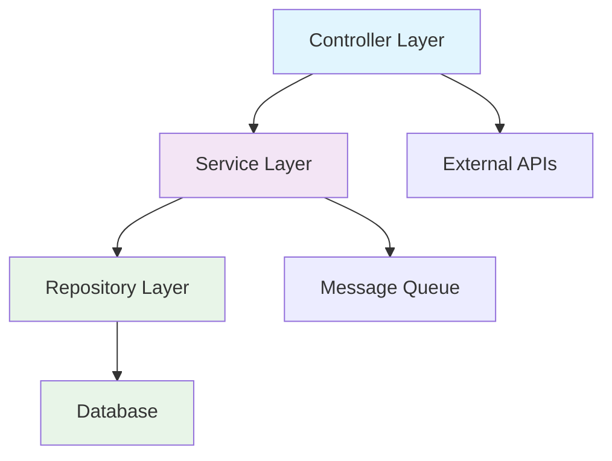

# /documentar-componente Task

When this command is used, execute the following task:

<!-- Powered by Método ZNS -->

# Documentar Componente Individual

## Propósito

Documentar un componente de software específico del sistema, creando documentación técnica completa que sirva como guía práctica para desarrolladores y operadores. Esta tarea está optimizada para componentes individuales dentro de ecosistemas empresariales complejos.

## Cuándo Usar Esta Tarea

**Usa esta tarea cuando:**

- Necesitas documentar un componente específico en detalle
- El componente es crítico para el sistema y requiere documentación técnica completa
- Nuevos desarrolladores necesitan entender cómo funciona un componente particular
- Buscas crear documentación estándar para componentes del ecosistema
- Requieres documentar APIs, dependencias y deployment de un componente específico

**Prerequisites:**

- Acceso al código fuente del componente
- Conocimiento de la arquitectura del componente
- Documentación existente del componente (si está disponible)
- Acceso a configuraciones de despliegue y variables de entorno

## Instrucciones de Ejecución de la Tarea

### 0. CONFIGURACIÓN Y CONTEXTO INICIAL

#### 0.1 Cargar Configuración del Proyecto

- Verificar que existe `.ZNS-metodo/core-config.yaml`
- Confirmar configuración de `architectureShardedLocation: docs/architecture`
- Si no existe, crear estructura base de documentación

#### 0.2 Elicitación de Contexto del Componente

**Realizar las siguientes preguntas obligatorias al usuario:**

1. **Identificación del Componente:**
   - "¿Cuál es el nombre del componente que quieres documentar?"
   - "¿En qué ruta/directorio se encuentra el componente?"
   - "¿Es un servicio, librería, API, frontend, u otro tipo de componente?"

2. **Contexto Técnico:**
   - "¿Qué tecnologías principales usa este componente (lenguaje, framework, etc.)?"
   - "¿Cuál es el propósito principal de este componente dentro del sistema?"

3. **Scope de Documentación:**
   - "¿Existe documentación previa de este componente que deba revisar?"

### 1. ANÁLISIS PROFUNDO DEL COMPONENTE

#### 1.1 Exploración de Estructura del Componente

**Ejecutar análisis exhaustivo del componente:**

- **Revisar GPS arquitectónico**: Si existe `{architectureShardedLocation}/index.md` (GPS del sistema), revisar información sobre este componente para contexto adicional
- **Mapear estructura interna**: Examinar directorios, archivos principales y organización del código
- **Identificar configuraciones**: Buscar archivos de configuración, variables de entorno, manifiestos
- **Revisar documentación existente**: Localizar READMEs, comentarios de código, documentación inline
- **Analizar dependencias**: Identificar dependencies en package.json, requirements.txt, pom.xml, etc.

#### 1.2 Análisis de Arquitectura y Patrones

**Para el componente identificado:**

- **Patrones de diseño**: Identificar arquitectura interna, patrones usados (MVC, Repository, Factory, etc.)
- **Tecnologías y frameworks**: Documentar stack tecnológico específico y versiones
- **Estructura de código**: Mapear organización de carpetas, módulos principales, puntos de entrada
- **Configuración y setup**: Identificar requisitos de configuración y setup inicial

#### 1.3 Análisis de APIs y Interfaces

**Mapear interfaces expuestas:**

- **Endpoints REST/GraphQL**: Identificar rutas, métodos, parámetros y respuestas
- **APIs internas**: Documentar interfaces para comunicación con otros componentes
- **Eventos y mensajería**: Identificar eventos publicados/consumidos
- **Contratos y versionamiento**: Documentar estrategias de versionado de APIs

#### 1.4 Análisis de Dependencias y Integraciones

**Evaluar relaciones del componente:**

- **Dependencias externas**: Librerías, servicios externos, APIs de terceros
- **Dependencias internas**: Otros componentes del sistema que requiere
- **Consumidores**: Qué otros componentes/servicios usan este componente
- **Puntos de integración**: Bases de datos, message queues, servicios externos

#### 1.5 Análisis de Deployment y Operaciones

**Mapear aspectos operacionales:**

- **Scripts de build**: Comandos de compilación, testing, empaquetado
- **Variables de entorno**: Configuraciones requeridas para diferentes ambientes
- **Prerequisitos de infraestructura**: Dependencias de infraestructura necesarias
- **Monitoreo y logging**: Herramientas y configuraciones de observabilidad

### 2. CREACIÓN DE LA DOCUMENTACIÓN DEL COMPONENTE

#### 2.1 Crear Directorio Base

**Crear estructura específica del componente:**

```
{architectureShardedLocation}/
└── architecture-{nombre-componente}.md    # Documentación del componente
```

#### 2.2 Generar `architecture-{nombre-componente}.md` - Documentación del Componente

**Crear documentación completa basada en el análisis realizado con las siguientes secciones:**

1. **Overview**
2. **Architecture**
3. **APIs**
4. **Dependencies**
5. **Deployment**

**Template del `index.md`:**

````markdown
# Componente: {Nombre del Componente}

## 📋 **Overview**

### Propósito

{Descripción de qué hace el componente y por qué existe}

### Contexto de Negocio

{Explicación del contexto de negocio y propósito dentro del sistema más amplio}

### Responsabilidades Principales

- {Responsabilidad 1}
- {Responsabilidad 2}
- {Responsabilidad 3}

### Ubicación

- **Repositorio**: {nombre del repo}
- **Ruta**: {ruta/al/componente}
- **Tipo**: {servicio/librería/API/frontend/etc.}

## 🏗️ **Architecture**

### Stack Tecnológico

- **Lenguaje**: {lenguaje principal}
- **Framework**: {framework principal}
- **Versión**: {versión específica}
- **Otras tecnologías**: {librerías/herramientas adicionales}

### Patrones de Diseño

{Descripción de los patrones arquitectónicos utilizados}

- **Patrón Principal**: {patrón usado - ej: MVC, Repository, Clean Architecture}
- **Justificación**: {por qué se eligió este patrón}

### Estructura del Código

```
{componente}/
├── src/
│   ├── controllers/     # {descripción}
│   ├── services/        # {descripción}
│   ├── models/          # {descripción}
│   └── utils/           # {descripción}
├── tests/               # {descripción}
├── config/              # {descripción}
└── docs/                # {descripción}
```

### Diagrama Conceptual

_Si aplica, generar diagrama Mermaid de la arquitectura interna:_



_Nota: Adaptar según la arquitectura real del componente_

## 🔌 **APIs**

### Endpoints Expuestos

_Si el componente expone APIs:_

#### REST Endpoints

| Método | Ruta                   | Descripción   | Parámetros          | Respuesta           |
| ------ | ---------------------- | ------------- | ------------------- | ------------------- |
| GET    | `/api/{resource}`      | {descripción} | {parámetros}        | {tipo de respuesta} |
| POST   | `/api/{resource}`      | {descripción} | {body schema}       | {tipo de respuesta} |
| PUT    | `/api/{resource}/{id}` | {descripción} | {parámetros + body} | {tipo de respuesta} |
| DELETE | `/api/{resource}/{id}` | {descripción} | {parámetros}        | {tipo de respuesta} |

#### Códigos de Error

| Código | Descripción    | Casos               |
| ------ | -------------- | ------------------- |
| 400    | Bad Request    | {casos específicos} |
| 401    | Unauthorized   | {casos específicos} |
| 404    | Not Found      | {casos específicos} |
| 500    | Internal Error | {casos específicos} |

#### Contratos y Versionamiento

- **Estrategia de versionado**: {descripción de la estrategia}
- **Versión actual**: {versión actual de la API}
- **Breaking changes**: {política de cambios}

### Eventos y Mensajería

_Si aplica:_

#### Eventos Publicados

| Evento      | Descripción   | Payload    | Consumidores               |
| ----------- | ------------- | ---------- | -------------------------- |
| `{evento1}` | {descripción} | `{schema}` | {componentes que escuchan} |
| `{evento2}` | {descripción} | `{schema}` | {componentes que escuchan} |

#### Eventos Consumidos

| Evento      | Descripción   | Origen              | Acción                  |
| ----------- | ------------- | ------------------- | ----------------------- |
| `{evento1}` | {descripción} | {componente origen} | {qué hace al recibirlo} |
| `{evento2}` | {descripción} | {componente origen} | {qué hace al recibirlo} |

### **N/A**

_Si el componente no expone APIs públicas o interfaces externas, explicar brevemente por qué (ej: "Es una librería interna", "Solo para uso interno del módulo X")_

## 📦 **Dependencies**

### Dependencias Externas

#### Librerías Críticas

| Librería    | Versión   | Propósito         | Criticidad    |
| ----------- | --------- | ----------------- | ------------- |
| {librería1} | {versión} | {para qué se usa} | 🔴 Crítica    |
| {librería2} | {versión} | {para qué se usa} | 🟡 Importante |
| {librería3} | {versión} | {para qué se usa} | 🟢 Opcional   |

#### Servicios Externos

- **{Servicio Externo 1}**: {descripción y para qué se usa}
- **{Servicio Externo 2}**: {descripción y para qué se usa}

### Dependencias Internas

#### Componentes del Sistema

- **{Componente A}**: {para qué lo usa}
- **{Componente B}**: {para qué lo usa}

#### Bases de Datos

- **{Base de Datos 1}**: {qué tablas/colecciones usa}
- **{Base de Datos 2}**: {qué tablas/colecciones usa}

### Quién Usa Este Componente

#### Consumidores Directos

- **{Componente X}**: {cómo lo usa}
- **{Componente Y}**: {cómo lo usa}

#### Consumidores Indirectos

- **{Sistema Z}**: {a través de qué componente}

### Gestión de Dependencias

```bash
# Comandos para actualizar dependencias
{comandos específicos para el tipo de proyecto}

# Verificación de vulnerabilidades
{comandos de seguridad}

# Auditoría de dependencias
{comandos de auditoría}
```

## 🚀 **Deployment**

### Configuración de Entorno

#### Variables de Entorno Requeridas

| Variable  | Descripción   | Ejemplo           | Requerida   |
| --------- | ------------- | ----------------- | ----------- |
| `{VAR_1}` | {descripción} | `{valor ejemplo}` | ✅ Sí       |
| `{VAR_2}` | {descripción} | `{valor ejemplo}` | ⚠️ Opcional |
| `{VAR_3}` | {descripción} | `{valor ejemplo}` | ✅ Sí       |

#### Archivo .env de Ejemplo

```bash
# Configuración de desarrollo
{VAR_1}=valor_desarrollo
{VAR_2}=valor_opcional
{VAR_3}=valor_requerido

# Configuración específica del componente
{COMPONENT_SPECIFIC_VAR}=valor
```

### Comandos de Desarrollo

#### Setup Inicial

```bash
# Instalación de dependencias
{comando de instalación}

# Configuración inicial
{comandos de setup}

# Verificación de setup
{comando de verificación}
```

#### Compilación

```bash
# Build de desarrollo
{comando de build dev}

# Build de producción
{comando de build prod}

# Verificación de build
{comando de verificación}
```

#### Testing

```bash
# Tests unitarios
{comando de tests unitarios}

# Tests de integración
{comando de tests integración}

# Coverage
{comando de coverage}

# Linting
{comando de linting}
```

#### Ejecución Local

```bash
# Modo desarrollo
{comando de desarrollo}

# Modo producción local
{comando de producción}

# Debug mode
{comando de debug}
```

### Pipeline de Despliegue

#### Prerequisitos de Infraestructura

- **{Requisito 1}**: {descripción del requisito}
- **{Requisito 2}**: {descripción del requisito}

#### Etapas del Pipeline

1. **Build Stage**
   - {descripción de lo que sucede}
   - Comandos: `{comandos específicos}`

2. **Test Stage**
   - {descripción de tests ejecutados}
   - Comandos: `{comandos específicos}`

3. **Deploy Stage**
   - {descripción del despliegue}
   - Comandos: `{comandos específicos}`

#### Variables de Entorno por Ambiente

**Desarrollo:**

```bash
{variables específicas de desarrollo}
```

**Staging:**

```bash
{variables específicas de staging}
```

**Producción:**

```bash
{variables específicas de producción}
```

### Buenas Prácticas de Despliegue

- **{Práctica 1}**: {descripción y justificación}
- **{Práctica 2}**: {descripción y justificación}
- **{Práctica 3}**: {descripción y justificación}

### Pasos Manuales

_Si existen pasos manuales en el despliegue:_

1. **{Paso Manual 1}**: {descripción detallada}
2. **{Paso Manual 2}**: {descripción detallada}

_Si no hay pasos manuales: "Todo el proceso de despliegue está automatizado"_

### Rollback

```bash
# Comando para rollback
{comando de rollback}

# Verificación post-rollback
{comando de verificación}
```

### Monitoreo Post-Despliegue

- **Health Checks**: `{comando o URL de health check}`
- **Logs**: `{comando para acceder a logs}`
- **Métricas**: `{herramienta/comando para métricas}`

---

**📌 Esta documentación debe mantenerse actualizada con cada cambio significativo en el componente.**

## 📝 **Notas de Mantenimiento**

| Fecha   | Versión | Cambios               | Autor   |
| ------- | ------- | --------------------- | ------- |
| {fecha} | 1.0     | Documentación inicial | {autor} |

---

_Documentación generada con Método ZNS - Arquitecto_
````

#### 2.3 Validación y Refinamiento

**Revisar la documentación generada:**

- Verificar completitud de todas las secciones
- Asegurar consistencia en el nivel de detalle
- Validar que la información sea práctica y útil
- Confirmar que los diagramas Mermaid sean apropiados
- Verificar que las secciones N/A estén apropiadamente documentadas

**Preguntar al usuario:**

- "¿Hay alguna sección que requiera más detalle?"
- "¿Falta algún aspecto específico del componente?"
- "¿La documentación cubre las necesidades de tu equipo?"
