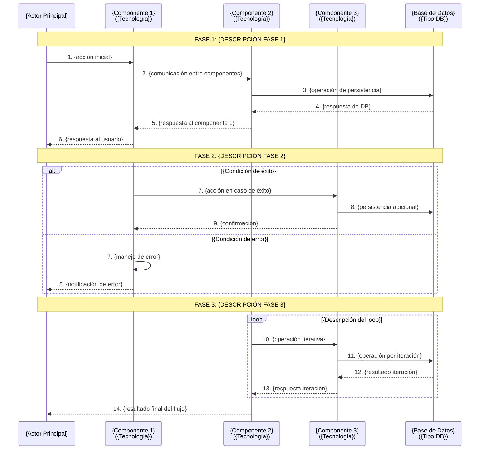
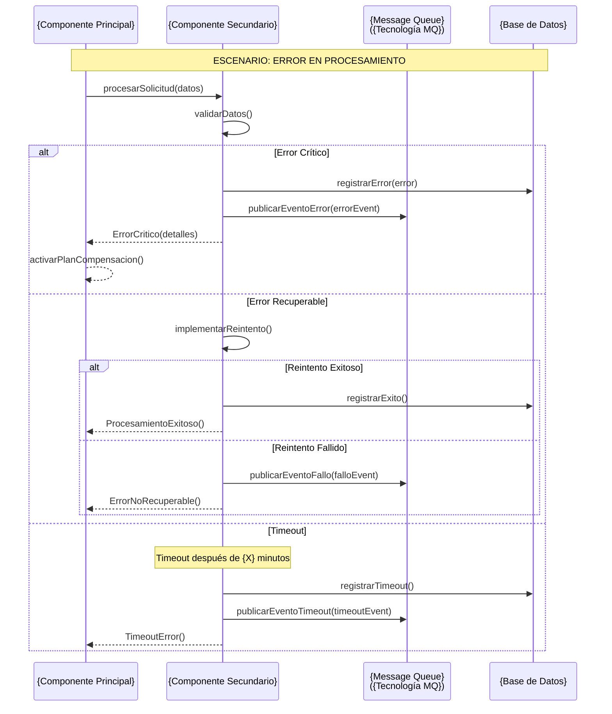
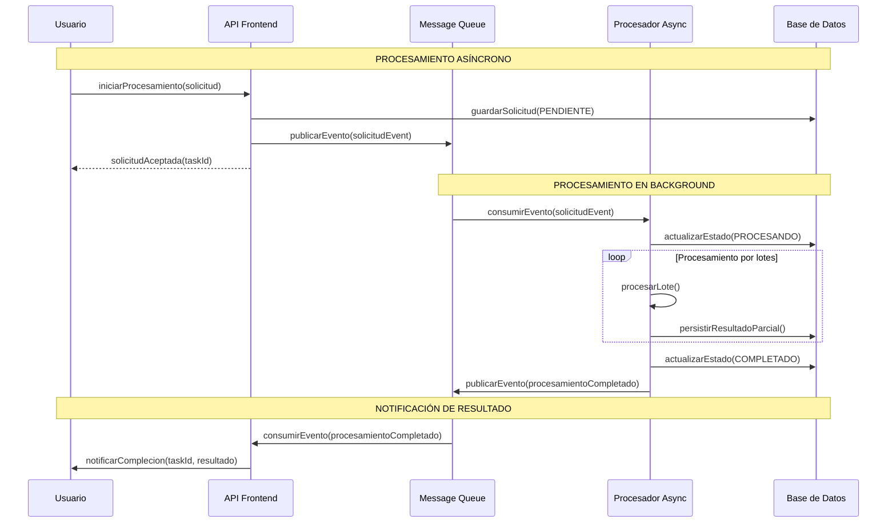
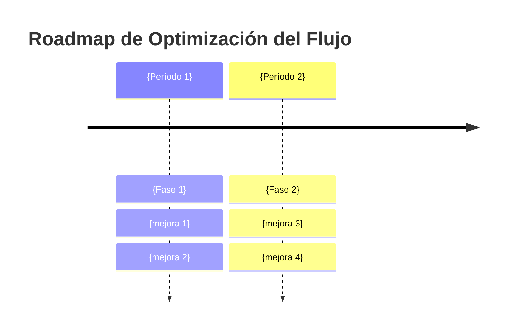

# /documentar-flujo-negocio Task

When this command is used, execute the following task:

<!-- Powered by Método ZNS -->

# Documentar Flujo de Negocio

## Propósito

Documentar flujos de negocio críticos del sistema mediante diagramas de secuencia detallados que ilustren las interacciones entre componentes, incluyendo rutas de éxito, manejo de errores y operaciones asíncronas. Esta tarea está optimizada para sistemas empresariales complejos con múltiples componentes e integraciones.

## Cuándo Usar Esta Tarea

**Usa esta tarea cuando:**

- Necesitas documentar un flujo de negocio crítico y complejo
- El flujo involucra múltiples componentes/servicios con interacciones asíncronas
- Requieres clarificar decisiones arquitectónicas o integraciones complejas
- Nuevos desarrolladores necesitan entender workflows clave del sistema
- Buscas documentar rutas de manejo de errores y recuperación
- El flujo incluye APIs externas, message queues o procesos batch

**Prerequisites:**

- Conocimiento del flujo de negocio a documentar
- Acceso a documentación existente (si está disponible)
- Comprensión de los componentes involucrados en el flujo
- Acceso al GPS arquitectónico del sistema (si existe)

## Instrucciones de Ejecución de la Tarea

### 0. CONFIGURACIÓN Y CONTEXTO INICIAL

#### 0.1 Cargar Configuración del Proyecto

- Verificar que existe `.ZNS-metodo/core-config.yaml`
- Confirmar configuración de `architectureShardedLocation: {arquitectureShardedLocation}`
- Si no existe, crear estructura base de documentación

#### 0.2 Elicitación de Contexto del Flujo

**Realizar las siguientes preguntas obligatorias al usuario:**

1. **Identificación del Flujo:**
   - "¿Cuál es el nombre/descripción del flujo de negocio a documentar?"
   - "¿Cuáles son los 3-5 componentes principales involucrados en este flujo?"

2. **Scope y Complejidad:**
   - "¿El flujo incluye comunicación asíncrona (message queues, eventos)?"
   - "¿Hay integraciones con sistemas externos en este flujo?"

3. **Contexto del Negocio:**
   - "Describe brevemente el proceso de negocio (2-3 líneas máximo)"
   - "¿Cuáles son los puntos críticos donde suelen ocurrir errores?"

### 1. ANÁLISIS PROFUNDO DEL FLUJO

#### 1.1 Revisión del Contexto Arquitectónico

**Preparar contexto base:**

- **Revisar GPS arquitectónico**: Si existe `{architectureShardedLocation}/index.md`, revisar información sobre los componentes involucrados
- **Revisar documentación de componentes**: Para cada componente del flujo, buscar y revisar `{architectureShardedLocation}/architecture-{nombre-componente}.md` si existe para obtener información sobre responsabilidades, patrones de integración, APIs y dependencias
- **Identificar patrones de integración**: Revisar protocolos de comunicación (REST, eventos, DB directa, etc.)
- **Mapear dependencias**: Entender relaciones entre componentes del flujo

#### 1.2 Análisis de Componentes del Flujo

**Para cada componente identificado:**

- **Rol en el flujo**: Qué responsabilidad tiene en el proceso de negocio
- **Tecnología**: Stack tecnológico específico del componente
- **Interfaces**: APIs, eventos, o mecanismos de comunicación que expone/consume
- **Puntos de falla**: Posibles errores o timeouts específicos del componente

#### 1.3 Mapeo de Interacciones y Secuencias

**Identificar el flujo paso a paso:**

- **Trigger inicial**: Qué inicia el flujo (usuario, evento, scheduler, etc.)
- **Secuencia principal**: Pasos del happy path del flujo
- **Decisiones y branches**: Puntos donde el flujo puede tomar diferentes rutas
- **Operaciones asíncronas**: Procesos que no bloquean la ejecución
- **Puntos de persistencia**: Dónde se guardan estados intermedios

#### 1.4 Análisis de Escenarios de Error

**Evaluar manejo de errores:**

- **Errores técnicos**: Timeouts, conexiones perdidas, servicios no disponibles
- **Errores de negocio**: Validaciones fallidas, datos inconsistentes
- **Estrategias de recuperación**: Reintentos, compensación, rollbacks
- **Notificaciones**: Cómo se informa al usuario sobre errores

### 2. CREACIÓN DE LA DOCUMENTACIÓN DEL FLUJO

#### 2.1 Crear Archivo de Documentación

**Crear estructura específica del flujo:**

```
{architectureShardedLocation}/
└── flujo-{nombre-flujo}.md    # Documentación del flujo de negocio
```

#### 2.2 Generar `flujo-{nombre-flujo}.md` - Documentación del Flujo

**Crear documentación completa basada en el análisis realizado:**

**Template del flujo:**

````markdown
# {Nombre del Sistema} - Flujo: {Nombre del Flujo} 🔄

## 📋 **Introducción**

### Descripción del Flujo

{Descripción del proceso de negocio basada en la respuesta del usuario}

### Scope del Documento

**Enfoque Principal**: Documentación técnica del flujo de trabajo
**Audiencia**: Desarrolladores, Arquitectos, Analistas de Negocio  
**Última Actualización**: {fecha actual}

### Componentes Involucrados

| Componente         | Tecnología   | Puerto/Contexto   | Responsabilidad               |
| ------------------ | ------------ | ----------------- | ----------------------------- |
| **{Componente 1}** | {tecnología} | {puerto/contexto} | {responsabilidad en el flujo} |
| **{Componente 2}** | {tecnología} | {puerto/contexto} | {responsabilidad en el flujo} |
| **{Componente 3}** | {tecnología} | {puerto/contexto} | {responsabilidad en el flujo} |

---

## 🔄 **Diagramas de Secuencia**

### 1. Flujo Principal: {Nombre del Flujo}



### 2. Flujo de Manejo de Errores

_Si el flujo tiene manejo de errores complejos, generar diagrama específico:_



_Nota: Adaptar según los escenarios de error específicos del flujo_

### 3. Flujo de Operaciones Asíncronas

_Solo incluir si el flujo contiene operaciones asíncronas. Ejemplo de template:_



_Nota: Adaptar componentes, tecnologías y secuencias según el flujo específico_

---

## 📊 **Estados y Transiciones**

### Diagrama de Estados del Flujo

```mermaid
stateDiagram-v2
    [*] --> {Estado_Inicial}: {trigger inicial}
    {Estado_Inicial} --> {Estado_Procesando}: {condición}
    {Estado_Procesando} --> {Estado_Exitoso}: {condición éxito}
    {Estado_Procesando} --> {Estado_Error}: {condición error}
    {Estado_Procesando} --> {Estado_Timeout}: {condición timeout}

    {Estado_Error} --> {Estado_Reintentando}: {usuario reintenta}
    {Estado_Timeout} --> {Estado_Reintentando}: {reintento automático}
    {Estado_Reintentando} --> {Estado_Procesando}: {reinicia procesamiento}

    {Estado_Exitoso} --> [*]
    {Estado_Error} --> [*]: {usuario cancela}
```

---

## 📋 **Configuración y Parámetros**

### Configuración del Flujo

_Si aplica, documentar configuraciones específicas:_

| Parámetro         | Valor         | Descripción             | Impacto si se Cambia |
| ----------------- | ------------- | ----------------------- | -------------------- |
| `{parametro1}`    | `{valor}`     | {descripción}           | {impacto del cambio} |
| `{parametro2}`    | `{valor}`     | {descripción}           | {impacto del cambio} |
| `{timeout_flujo}` | `{X} minutos` | Tiempo máximo del flujo | {impacto del cambio} |

### Message Queues Utilizadas

_Solo incluir si el flujo utiliza message queues. Ejemplo de template:_

| Cola             | Exchange     | Routing Key     | TTL     | Propósito               |
| ---------------- | ------------ | --------------- | ------- | ----------------------- |
| `{nombre.cola1}` | `{exchange}` | `{routing.key}` | `{ttl}` | {propósito en el flujo} |
| `{nombre.cola2}` | `{exchange}` | `{routing.key}` | `{ttl}` | {propósito en el flujo} |

---

## 🔧 **Métricas y Monitoreo**

### Puntos Críticos de Medición

| Métrica                    | Componente             | Umbral Esperado | Acción si se Excede    |
| -------------------------- | ---------------------- | --------------- | ---------------------- |
| **{métrica1}**             | {componente}           | {umbral}        | {acción}               |
| **{métrica2}**             | {componente}           | {umbral}        | {acción}               |
| **Tiempo total del flujo** | {componente principal} | < {X} minutos   | {acción de escalación} |

### Logs Críticos a Monitorear

| Componente        | Archivo Log     | Patrón a Buscar       | Severidad |
| ----------------- | --------------- | --------------------- | --------- |
| **{Componente1}** | `{archivo.log}` | `{patrón de error}`   | ERROR     |
| **{Componente2}** | `{archivo.log}` | `{patrón de warning}` | WARN      |

---

## 🧪 **Escenarios de Prueba**

### Casos de Prueba Críticos

#### TC001: Flujo Exitoso Completo

```gherkin
Scenario: {descripción del escenario exitoso}
  Given {condiciones iniciales}
  When {acción del usuario}
  Then {resultado esperado}
  And {verificaciones adicionales}
```

#### TC002: Manejo de Error Crítico

```gherkin
Scenario: {descripción del escenario de error}
  Given {condiciones que causan error}
  When {acción que trigger el error}
  Then {respuesta esperada del sistema}
  And {verificación de recuperación}
```

#### TC003: Timeout en Procesamiento

```gherkin
Scenario: {descripción del escenario de timeout}
  Given {condiciones que causan timeout}
  When {el procesamiento excede el límite}
  Then {el sistema debe manejar el timeout}
  And {debe permitir recuperación}
```

---

## 🔍 **Troubleshooting**

### Problemas Comunes y Soluciones

#### Error: "{Descripción del error común 1}"

**Causa**: {causa raíz del problema}
**Diagnóstico**:

```bash
# Comandos para diagnosticar
{comandos de diagnóstico}
```

**Solución**: {pasos para resolver}

#### Error: "{Descripción del error común 2}"

**Causa**: {causa raíz del problema}
**Diagnóstico**: {método de diagnóstico}
**Solución**: {pasos para resolver}

### Comandos de Diagnóstico Útiles

```bash
# Verificar estado de componentes
{comandos para verificar salud}

# Revisar logs de errores
{comandos para logs}

# Verificar métricas
{comandos para métricas}
```

---

## 🚀 **Optimizaciones Futuras**

### Oportunidades de Mejora Identificadas

1. **{Área de mejora 1}**
   - {descripción de la mejora}
   - {beneficio esperado}
   - {complejidad estimada}

2. **{Área de mejora 2}**
   - {descripción de la mejora}
   - {beneficio esperado}
   - {complejidad estimada}

### Roadmap de Evolución



---

## 📚 **Referencias**

- **GPS Arquitectónico**: [{nombre del GPS}](./{archivo-gps}.md)
- **Documentación de Componentes**:
  - [{Componente 1}](./{archivo-componente1}.md)
  - [{Componente 2}](./{archivo-componente2}.md)
- **Configuración**: {referencias a configuración}

---

_Documentación generada con Método ZNS - Arquitecto_  
_Última actualización: {fecha}_  
_Versión: 1.0_
````

#### 2.3 Validación y Refinamiento

**Revisar la documentación generada:**

- Verificar que los diagramas Mermaid reflejen correctamente el flujo
- Asegurar que los escenarios de error estén bien documentados
- Validar que la información sea práctica para desarrolladores
- Confirmar que los casos de prueba cubren escenarios críticos

**Preguntar al usuario:**

- "¿Los diagramas capturan correctamente las interacciones del flujo?"
- "¿Hay algún escenario de error específico que deba agregar?"
- "¿La documentación cubre las necesidades de tu equipo para entender este flujo?"
