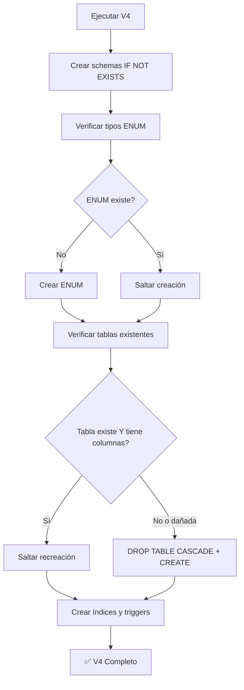

-- ============================================================================
-- RESUMEN: V4 - SOLUCIÓN FINAL AL PROBLEMA CASCADE
-- Archivo: V4_SOLUCION_CASCADE.md  
-- Fecha: 2025-11-14
-- Autor: Database Engineer Senior - ZNS-METHOD
-- ============================================================================

# 🎯 PROBLEMA CASCADE RESUELTO

## ❌ **CAUSA RAÍZ IDENTIFICADA**

**Log del usuario:**
```
drop cascades to column estado_actual of table autenticacion_schema.proceso_registro
drop cascades to column tipo_documento of table autenticacion_schema.verificacion_identidad  
drop cascades to column tipo_archivo of table shared_schema.archivos
drop cascades to column estado of table autenticacion_schema.verificacion_identidad
relation "proceso_registro" already exists, skipping
ERROR: column "estado_actual" does not exist
```

**El problema:** 
1. **`DROP TYPE ... CASCADE`** eliminaba las columnas de las tablas existentes
2. **`CREATE TABLE IF NOT EXISTS`** NO recreaba la tabla (porque ya existía)
3. **Resultado:** Tabla existía pero **SIN las columnas eliminadas por CASCADE**

## ✅ **SOLUCIÓN IMPLEMENTADA**

### 1. **ENUMs No Destructivos**
```sql
-- ANTES (❌ Destructivo con CASCADE)
DROP TYPE IF EXISTS shared_schema.estado_registro CASCADE;
CREATE TYPE shared_schema.estado_registro AS ENUM (...);

-- DESPUÉS (✅ Solo crear si no existe)
DO $$
BEGIN
    IF NOT EXISTS (SELECT 1 FROM pg_type 
                   WHERE typname = 'estado_registro' 
                   AND typnamespace = (SELECT oid FROM pg_namespace WHERE nspname = 'shared_schema')) THEN
        CREATE TYPE shared_schema.estado_registro AS ENUM (...);
    END IF;
END
$$;
```

### 2. **Detección y Reparación de Tablas Dañadas**
```sql
-- Función helper para verificar columnas
CREATE OR REPLACE FUNCTION shared_schema.tabla_tiene_columna(
    schema_name TEXT, table_name TEXT, column_name TEXT
) RETURNS BOOLEAN AS $$
BEGIN
    RETURN EXISTS (
        SELECT 1 FROM information_schema.columns 
        WHERE table_schema = schema_name 
        AND table_name = table_name 
        AND column_name = column_name
    );
END;
$$ LANGUAGE plpgsql;

-- Reparación automática antes de CREATE TABLE
DO $$
BEGIN
    IF EXISTS (tabla existe) THEN
        IF NOT tabla_tiene_columna(schema, tabla, columna_critica) THEN
            RAISE NOTICE 'Tabla dañada por CASCADE - eliminando para recrear';
            DROP TABLE schema.tabla CASCADE;
        END IF;
    END IF;
END
$$;
```

### 3. **Tablas Verificadas y Reparadas**

- ✅ **`proceso_registro`** - Verifica columna `estado_actual`
- ✅ **`archivos`** - Verifica columna `tipo_archivo` 
- ✅ **`verificacion_identidad`** - Verifica columnas `tipo_documento` y `estado`

## 🔧 **FLUJO DE EJECUCIÓN CORREGIDO**



## 🚀 **RESULTADO FINAL**

### ✅ **Idempotencia Verdadera:**
- Primera ejecución: Crea todo desde cero
- Segunda ejecución: Mantiene datos existentes
- **NO más errores de CASCADE destructivo**

### ✅ **Objetos Corregidos:**
- **4 tipos ENUM:** No destructivos (solo crear si no existen)
- **4 tablas:** Auto-reparación si están dañadas
- **Función helper:** `tabla_tiene_columna()` para verificaciones
- **Lógica defensiva:** Todos los índices y triggers verifican existencia

## 🧪 **VALIDACIÓN**

**Comando de prueba:**
```sql
-- Ejecutar V4 primera vez: Debe funcionar
\i V4__registro_estudiantes_multistep.sql

-- Ejecutar V4 segunda vez: Debe ser idempotente  
\i V4__registro_estudiantes_multistep.sql

-- No deben aparecer errores de:
-- ❌ "column estado_actual does not exist" 
-- ❌ "type already exists"
-- ❌ "relation already exists" (con errores)
```

---

**🎯 V4 ahora es verdaderamente idempotente y resiliente a ejecuciones múltiples.**