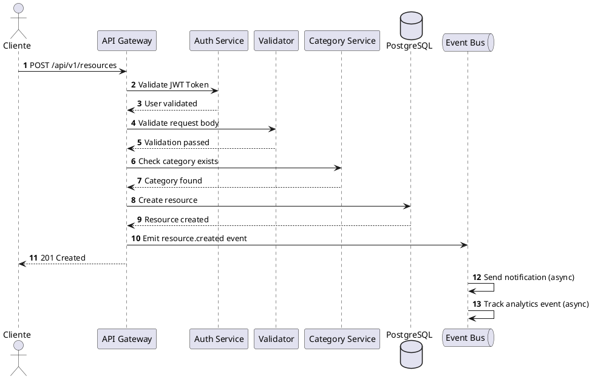
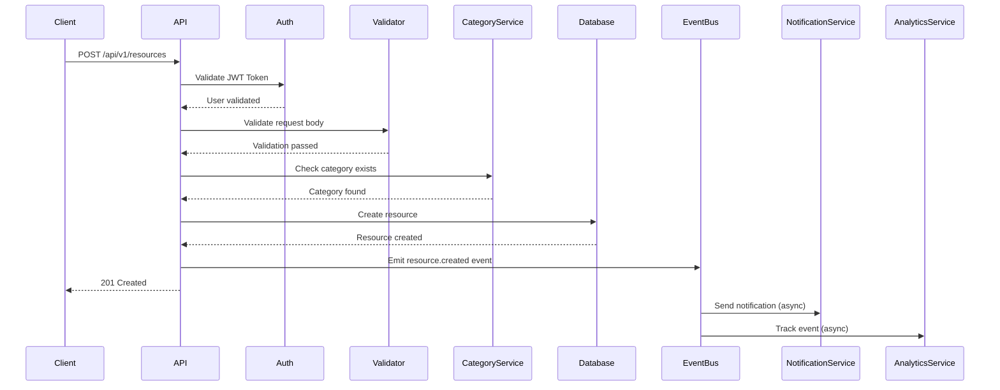

# Plantilla de Especificación de API Endpoint

## Endpoint: [Nombre Descriptivo del Endpoint]

### Información General

**Versión API:** v1
**Última Actualización:** [Fecha]
**Estado:** ✅ Activo | ⚠️ Deprecado | 🚧 En Desarrollo
**Responsable:** [Nombre del Tech Lead]

---

### 1. Descripción

**URL:** `[METHOD] /api/v1/resource`

**Descripción Breve:**
[Descripción en 1-2 líneas del propósito del endpoint]

**Caso de Uso:**
[Descripción más detallada del caso de uso y cuándo se debe usar este endpoint]

**Ejemplo de Uso:**
```
El endpoint permite a los usuarios autenticados crear un nuevo recurso
en su cuenta. Útil para la funcionalidad de "Agregar Producto" en la app móvil.
```

---

### 2. Autenticación y Autorización

#### 2.1 Autenticación

**Tipo:** JWT Bearer Token

**Header Requerido:**
```http
Authorization: Bearer <jwt_token>
```

**Validación:**
- ✅ Token debe estar presente
- ✅ Token debe ser válido (firma verificada)
- ✅ Token no debe estar expirado
- ✅ Usuario asociado debe estar activo

#### 2.2 Autorización

**Roles Permitidos:**
- ✅ USER (todos los usuarios autenticados)
- ✅ ADMIN (administradores)
- ❌ GUEST (usuarios no autenticados)

**Permisos Específicos:**
```typescript
@UseGuards(JwtAuthGuard, RolesGuard)
@Roles('USER', 'ADMIN')
@RequirePermission('resource:create')
```

---

### 3. Request

#### 3.1 HTTP Method y URL

```
POST /api/v1/resources
```

#### 3.2 Headers

| Header | Tipo | Requerido | Descripción | Ejemplo |
|--------|------|-----------|-------------|---------|
| `Authorization` | string | ✅ Sí | JWT Bearer token | `Bearer eyJhbGc...` |
| `Content-Type` | string | ✅ Sí | Tipo de contenido | `application/json` |
| `X-Correlation-ID` | string | ⚪ No | ID para tracing | `abc-123-def` |
| `Accept-Language` | string | ⚪ No | Idioma preferido | `es-CO`, `en-US` |

#### 3.3 Path Parameters

[Solo si aplica]

| Parámetro | Tipo | Descripción | Ejemplo | Validación |
|-----------|------|-------------|---------|------------|
| `id` | UUID | ID del recurso | `123e4567-e89b-12d3-a456-426614174000` | UUID v4 válido |
| `slug` | string | Slug del recurso | `mi-producto-123` | Min 3, max 100 chars |

#### 3.4 Query Parameters

[Solo si aplica]

| Parámetro | Tipo | Requerido | Default | Descripción | Validación |
|-----------|------|-----------|---------|-------------|------------|
| `page` | integer | ⚪ No | 1 | Número de página | Min: 1, Max: 1000 |
| `limit` | integer | ⚪ No | 20 | Elementos por página | Min: 1, Max: 100 |
| `sort` | string | ⚪ No | `createdAt:desc` | Campo y orden | `field:(asc\|desc)` |
| `filter` | string | ⚪ No | - | Filtro de búsqueda | Max 200 chars |

#### 3.5 Request Body

**Content-Type:** `application/json`

**Schema:**
```typescript
interface CreateResourceRequest {
  name: string;           // Required, min 3, max 200
  description?: string;   // Optional, max 2000
  categoryId: string;     // Required, UUID
  price: number;          // Required, > 0
  currency: string;       // Required, ISO 4217 (USD, COP, etc.)
  tags?: string[];        // Optional, max 10 tags
  metadata?: Record<string, unknown>; // Optional, flexible
  images?: {
    url: string;          // Required, valid URL
    alt?: string;         // Optional
    order: number;        // Required, >= 0
  }[];
}
```

**Validation Schema (Zod):**
```typescript
const CreateResourceSchema = z.object({
  name: z.string().min(3).max(200),
  description: z.string().max(2000).optional(),
  categoryId: z.string().uuid(),
  price: z.number().positive(),
  currency: z.enum(['USD', 'COP', 'MXN', 'ARS']),
  tags: z.array(z.string()).max(10).optional(),
  metadata: z.record(z.unknown()).optional(),
  images: z.array(z.object({
    url: z.string().url(),
    alt: z.string().optional(),
    order: z.number().int().nonnegative()
  })).optional()
});
```

**Ejemplo de Request:**
```json
{
  "name": "Artesanía Wayuu",
  "description": "Mochila tejida a mano por artesanos de La Guajira",
  "categoryId": "f47ac10b-58cc-4372-a567-0e02b2c3d479",
  "price": 120000,
  "currency": "COP",
  "tags": ["artesanía", "wayuu", "mochila", "hecho a mano"],
  "metadata": {
    "origin": "La Guajira, Colombia",
    "material": "Hilo de algodón"
  },
  "images": [
    {
      "url": "https://cdn.example.com/images/product-1.jpg",
      "alt": "Vista frontal de la mochila",
      "order": 0
    },
    {
      "url": "https://cdn.example.com/images/product-2.jpg",
      "alt": "Vista lateral de la mochila",
      "order": 1
    }
  ]
}
```

---

### 4. Response

#### 4.1 Success Response (201 Created)

**HTTP Status:** `201 Created`

**Headers:**
```http
Content-Type: application/json
Location: /api/v1/resources/123e4567-e89b-12d3-a456-426614174000
X-Request-ID: abc-123-def
```

**Schema:**
```typescript
interface CreateResourceResponse {
  data: {
    id: string;           // UUID of created resource
    name: string;
    description?: string;
    categoryId: string;
    price: number;
    currency: string;
    tags: string[];
    metadata: Record<string, unknown>;
    images: Array<{
      id: string;
      url: string;
      alt?: string;
      order: number;
    }>;
    userId: string;       // Owner of the resource
    status: string;       // ACTIVE, INACTIVE, etc.
    createdAt: string;    // ISO 8601 timestamp
    updatedAt: string;    // ISO 8601 timestamp
  };
  meta: {
    requestId: string;
    timestamp: string;
  };
}
```

**Ejemplo de Response:**
```json
{
  "data": {
    "id": "123e4567-e89b-12d3-a456-426614174000",
    "name": "Artesanía Wayuu",
    "description": "Mochila tejida a mano por artesanos de La Guajira",
    "categoryId": "f47ac10b-58cc-4372-a567-0e02b2c3d479",
    "price": 120000,
    "currency": "COP",
    "tags": ["artesanía", "wayuu", "mochila", "hecho a mano"],
    "metadata": {
      "origin": "La Guajira, Colombia",
      "material": "Hilo de algodón"
    },
    "images": [
      {
        "id": "img-001",
        "url": "https://cdn.example.com/images/product-1.jpg",
        "alt": "Vista frontal de la mochila",
        "order": 0
      },
      {
        "id": "img-002",
        "url": "https://cdn.example.com/images/product-2.jpg",
        "alt": "Vista lateral de la mochila",
        "order": 1
      }
    ],
    "userId": "user-789",
    "status": "ACTIVE",
    "createdAt": "2025-11-07T15:30:00.000Z",
    "updatedAt": "2025-11-07T15:30:00.000Z"
  },
  "meta": {
    "requestId": "abc-123-def",
    "timestamp": "2025-11-07T15:30:00.000Z"
  }
}
```

#### 4.2 Error Responses

**4.2.1 Bad Request (400)**

**Caso:** Validación de datos fallida

```json
{
  "error": {
    "code": "VALIDATION_ERROR",
    "message": "Error de validación en los datos enviados",
    "details": [
      {
        "field": "name",
        "message": "El nombre debe tener entre 3 y 200 caracteres",
        "value": "AB"
      },
      {
        "field": "price",
        "message": "El precio debe ser mayor a 0",
        "value": -100
      }
    ]
  },
  "meta": {
    "requestId": "abc-123-def",
    "timestamp": "2025-11-07T15:30:00.000Z"
  }
}
```

**4.2.2 Unauthorized (401)**

**Caso:** Token inválido o ausente

```json
{
  "error": {
    "code": "UNAUTHORIZED",
    "message": "Token de autenticación inválido o expirado"
  },
  "meta": {
    "requestId": "abc-123-def",
    "timestamp": "2025-11-07T15:30:00.000Z"
  }
}
```

**4.2.3 Forbidden (403)**

**Caso:** Usuario no tiene permisos

```json
{
  "error": {
    "code": "FORBIDDEN",
    "message": "No tienes permisos para realizar esta acción",
    "requiredPermission": "resource:create"
  },
  "meta": {
    "requestId": "abc-123-def",
    "timestamp": "2025-11-07T15:30:00.000Z"
  }
}
```

**4.2.4 Not Found (404)**

**Caso:** Recurso relacionado no existe (ej: categoryId inválido)

```json
{
  "error": {
    "code": "RESOURCE_NOT_FOUND",
    "message": "La categoría especificada no existe",
    "resource": "Category",
    "id": "f47ac10b-58cc-4372-a567-0e02b2c3d479"
  },
  "meta": {
    "requestId": "abc-123-def",
    "timestamp": "2025-11-07T15:30:00.000Z"
  }
}
```

**4.2.5 Conflict (409)**

**Caso:** Recurso duplicado

```json
{
  "error": {
    "code": "RESOURCE_CONFLICT",
    "message": "Ya existe un recurso con ese nombre para este usuario",
    "conflictingField": "name"
  },
  "meta": {
    "requestId": "abc-123-def",
    "timestamp": "2025-11-07T15:30:00.000Z"
  }
}
```

**4.2.6 Rate Limit Exceeded (429)**

**Caso:** Demasiadas peticiones

```json
{
  "error": {
    "code": "RATE_LIMIT_EXCEEDED",
    "message": "Has excedido el límite de peticiones. Intenta de nuevo en 60 segundos",
    "retryAfter": 60
  },
  "meta": {
    "requestId": "abc-123-def",
    "timestamp": "2025-11-07T15:30:00.000Z"
  }
}
```

**4.2.7 Internal Server Error (500)**

**Caso:** Error inesperado del servidor

```json
{
  "error": {
    "code": "INTERNAL_SERVER_ERROR",
    "message": "Ocurrió un error inesperado. Nuestro equipo ha sido notificado",
    "errorId": "error-xyz-789"
  },
  "meta": {
    "requestId": "abc-123-def",
    "timestamp": "2025-11-07T15:30:00.000Z"
  }
}
```

**4.2.8 Service Unavailable (503)**

**Caso:** Servicio temporalmente no disponible

```json
{
  "error": {
    "code": "SERVICE_UNAVAILABLE",
    "message": "El servicio está temporalmente no disponible. Intenta de nuevo más tarde",
    "retryAfter": 300
  },
  "meta": {
    "requestId": "abc-123-def",
    "timestamp": "2025-11-07T15:30:00.000Z"
  }
}
```

---

### 5. Comportamiento y Lógica de Negocio

#### 5.1 Flujo de Ejecución

> **Usar PlantUML Sequence Diagram para documentación profesional:**



> **Alternativa rápida con Mermaid (solo para borradores):**


#### 5.2 Reglas de Negocio

1. **Validación de Categoría:**
   - La categoría especificada debe existir
   - La categoría debe estar activa
   - El usuario debe tener permiso para crear en esa categoría

2. **Validación de Precio:**
   - El precio debe ser mayor a 0
   - Máximo 2 decimales permitidos
   - Moneda debe ser soportada (USD, COP, MXN, ARS)

3. **Validación de Imágenes:**
   - Máximo 10 imágenes por recurso
   - URLs deben ser válidas y accesibles
   - Order debe ser único por recurso

4. **Límites:**
   - Usuario básico: máximo 50 recursos activos
   - Usuario premium: máximo 500 recursos activos
   - Tags: máximo 10 por recurso

#### 5.3 Side Effects

**Eventos Emitidos:**
- `resource.created`: Evento principal de creación
  ```json
  {
    "eventType": "resource.created",
    "resourceId": "123e4567...",
    "userId": "user-789",
    "timestamp": "2025-11-07T15:30:00.000Z",
    "data": { /* resource data */ }
  }
  ```

**Acciones Asíncronas:**
- Envío de email de confirmación (NotificationService)
- Registro de evento en analytics (AnalyticsService)
- Indexación en motor de búsqueda (SearchService)
- Generación de thumbnails de imágenes (MediaService)

---

### 6. Performance y Escalabilidad

#### 6.1 Métricas de Performance

| Métrica | Objetivo | Actual | Estado |
|---------|----------|--------|--------|
| Latencia p50 | < 100ms | 85ms | ✅ OK |
| Latencia p95 | < 200ms | 175ms | ✅ OK |
| Latencia p99 | < 500ms | 450ms | ✅ OK |
| Throughput | 500 req/sec | 600 req/sec | ✅ OK |
| Tasa de error | < 0.1% | 0.05% | ✅ OK |

#### 6.2 Rate Limiting

**Configuración:**
- **Usuario autenticado:** 100 requests / minuto
- **Usuario premium:** 500 requests / minuto
- **Admin:** Sin límite

**Headers de Rate Limit:**
```http
X-RateLimit-Limit: 100
X-RateLimit-Remaining: 95
X-RateLimit-Reset: 1699372800
```

#### 6.3 Caching

**Estrategia:** No cacheable (POST requests)

**Nota:** Los recursos creados serán cacheados en requests GET posteriores.

---

### 7. Seguridad

#### 7.1 Validación de Input

- ✅ Todos los campos son validados con Zod
- ✅ XSS prevention: sanitización de strings
- ✅ SQL Injection prevention: uso de ORM (Prisma)
- ✅ NoSQL Injection prevention: validación estricta de tipos
- ✅ Tamaño máximo de payload: 10 MB

#### 7.2 Datos Sensibles

| Campo | Clasificación | Tratamiento |
|-------|---------------|-------------|
| `userId` | PII | Logged (ofuscado en logs públicos) |
| `metadata` | Potencialmente sensible | No loggeado en detalle |
| `price` | Confidencial (negocio) | Encriptado en logs |

#### 7.3 OWASP Top 10 Mitigations

- ✅ A01: Broken Access Control → JWT + RBAC
- ✅ A02: Cryptographic Failures → TLS 1.3
- ✅ A03: Injection → Input validation + ORM
- ✅ A04: Insecure Design → Security by design
- ✅ A05: Security Misconfiguration → Hardened defaults
- ✅ A06: Vulnerable Components → Dependency scanning
- ✅ A07: Auth Failures → JWT + MFA (admin)
- ✅ A08: Software/Data Integrity → Signed payloads
- ✅ A09: Logging Failures → Centralized logging
- ✅ A10: SSRF → URL validation

---

### 8. Testing

#### 8.1 Unit Tests

```typescript
describe('POST /api/v1/resources', () => {
  it('should create resource with valid data', async () => {
    const response = await request(app)
      .post('/api/v1/resources')
      .set('Authorization', `Bearer ${validToken}`)
      .send(validResourceData)
      .expect(201);

    expect(response.body.data.id).toBeDefined();
    expect(response.body.data.name).toBe(validResourceData.name);
  });

  it('should return 400 for invalid data', async () => {
    const response = await request(app)
      .post('/api/v1/resources')
      .set('Authorization', `Bearer ${validToken}`)
      .send({ name: 'AB' }) // Too short
      .expect(400);

    expect(response.body.error.code).toBe('VALIDATION_ERROR');
  });

  it('should return 401 without token', async () => {
    await request(app)
      .post('/api/v1/resources')
      .send(validResourceData)
      .expect(401);
  });
});
```

#### 8.2 Integration Tests

```typescript
describe('Resource Creation Flow', () => {
  it('should create resource and emit event', async () => {
    const eventSpy = jest.spyOn(eventBus, 'emit');

    await request(app)
      .post('/api/v1/resources')
      .set('Authorization', `Bearer ${validToken}`)
      .send(validResourceData)
      .expect(201);

    expect(eventSpy).toHaveBeenCalledWith(
      'resource.created',
      expect.objectContaining({
        resourceId: expect.any(String)
      })
    );
  });
});
```

#### 8.3 Load Tests (k6)

```javascript
import http from 'k6/http';
import { check } from 'k6';

export let options = {
  stages: [
    { duration: '2m', target: 100 }, // Ramp up
    { duration: '5m', target: 100 }, // Stable
    { duration: '2m', target: 0 },   // Ramp down
  ],
  thresholds: {
    http_req_duration: ['p(95)<200'], // 95% under 200ms
    http_req_failed: ['rate<0.01'],    // Error rate < 1%
  },
};

export default function () {
  const res = http.post(
    'https://api.example.com/api/v1/resources',
    JSON.stringify(validResourceData),
    {
      headers: {
        'Authorization': `Bearer ${__ENV.TOKEN}`,
        'Content-Type': 'application/json',
      },
    }
  );

  check(res, {
    'status is 201': (r) => r.status === 201,
    'response time < 200ms': (r) => r.timings.duration < 200,
  });
}
```

---

### 9. Monitoreo

#### 9.1 Métricas Custom

```typescript
// Prometheus metrics
const resourceCreationCounter = new Counter({
  name: 'resource_creation_total',
  help: 'Total number of resources created',
  labelNames: ['userId', 'categoryId', 'status']
});

const resourceCreationDuration = new Histogram({
  name: 'resource_creation_duration_seconds',
  help: 'Duration of resource creation',
  buckets: [0.1, 0.3, 0.5, 1, 2, 5]
});
```

#### 9.2 Alertas

```yaml
alerts:
  - name: HighResourceCreationLatency
    condition: p95(resource_creation_duration) > 500ms
    duration: 5m
    severity: warning
    notification: slack

  - name: HighResourceCreationErrorRate
    condition: error_rate > 1%
    duration: 3m
    severity: critical
    notification: pagerduty
```

---

### 10. Versionado y Deprecación

**Versión Actual:** v1
**Próxima Versión:** v2 (estimada Q2 2026)

**Cambios Planeados en v2:**
- Soporte para recursos multimedia (video, audio)
- Geolocalización de recursos
- Tags jerárquicos (taxonomy)

**Plan de Deprecación (si aplica):**
- Fecha de deprecación: N/A (primera versión)
- Período de soporte: Mínimo 12 meses post v2 release
- Notificación: Header `Deprecation` + documentación

---

### 11. Documentación Relacionada

- **OpenAPI Spec:** `/docs/openapi/resources.yaml`
- **Postman Collection:** `/docs/postman/resources.postman_collection.json`
- **Ejemplos de código:** `/docs/examples/resource-creation.md`
- **Runbook:** `/docs/runbooks/resource-creation-issues.md`

---

### 12. Changelog

| Versión | Fecha | Cambios | Autor |
|---------|-------|---------|-------|
| 1.0 | 2025-11-07 | Versión inicial del endpoint | Tech Team |

---

**Última revisión:** 2025-11-07
**Próxima revisión:** 2025-12-07
**Responsable:** [Nombre del Tech Lead]
