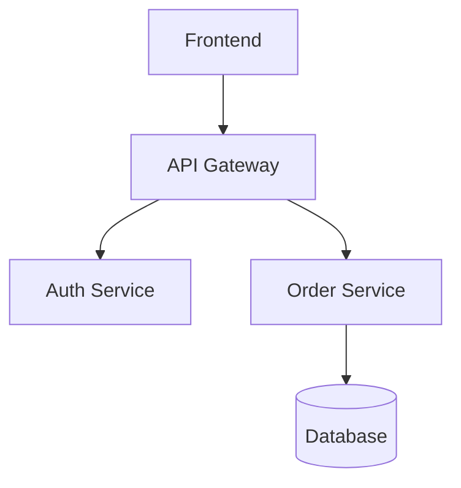

# Política de Diagramación - Método CEIBA v1.2

## 📐 Estándar Oficial de Diagramas

**Fecha de Vigencia:** 7 de noviembre de 2025  
**Versión:** 1.2  
**Estado:** Obligatorio para todos los proyectos

---

## 🎯 Resumen Ejecutivo

El Método CEIBA establece **PlantUML + C4 Model** como estándar principal para toda la documentación arquitectónica, reemplazando el uso de Mermaid en diagramas enterprise.

### ✅ Decisión Arquitectónica

**PlantUML + C4 Model es OBLIGATORIO para:**
- Diagramas de arquitectura (C4 L1/L2/L3)
- Modelos de datos (ERD)
- Diagramas de secuencia
- Diagramas de deployment/infraestructura

**Mermaid es OPCIONAL solo para:**
- Flowcharts simples embebidos en documentación
- Diagramas Gantt para roadmaps rápidos
- Documentación interna no crítica

---

## 📊 Comparativa: PlantUML vs Mermaid

| Criterio | PlantUML + C4 | Mermaid | Ganador |
|----------|---------------|---------|---------|
| **Versionable en Git** | ✅ Archivos .puml legibles | ✅ Sintaxis Markdown | 🤝 Empate |
| **Exportación a herramientas** | ✅ SVG → Draw.io → PNG/PDF | ⚠️ Solo PNG/SVG directo | 🏆 PlantUML |
| **Control de layout** | ✅ Alto control manual | ⚠️ Automático inflexible | 🏆 PlantUML |
| **Iconos cloud providers** | ✅ AWS/Azure/GCP oficiales | ❌ No disponibles | 🏆 PlantUML |
| **Calidad visual** | ✅ Profesional (300dpi+) | ⚠️ Limitado | 🏆 PlantUML |
| **C4 Model support** | ✅ Biblioteca oficial | ⚠️ Sintaxis custom | 🏆 PlantUML |
| **Notación Crow's Foot** | ✅ Nativo | ❌ No soportado | 🏆 PlantUML |
| **Refinamiento visual** | ✅ Import a Draw.io | ❌ Imposible | 🏆 PlantUML |
| **Curva de aprendizaje** | ⚠️ Media | ✅ Baja | 🏆 Mermaid |
| **Integración Markdown** | ⚠️ Referencia externa | ✅ Embebido nativo | 🏆 Mermaid |

**Resultado:** PlantUML gana 8/10 criterios críticos para arquitectura enterprise.

---

## 🛠️ Herramientas y Setup

### Instalación de PlantUML

**macOS:**
```bash
brew install plantuml
brew install openjdk  # Dependencia
```

**Windows:**
```powershell
choco install plantuml
choco install openjdk11
```

**Linux:**
```bash
sudo apt install plantuml
sudo apt install default-jre
```

**Verificación:**
```bash
plantuml -version
# Output esperado: PlantUML version 1.2024.x
```

### Extensiones VSCode Recomendadas

1. **PlantUML** (jebbs.plantuml)
   - Preview en tiempo real
   - Export a PNG/SVG
   - Syntax highlighting

2. **C4-PlantUML Snippets** (RicardoNiepel.c4model-extension)
   - Snippets para C4 L1/L2/L3
   - Autocompletado de elementos

3. **Markdown Preview Enhanced** (shd101wyy.markdown-preview-enhanced)
   - Preview de .puml embebidos en .md

### Instalación de Bibliotecas C4

**Método 1: Include remoto (recomendado)**
```plantuml
@startuml
!include https://raw.githubusercontent.com/plantuml-stdlib/C4-PlantUML/master/C4_Context.puml
!include https://raw.githubusercontent.com/plantuml-stdlib/C4-PlantUML/master/C4_Container.puml
!include https://raw.githubusercontent.com/plantuml-stdlib/C4-PlantUML/master/C4_Component.puml
@enduml
```

**Método 2: Clone local**
```bash
git clone https://github.com/plantuml-stdlib/C4-PlantUML.git
# Luego usar: !include ./C4-PlantUML/C4_Context.puml
```

---

## 📐 Workflow de Diagramación

### Paso 1: Crear Diagrama en PlantUML

**Archivo:** `c4-l1-context-sistema.puml`
```plantuml
@startuml
!include https://raw.githubusercontent.com/plantuml-stdlib/C4-PlantUML/master/C4_Context.puml

title Sistema de Gestión de Pedidos - Contexto

Person(cliente, "Cliente", "Usuario de la tienda online")
System(sistema, "Sistema E-commerce", "Permite gestionar pedidos y pagos")
System_Ext(payment, "Pasarela de Pago", "Stripe/PayPal")
System_Ext(shipping, "Proveedor Logística", "DHL/FedEx")

Rel(cliente, sistema, "Realiza pedidos", "HTTPS")
Rel(sistema, payment, "Procesa pagos", "REST API")
Rel(sistema, shipping, "Crea envíos", "REST API")

@enduml
```

### Paso 2: Renderizar a SVG

```bash
# Renderizar un archivo
plantuml -tsvg c4-l1-context-sistema.puml

# Batch rendering (todos los .puml)
plantuml -tsvg ./04-architecture/diagrams/*.puml

# Output: c4-l1-context-sistema.svg
```

### Paso 3: Importar a Draw.io (Opcional)

1. Abrir Draw.io (https://app.diagrams.net/)
2. File → Import from → SVG
3. Seleccionar: `c4-l1-context-sistema.svg`
4. Ajustar:
   - Colores corporativos
   - Fuentes (tamaño, familia)
   - Layout fino
   - Agregar logo de empresa
5. Exportar:
   - Draw.io XML: `c4-l1-context-sistema.drawio.xml`
   - PNG (300dpi): `c4-l1-context-sistema.png`
   - PDF: `c4-l1-context-sistema.pdf`

### Paso 4: Versionar en Git

```bash
git add 04-architecture/diagrams/c4-l1-context-sistema.puml
git add 04-architecture/diagrams/c4-l1-context-sistema.svg
git add 04-architecture/diagrams/c4-l1-context-sistema.drawio.xml
git add 04-architecture/diagrams/c4-l1-context-sistema.png
git commit -m "docs: Add C4 L1 context diagram for order management system"
```

**Archivos a versionar:**
- ✅ `.puml` - Fuente principal (código)
- ✅ `.svg` - Renderizado automático
- ✅ `.drawio.xml` - Versión refinada (Draw.io)
- ✅ `.png` - Imagen final para presentaciones

---

## 📋 Nomenclatura de Archivos

### Convención Obligatoria

```
[tipo]-[nivel]-[nombre-descriptivo]-[sistema].puml
```

**Ejemplos:**

**C4 Model:**
```
c4-l1-context-ecommerce.puml
c4-l2-containers-ecommerce.puml
c4-l3-components-order-service.puml
c4-l3-components-payment-service.puml
```

**ERD (Entity-Relationship Diagram):**
```
erd-database-main.puml
erd-database-orders.puml
erd-database-users.puml
```

**Sequence Diagrams:**
```
sequence-auth-login.puml
sequence-order-checkout.puml
sequence-payment-process.puml
sequence-error-compensation.puml
```

**Deployment:**
```
deployment-aws-production.puml
deployment-aws-staging.puml
deployment-azure-production.puml
deployment-onprem-datacenter.puml
```

---

## 🎨 Guía de Estilo Visual

### Paleta de Colores C4

**Por defecto (C4 Model):**
- **Person:** #08427B (azul oscuro)
- **System:** #1168BD (azul medio)
- **System_Ext:** #999999 (gris)
- **Container:** #438DD5 (azul claro)
- **Component:** #85BBF0 (azul muy claro)

**Personalización (opcional):**
```plantuml
!define PERSON_BG_COLOR #2E86C1
!define SYSTEM_BG_COLOR #5DADE2
!define EXTERNAL_BG_COLOR #ABB2B9

Person(user, "Usuario", "Descripción", $bgColor=PERSON_BG_COLOR)
```

### Fuentes y Tamaños

```plantuml
skinparam defaultFontName Arial
skinparam defaultFontSize 14
skinparam titleFontSize 18
skinparam titleFontStyle bold
```

### Layout y Espaciado

```plantuml
' Controlar dirección del flujo
left to right direction
' o
top to bottom direction

' Espaciado entre elementos
skinparam nodesep 80
skinparam ranksep 60
```

---

## 🔄 Migración de Mermaid a PlantUML

### Tabla de Conversión

| Mermaid | PlantUML + C4 | Notas |
|---------|---------------|-------|
| `graph TD` | `!include C4_Container.puml` | C4 más expresivo |
| `A[Label]` | `Container(a, "Label", "Tech")` | Más metadata |
| `A --> B` | `Rel(a, b, "Label", "Protocol")` | Protocolo explícito |
| `classDiagram` | `@startuml` + `entity` | Crow's Foot nativo |
| `sequenceDiagram` | `@startuml` + `participant` | `autonumber` mejor |

### Ejemplo de Conversión

**Antes (Mermaid):**


**Después (PlantUML + C4):**
```plantuml
@startuml
!include https://raw.githubusercontent.com/plantuml-stdlib/C4-PlantUML/master/C4_Container.puml

Container(web, "Frontend", "React 18", "SPA para usuarios")
Container(gateway, "API Gateway", "Kong", "Routing y rate limiting")
Container(auth, "Auth Service", "Node.js", "JWT authentication")
Container(orders, "Order Service", "Java Spring", "Gestión de pedidos")
ContainerDb(db, "Database", "PostgreSQL 15", "Datos transaccionales")

Rel(web, gateway, "Consume APIs", "HTTPS/REST")
Rel(gateway, auth, "Valida tokens", "gRPC")
Rel(gateway, orders, "CRUD pedidos", "REST")
Rel(orders, db, "Lee/escribe", "SQL")

@enduml
```

**Beneficios:**
- ✅ Tecnologías visibles (React, Kong, Node.js, Java, PostgreSQL)
- ✅ Protocolos explícitos (HTTPS, gRPC, REST, SQL)
- ✅ Tipos de contenedores claros (Container vs ContainerDb)
- ✅ Notación C4 estándar de industria

---

## 📚 Recursos y Referencias

### Documentación Oficial

- **PlantUML:** https://plantuml.com/
- **C4 Model:** https://c4model.com/
- **C4-PlantUML Repo:** https://github.com/plantuml-stdlib/C4-PlantUML
- **AWS Icons:** https://github.com/awslabs/aws-icons-for-plantuml
- **Azure Icons:** https://github.com/plantuml-stdlib/Azure-PlantUML
- **GCP Icons:** https://github.com/Piotr1215/gcp-icons-for-plantuml

### Ejemplos Completos

Ver plantillas detalladas en:
```
./02-agentes/2.definicion_arquitectura/prompt-arquitectura-soluciones.md
```

Secciones relevantes:
- Línea 1660-1850: Plantillas C4 L1/L2/L3 completas
- Línea 1900-2100: ERD con Crow's Foot
- Línea 2200-2300: Sequence diagrams
- Línea 2400-2500: Deployment con AWS/Azure/GCP

### Cheatsheets

**C4 L1 - Context:**
```plantuml
Person(alias, "Label", "Description")
System(alias, "Label", "Description")
System_Ext(alias, "Label", "Description")
Rel(from, to, "Label", "Protocol")
```

**C4 L2 - Container:**
```plantuml
Container(alias, "Label", "Technology", "Description")
ContainerDb(alias, "Label", "Technology", "Description")
System_Boundary(alias, "Label") { ... }
```

**C4 L3 - Component:**
```plantuml
Component(alias, "Label", "Technology", "Description")
ComponentDb(alias, "Label", "Technology", "Description")
```

---

## ✅ Checklist de Cumplimiento

### Para Arquitectos de Soluciones

- [ ] Todos los diagramas de arquitectura en formato .puml
- [ ] C4 L1 (Context) creado para el sistema completo
- [ ] C4 L2 (Container) creado con todas las tecnologías
- [ ] C4 L3 (Component) creado para servicios críticos (top 3-5)
- [ ] ERD en PlantUML con notación Crow's Foot
- [ ] Diagramas de secuencia para flujos críticos (top 5)
- [ ] Diagrama de deployment con iconos de cloud provider
- [ ] Todos los .puml versionados en Git
- [ ] SVG generados y versionados
- [ ] PNG finales exportados (300dpi mínimo)

### Para Revisores de Código

- [ ] Pull requests incluyen archivos .puml (no solo imágenes)
- [ ] Nomenclatura de archivos cumple convención
- [ ] Diagramas Mermaid justificados (solo para docs simples)
- [ ] No hay diagramas de arquitectura en Mermaid
- [ ] Draw.io XML incluidos si hay refinamiento manual
- [ ] Commit messages descriptivos (`docs: Add C4 L2 container diagram`)

---

## 🚨 Excepciones y Casos Especiales

### ¿Cuándo usar Mermaid?

**✅ Permitido:**
1. **Flowcharts en documentación interna:**
   ```markdown
   ## Proceso de Onboarding
   ```mermaid
   graph TD
       A[Registro] --> B{Email verificado?}
       B -->|Sí| C[Activar cuenta]
       B -->|No| D[Enviar email]
   ```
   ```

2. **Diagramas Gantt para roadmaps:**
   ```mermaid
   gantt
       title Roadmap Q1 2025
       section Backend
       Auth Service     :a1, 2025-01-01, 30d
       Order Service    :a2, after a1, 45d
   ```

3. **Diagramas de clase/estado simples en READMEs:**
   ```mermaid
   stateDiagram-v2
       [*] --> Draft
       Draft --> Published
       Published --> Archived
   ```

**❌ NO Permitido:**
- Diagramas C4 en Mermaid
- ERD en Mermaid (usar PlantUML Crow's Foot)
- Diagramas de deployment en Mermaid
- Diagramas para presentaciones a clientes

### Proyectos Legacy con Mermaid

**Estrategia de Migración:**

1. **No migrar inmediatamente** (evitar refactoring masivo)
2. **Nuevos diagramas en PlantUML** (desde hoy)
3. **Migrar al modificar** (si actualizas un Mermaid, migrarlo a PlantUML)
4. **Priorizar arquitectura crítica** (C4 L1/L2 primero)
5. **Documentar deuda técnica** (ADR explicando plan de migración)

**Timeline sugerido:**
- **Mes 1-2:** Nuevos diagramas en PlantUML
- **Mes 3-4:** Migrar C4 L1/L2 principales
- **Mes 5-6:** Migrar ERD y deployment
- **Mes 6+:** Mantener Mermaid solo para docs simples

---

## 📞 Soporte y Preguntas

### FAQ

**Q: ¿Por qué PlantUML si Mermaid es más simple?**  
A: Arquitectura enterprise requiere calidad profesional, exportación flexible y control de layout. PlantUML cumple estos requisitos; Mermaid no.

**Q: ¿Puedo usar Draw.io directamente sin PlantUML?**  
A: No recomendado. Draw.io no es versionable (archivos binarios XML). PlantUML → Draw.io es versionable + refinable.

**Q: ¿Qué pasa si el cliente pide diagramas en Visio/Lucidchart?**  
A: Exporta PNG desde PlantUML → Import a Visio/Lucidchart → Ajustar estilo corporativo. Siempre mantener .puml como fuente.

**Q: ¿Necesito Java instalado?**  
A: Sí, PlantUML requiere Java Runtime Environment (JRE 8+). Se instala automáticamente con brew/choco.

**Q: ¿Cómo automatizo en CI/CD?**  
A: Usa Docker: `plantuml/plantuml:latest` en GitHub Actions/GitLab CI para renderizar .puml → PNG en cada commit.

### Contacto

- **Equipo CEIBA:** ceiba-support@example.com
- **Slack:** #ceiba-architecture
- **Office Hours:** Martes 10-11am (demos de PlantUML)

---

## 📝 Historial de Cambios

### v1.2 (7 noviembre 2025)
- ✅ Establecido PlantUML + C4 como estándar obligatorio
- ✅ Mermaid relegado a uso secundario (flowcharts simples)
- ✅ Documentación completa de workflow y herramientas
- ✅ Tabla de conversión Mermaid → PlantUML
- ✅ Checklist de cumplimiento para arquitectos

### v1.1 (Anterior)
- Soporte mixto PlantUML + Mermaid (sin preferencia clara)

### v1.0 (Inicial)
- Solo Mermaid mencionado

---

**Autor:** Equipo CEIBA  
**Revisado por:** Solutions Architects Senior  
**Próxima Revisión:** Q2 2026
