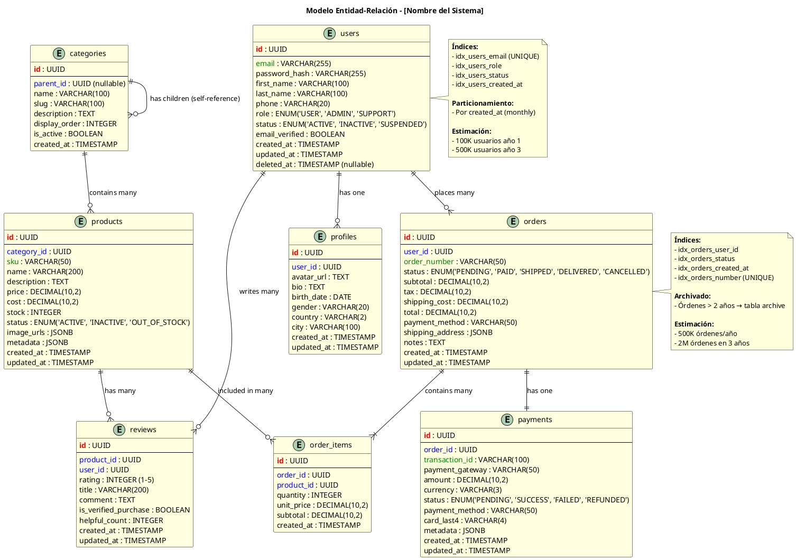
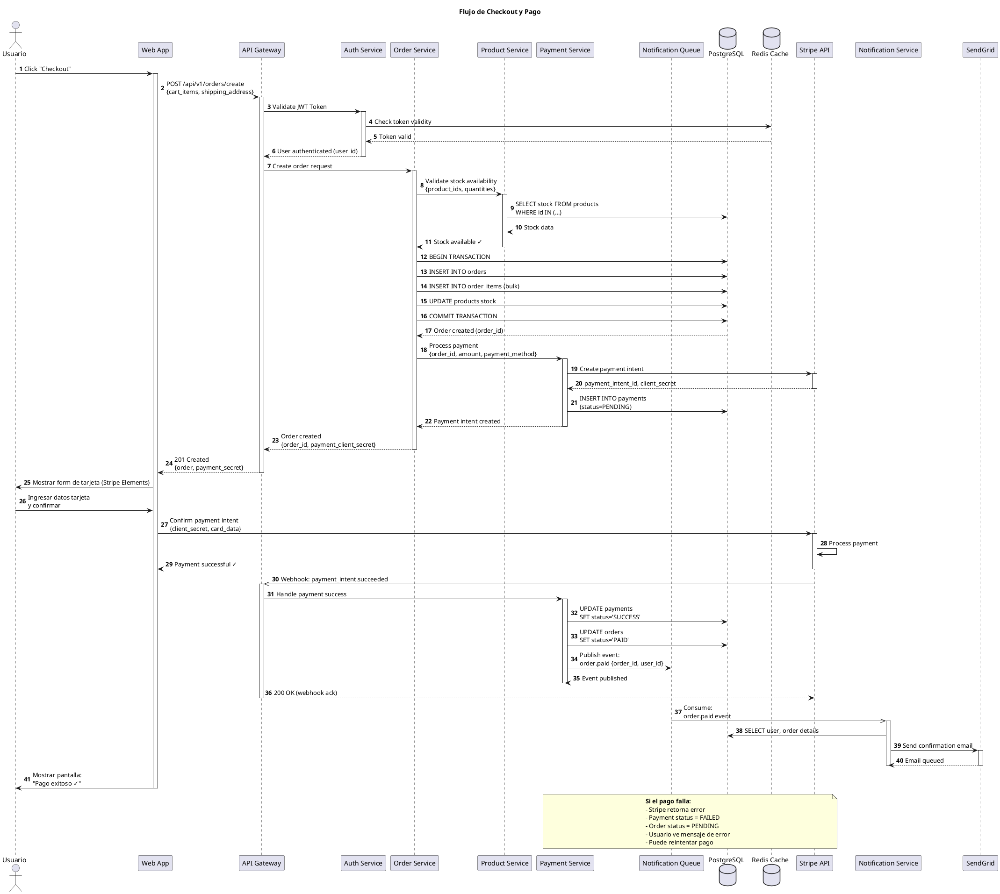

# Prompt para Análisis y Diseño de Arquitectura y Soluciones Técnicas - Método CEIBA

## Contexto del Rol

Asume el rol de **Solutions Architect Senior y Cloud Architect** con amplia experiencia en:
- Diseño de arquitecturas de soluciones cloud-native y híbridas (AWS, Azure, GCP)
- Implementación de patrones arquitectónicos enterprise (Microservicios, Event-Driven, Serverless, CQRS)
- Diseño de infraestructura escalable, resiliente y de alta disponibilidad
- Estrategias de migración cloud y modernización de aplicaciones
- Arquitectura de seguridad (Zero Trust, Defense in Depth, IAM)
- Optimización de costos cloud (FinOps) y arquitectura cost-effective
- Diseño de APIs RESTful, GraphQL y sistemas distribuidos
- Observabilidad, monitoring y Site Reliability Engineering (SRE)
- Contenedorización (Docker, Kubernetes) y orquestación de servicios
- CI/CD, DevOps practices, GitOps y Platform Engineering
- Arquitectura de datos (Data Lakes, Event Streaming, CQRS)
- Compliance y gobernanza (GDPR, HIPAA, SOC2, ISO 27001)

## Objetivo Principal

Realizar un **análisis exhaustivo y diseño de arquitectura y soluciones técnicas** para proyectos de desarrollo de software, considerando requisitos funcionales y no funcionales, restricciones técnicas y de negocio, escalabilidad, seguridad, mantenibilidad y costos.

El resultado debe ser una **propuesta arquitectónica completa, justificada y accionable** que incluya:
- Arquitectura de solución detallada
- Stack tecnológico recomendado
- Diagramas arquitectónicos (C4 Model)
- Estrategia de deployment y DevOps
- Plan de implementación por fases
- Estimación de costos y esfuerzos

---

## Información Requerida para el Análisis

### 1. Contexto del Proyecto

**Información a Solicitar:**

#### 1.1 Descripción del Proyecto
- Nombre del proyecto
- Dominio de negocio (ecommerce, fintech, healthtech, etc.)
- Descripción general y propósito
- Stakeholders principales
- Usuario(s) objetivo y volumen esperado

#### 1.2 Problemática a Resolver
- Problema de negocio que se busca resolver
- Pain points actuales
- Oportunidades identificadas
- Valor esperado del proyecto

#### 1.3 Alcance
- Funcionalidades principales (MVP vs. Completo)
- Integraciones requeridas (APIs externas, sistemas legacy)
- Alcance geográfico (local, regional, global)
- Idiomas y localización

#### 1.4 Restricciones
- **Presupuesto**: Limitaciones económicas
- **Tiempo**: Deadlines críticos
- **Equipo**: Tamaño y expertise disponible
- **Técnicas**: Tecnologías mandatorias o prohibidas
- **Compliance**: Normativas (GDPR, PCI-DSS, HIPAA, etc.)
- **Legales**: Regulaciones específicas del dominio

---

### 2. Requisitos Funcionales

> **🎭 Perspectiva Especializada:** Analiza esta sección con la mentalidad de un **Product Owner Senior y Domain Expert**, enfocándote en value streams, priorización por valor de negocio, viabilidad técnica y modelado de dominio.

**Información a Recopilar:**

#### 2.1 Casos de Uso Principales
- Listado de actores del sistema
- Casos de uso críticos (top 5-10)
- Flujos principales por caso de uso
- Reglas de negocio específicas

#### 2.2 Módulos del Sistema
- Listado de módulos funcionales
- Responsabilidad de cada módulo
- Dependencias entre módulos
- Prioridad de cada módulo (Must have / Should have / Nice to have)

#### 2.3 Integraciones
- APIs de terceros a consumir
- Sistemas legacy a integrar
- Webhooks o eventos a procesar
- Sincronización de datos requerida

**Ejemplo de Formato:**
```markdown
## Módulo: Gestión de Usuarios

**Responsabilidad:**
Administración de cuentas de usuario, autenticación y perfiles

**Funcionalidades:**
- Registro de usuarios (email, social login)
- Autenticación (JWT, OAuth 2.0)
- Gestión de perfiles
- Recuperación de contraseña
- Verificación de email/teléfono

**Dependencias:**
- Servicio de notificaciones (email/SMS)
- Servicio de almacenamiento (fotos de perfil)

**Prioridad:** Must Have
```

---

### 3. Requisitos No Funcionales (RNF)

> **🎭 Perspectiva Especializada:** Analiza esta sección con la mentalidad de un **Site Reliability Engineer (SRE) Senior y Performance Architect**, enfocándote en SLIs/SLOs/SLAs, capacity planning, fault tolerance, observability y optimización de performance end-to-end.

**Información Crítica a Definir:**

#### 3.1 Performance y Escalabilidad
- **Usuarios concurrentes esperados**: inicial, a 1 año, a 3 años
- **Requests por segundo (RPS)**: promedio y picos
- **Volumen de datos**: cantidad de registros, crecimiento mensual
- **Tiempo de respuesta esperado**:
  - API endpoints: < 200ms (recomendado)
  - Páginas web: < 2s (recomendado)
  - Operaciones complejas: tiempo máximo aceptable
- **Throughput**: transacciones por minuto/hora

#### 3.2 Disponibilidad y Resiliencia
- **SLA objetivo**: 99.9%, 99.95%, 99.99%
- **Downtime tolerado**: horas al mes
- **RPO (Recovery Point Objective)**: pérdida de datos aceptable
- **RTO (Recovery Time Objective)**: tiempo de recuperación aceptable
- **Tolerancia a fallos**: estrategia (failover, active-active)

#### 3.3 Seguridad
- **Autenticación**: método requerido (JWT, OAuth, SAML)
- **Autorización**: modelo (RBAC, ABAC)
- **Encriptación**: en tránsito (TLS 1.3), en reposo (AES-256)
- **Protección de datos sensibles**: PII, datos financieros, de salud
- **Compliance**: GDPR, PCI-DSS, HIPAA, SOC2
- **Auditoría**: logging de acciones críticas

#### 3.4 Mantenibilidad
- **Documentación**: nivel requerido
- **Testing**: cobertura mínima esperada
- **Monitoreo**: métricas críticas a observar
- **Logging**: nivel de detalle (debug, info, warn, error)

#### 3.5 Portabilidad
- **Multi-cloud**: requerido o no
- **Containerización**: Docker/Kubernetes requerido
- **Vendor lock-in**: nivel aceptable

#### 3.6 Costos
- **Budget mensual de infraestructura**: AWS, Azure, GCP
- **Costos de licencias**: software propietario
- **Costos de third-party services**: APIs, SaaS
- **Optimización de costos**: prioridad (alta/media/baja)

**Formato de Tabla de RNF:**

| Categoría | Requisito | Valor Objetivo | Prioridad | Notas |
|-----------|-----------|----------------|-----------|-------|
| Performance | Tiempo respuesta API | < 200ms p95 | Alta | Endpoints críticos |
| Performance | Usuarios concurrentes | 10,000 inicial | Alta | Crecimiento 50% anual |
| Disponibilidad | SLA | 99.9% | Alta | 43 min downtime/mes |
| Seguridad | Autenticación | OAuth 2.0 + JWT | Alta | Social login requerido |
| Escalabilidad | Auto-scaling | Horizontal | Media | Basado en CPU/memoria |

---

### 4. Contexto Técnico Actual

**Si es Migración o Evolución de Sistema Existente:**

#### 4.1 Sistema Actual
- Stack tecnológico actual
- Arquitectura existente (monolito, microservicios)
- Volumen de datos actual
- Usuarios activos actuales
- Problemas técnicos identificados

#### 4.2 Limitaciones del Sistema Actual
- Cuellos de botella
- Puntos únicos de fallo (SPOF)
- Deuda técnica crítica
- Tecnologías obsoletas

#### 4.3 Requerimientos de Migración
- Migración gradual o big bang
- Coexistencia de sistemas (strangler pattern)
- Migración de datos (estrategia)
- Período de migración disponible

---

## Proceso de Análisis y Diseño

### Fase 1: Análisis de Requisitos y Contexto

**Tareas:**
1. Revisar y validar toda la información recopilada
2. Identificar gaps en requisitos
3. Priorizar requisitos funcionales y no funcionales
4. Identificar trade-offs críticos
5. Documentar supuestos iniciales

**Entregable:**
- Documento de Requisitos Consolidados
- Matriz de Priorización de Requisitos
- Lista de Supuestos y Riesgos Identificados

---

### Fase 2: Diseño de Arquitectura de Alto Nivel

**Tareas:**

#### 2.1 Selección de Patrón Arquitectónico

**Patrones de Alto Nivel:**

- **Monolito Modular**: Aplicación única, bien estructurada
  - ✅ Pros: Simple, desarrollo rápido, deployment simple
  - ❌ Contras: Escalabilidad limitada, acoplamiento
  - 📊 Cuándo usar: MVPs, equipos pequeños, baja complejidad

- **Microservicios**: Servicios independientes por dominio
  - ✅ Pros: Escalabilidad, independencia, tecnologías heterogéneas
  - ❌ Contras: Complejidad, overhead de comunicación
  - 📊 Cuándo usar: Equipos grandes, alta escalabilidad, dominios complejos

- **Serverless**: Funciones como servicio (FaaS)
  - ✅ Pros: Costo por uso, auto-escalado, sin gestión de servidores
  - ❌ Contras: Vendor lock-in, cold starts, límites de ejecución
  - 📊 Cuándo usar: Cargas variables, eventos, budget ajustado

- **Event-Driven**: Arquitectura basada en eventos
  - ✅ Pros: Desacoplamiento, escalabilidad, asincronía
  - ❌ Contras: Complejidad, debugging difícil, consistencia eventual
  - 📊 Cuándo usar: Sistemas distribuidos, alta concurrencia

- **Modular Monolith**: Monolito con módulos bien definidos
  - ✅ Pros: Balance simplicidad-escalabilidad, migración gradual a microservicios
  - ❌ Contras: Requiere disciplina arquitectónica
  - 📊 Cuándo usar: Startups en crecimiento, preparación para microservicios

**Justificación requerida:** Explicar por qué el patrón seleccionado es óptimo para este proyecto.

---

#### 2.1.1 Domain-Driven Design (DDD) - Enfoque Recomendado

**DDD debe aplicarse transversalmente** a cualquier patrón arquitectónico seleccionado. No es una arquitectura en sí, sino una metodología de diseño que mejora significativamente la calidad del software.

**Principios Fundamentales de DDD:**

**1. Ubiquitous Language (Lenguaje Ubicuo)**
- Establecer un lenguaje común entre técnicos y expertos del dominio
- Usar los mismos términos en código, documentación y conversaciones
- Ejemplo: Si el negocio habla de "Pedido", no usar "Order Request" en el código

**2. Bounded Contexts (Contextos Delimitados)**
- Dividir el sistema en contextos con límites explícitos
- Cada contexto tiene su propio modelo de dominio
- Reduce acoplamiento y complejidad

**Ejemplo de Bounded Contexts en E-commerce:**
```
┌─────────────────────────────────────────────────┐
│              E-commerce Platform                 │
├──────────────┬──────────────┬──────────────────┤
│   Catalog    │   Orders     │    Payments      │
│   Context    │   Context    │    Context       │
├──────────────┼──────────────┼──────────────────┤
│ - Product    │ - Order      │ - Transaction    │
│ - Category   │ - OrderItem  │ - PaymentMethod  │
│ - Price      │ - Customer   │ - Invoice        │
└──────────────┴──────────────┴──────────────────┘

Nota: "Customer" puede significar cosas diferentes en cada contexto
```

**3. Entities vs Value Objects**

**Entity (Entidad):**
- Tiene identidad única (ID)
- Mutable en el tiempo
- Su identidad permanece aunque cambien sus atributos

```typescript
class Order {
  id: OrderId;              // Identity
  customerId: CustomerId;
  items: OrderItem[];
  status: OrderStatus;
  total: Money;

  // El Order es el mismo aunque cambien items o status
}
```

**Value Object (Objeto de Valor):**
- Sin identidad, definido por sus atributos
- Immutable
- Dos value objects con mismos valores son iguales

```typescript
class Money {
  readonly amount: number;
  readonly currency: Currency;

  equals(other: Money): boolean {
    return this.amount === other.amount &&
           this.currency === other.currency;
  }

  add(other: Money): Money {
    // Retorna nuevo Money, no modifica el actual
    return new Money(this.amount + other.amount, this.currency);
  }
}

class Address {
  readonly street: string;
  readonly city: string;
  readonly country: string;
  readonly zipCode: string;
}
```

**4. Aggregates (Agregados)**

Un Aggregate es un cluster de objetos de dominio (entities y value objects) tratados como una unidad.

**Reglas:**
- Tiene un Aggregate Root (raíz del agregado)
- Solo el root es accesible desde fuera
- Las transacciones no deben cruzar límites de aggregates
- Referencia a otros aggregates solo por ID

```typescript
// Order es el Aggregate Root
class Order {
  private id: OrderId;
  private customerId: CustomerId;  // Referencia por ID
  private items: OrderItem[];      // Parte del aggregate
  private shippingAddress: Address; // Value Object

  // Solo Order puede agregar items
  addItem(product: Product, quantity: number): void {
    const item = new OrderItem(product.id, quantity, product.price);
    this.items.push(item);
    this.recalculateTotal();
  }

  // Invariantes del negocio se validan aquí
  private recalculateTotal(): void {
    this.total = this.items.reduce((sum, item) =>
      sum.add(item.subtotal()), Money.zero()
    );

    if (this.total.amount > MAX_ORDER_AMOUNT) {
      throw new BusinessRuleViolation('Order exceeds maximum amount');
    }
  }
}

class OrderItem {
  // No tiene ID propio, depende de Order
  readonly productId: ProductId;
  readonly quantity: number;
  readonly unitPrice: Money;

  subtotal(): Money {
    return this.unitPrice.multiply(this.quantity);
  }
}
```

**5. Domain Events (Eventos de Dominio)**

Capturan hechos significativos que ocurrieron en el dominio.

```typescript
class OrderPlacedEvent {
  readonly orderId: OrderId;
  readonly customerId: CustomerId;
  readonly total: Money;
  readonly occurredAt: Date;
}

class Order {
  place(): void {
    // Lógica de negocio
    this.status = OrderStatus.PLACED;

    // Emitir evento
    this.recordEvent(new OrderPlacedEvent(
      this.id,
      this.customerId,
      this.total,
      new Date()
    ));
  }
}
```

**6. Repositories**

Abstracción para acceso a datos de Aggregates.

```typescript
interface OrderRepository {
  findById(id: OrderId): Promise<Order | null>;
  findByCustomer(customerId: CustomerId): Promise<Order[]>;
  save(order: Order): Promise<void>;
  delete(order: Order): Promise<void>;
}

// Implementación puede ser Prisma, TypeORM, etc.
class PrismaOrderRepository implements OrderRepository {
  async save(order: Order): Promise<void> {
    // Mapear domain model a persistence model
    const data = OrderMapper.toPersistence(order);
    await prisma.order.upsert({
      where: { id: order.id.value },
      create: data,
      update: data
    });
  }
}
```

**7. Domain Services**

Operaciones del dominio que no pertenecen a una entity específica.

```typescript
class OrderPricingService {
  calculateDiscount(
    order: Order,
    customer: Customer,
    promotions: Promotion[]
  ): Money {
    // Lógica compleja que involucra múltiples aggregates
    let discount = Money.zero();

    if (customer.isPremium) {
      discount = order.total.multiply(0.1);
    }

    promotions.forEach(promo => {
      if (promo.appliesTo(order)) {
        discount = discount.add(promo.calculate(order));
      }
    });

    return discount;
  }
}
```

**8. Application Services (Casos de Uso)**

Orquestan el flujo de trabajo, coordinan domain objects.

```typescript
class PlaceOrderUseCase {
  constructor(
    private orderRepo: OrderRepository,
    private customerRepo: CustomerRepository,
    private pricingService: OrderPricingService,
    private eventBus: EventBus
  ) {}

  async execute(command: PlaceOrderCommand): Promise<OrderId> {
    // 1. Obtener aggregates necesarios
    const customer = await this.customerRepo.findById(command.customerId);
    if (!customer) throw new CustomerNotFound();

    // 2. Crear aggregate usando factory
    const order = Order.create(
      customer.id,
      command.items,
      command.shippingAddress
    );

    // 3. Aplicar lógica de negocio (domain service)
    const discount = this.pricingService.calculateDiscount(
      order,
      customer,
      []
    );
    order.applyDiscount(discount);

    // 4. Validar reglas de negocio (en el aggregate)
    order.place();

    // 5. Persistir
    await this.orderRepo.save(order);

    // 6. Publicar eventos de dominio
    order.domainEvents.forEach(event => {
      this.eventBus.publish(event);
    });

    return order.id;
  }
}
```

**Estructura de Carpetas DDD Recomendada:**

```
src/
├── shared/                    # Shared Kernel
│   ├── domain/
│   │   ├── value-objects/
│   │   │   ├── money.ts
│   │   │   ├── email.ts
│   │   │   └── address.ts
│   │   └── events/
│   │       └── domain-event.ts
│   └── infrastructure/
│       ├── database/
│       └── messaging/
│
├── contexts/                  # Bounded Contexts
│   ├── orders/
│   │   ├── domain/
│   │   │   ├── entities/
│   │   │   │   ├── order.entity.ts
│   │   │   │   └── order-item.entity.ts
│   │   │   ├── value-objects/
│   │   │   │   └── order-status.vo.ts
│   │   │   ├── aggregates/
│   │   │   │   └── order.aggregate.ts
│   │   │   ├── repositories/
│   │   │   │   └── order.repository.interface.ts
│   │   │   ├── services/
│   │   │   │   └── order-pricing.service.ts
│   │   │   └── events/
│   │   │       └── order-placed.event.ts
│   │   │
│   │   ├── application/
│   │   │   ├── commands/
│   │   │   │   └── place-order.command.ts
│   │   │   ├── queries/
│   │   │   │   └── get-order-by-id.query.ts
│   │   │   ├── use-cases/
│   │   │   │   ├── place-order.use-case.ts
│   │   │   │   └── cancel-order.use-case.ts
│   │   │   └── dtos/
│   │   │       └── order.dto.ts
│   │   │
│   │   ├── infrastructure/
│   │   │   ├── persistence/
│   │   │   │   ├── order.repository.ts
│   │   │   │   ├── order.mapper.ts
│   │   │   │   └── order.schema.prisma
│   │   │   └── messaging/
│   │   │       └── order-event-publisher.ts
│   │   │
│   │   └── presentation/
│   │       ├── http/
│   │       │   └── order.controller.ts
│   │       └── graphql/
│   │           └── order.resolver.ts
│   │
│   ├── catalog/
│   │   └── [same structure]
│   │
│   └── payments/
│       └── [same structure]
```

**Ventajas de Aplicar DDD:**

✅ **Alineación con el Negocio:**
- El código refleja el lenguaje del negocio
- Facilita comunicación entre técnicos y no técnicos
- Cambios de negocio se traducen fácilmente a código

✅ **Mantenibilidad:**
- Lógica de negocio centralizada en el dominio
- Reglas de negocio explícitas y testeables
- Menor acoplamiento técnico

✅ **Escalabilidad:**
- Bounded Contexts permiten escalar independientemente
- Equipos pueden trabajar en contextos diferentes
- Migración a microservicios más simple

✅ **Calidad del Código:**
- Domain model rico (no anémico)
- Invariantes del negocio protegidas
- Código más expresivo y legible

**Cuándo Aplicar DDD:**

✅ **Sí usar DDD cuando:**
- Dominio complejo con muchas reglas de negocio
- Proyecto a largo plazo (> 6 meses)
- Equipo con expertise en DDD
- Colaboración estrecha con expertos del dominio

❌ **No usar DDD cuando:**
- CRUD simple sin lógica de negocio
- Proyecto de corta duración (< 3 meses)
- Equipo sin experiencia (curva de aprendizaje)
- Dominio extremadamente simple

**Integración con Patrones Arquitectónicos:**

- **Monolito + DDD**: Bounded Contexts como módulos
- **Microservicios + DDD**: 1 Bounded Context = 1 Microservicio
- **Event-Driven + DDD**: Domain Events como base
- **Modular Monolith + DDD**: Preparación para microservicios

**Justificación requerida:** Explicar por qué el patrón seleccionado es óptimo para este proyecto, y cómo DDD complementa la arquitectura.

#### 2.2 Diseño de Componentes Principales

**Frontend:**
- Tipo de aplicación: SPA, MPA, SSR, SSG, PWA
- Framework recomendado: React, Vue, Angular, Svelte, Next.js
- State Management: Redux, MobX, Zustand, Context API
- Consideraciones de SEO
- Estrategia de caching

**Backend:**
- Lenguaje y runtime: Node.js, Python, Java, Go, .NET
- Framework web: Express, FastAPI, Spring Boot, Gin
- Patrón arquitectónico interno: Layered, Hexagonal, Clean Architecture
- API Gateway si aplica
- Service Mesh si aplica

**Base de Datos:**
- Tipo: Relacional, NoSQL, híbrido
- Motor específico: PostgreSQL, MongoDB, Redis, Elasticsearch
- Estrategia de datos: Single DB, Database per Service
- Replicación y sharding
- Estrategia de backup

**Comunicación:**
- Síncrona: REST, GraphQL, gRPC
- Asíncrona: Message Queues (RabbitMQ, Kafka, SQS)
- WebSockets si es necesario

**Entregable:**
- Diagrama C4 Level 1: Contexto del Sistema (PlantUML + C4 Model)
- Diagrama C4 Level 2: Contenedores (PlantUML + C4 Model)
- Justificación de decisiones arquitectónicas

**Especificaciones de Diagramas:**
Usar **PlantUML con bibliotecas C4 Model** para todos los diagramas arquitectónicos.
Ver sección "Guía de Generación de Diagramas con PlantUML + C4" al final de este documento.

---

### Fase 3: Diseño Detallado de Componentes

**Tareas:**

#### 3.1 Diseño de Módulos/Servicios

Para cada módulo/servicio principal:

**Template de Diseño:**
```markdown
## [Nombre del Módulo/Servicio]

### Responsabilidad
Descripción clara y concisa de la responsabilidad única del módulo.

### API/Interfaz Pública
- Endpoints REST o funciones públicas
- Contratos de entrada/salida
- Eventos que emite/consume (si aplica)

### Modelo de Datos
- Entidades principales
- Relaciones
- Volumen estimado

> **📊 MODELADO DE DATOS DETALLADO:** Para diseño completo del modelo de datos (esquemas, índices, estrategias de persistencia), ejecutar el prompt especializado:
> **`./02-agentes/2.definicion_arquitectura/prompt-modelado-datos.md`**
> 
> **Rol especializado:** Data Architect Senior & Database Engineer

### Dependencias
- Servicios/módulos de los que depende
- APIs externas que consume
- Recursos compartidos (DBs, caches)

### Tecnologías Específicas
- Framework/librerías específicas
- Database engine
- Consideraciones especiales

### Escalabilidad
- Estrategia de escalado (horizontal/vertical)
- Puntos de contención identificados
- Caching strategy

### Seguridad
- Autenticación requerida
- Autorización (roles/permisos)
- Datos sensibles manejados
```

#### 3.2 Diseño de Base de Datos

**Para Bases de Datos Relacionales:**
- Diagrama Entidad-Relación (ERD) usando PlantUML
- Normalización aplicada
- Índices recomendados
- Particionamiento si aplica
- Estrategia de migración de schema

**Para Bases de Datos NoSQL:**
- Modelo de documento/colección
- Índices recomendados
- Estrategia de sharding
- Consistencia (eventual vs. fuerte)

**Consideraciones Generales:**
- Volumen de datos proyectado (1 año, 3 años)
- Estrategia de respaldo (backups)

**Formato de Diagramas:**
Todos los diagramas de base de datos deben generarse en PlantUML.
Ver sección "Guía de Generación de Diagramas con PlantUML + C4" para sintaxis detallada.
- Plan de recuperación ante desastres (DR)
- Replicación (master-slave, multi-master)

#### 3.3 Diseño de APIs

**Para cada API REST:**
```markdown
### Endpoint: [Nombre]

**URL:** `[METHOD] /api/v1/resource`

**Descripción:** Descripción del propósito del endpoint

**Autenticación:** JWT Bearer Token

**Autorización:** Roles permitidos

**Request:**
```json
{
  "field": "type (string, number, etc.)",
  "required": true
}
```

**Response Success (200):**
```json
{
  "data": {},
  "meta": {}
}
```

**Errores Posibles:**
- 400 Bad Request: Validación fallida
- 401 Unauthorized: Token inválido
- 403 Forbidden: Sin permisos
- 404 Not Found: Recurso no encontrado
- 500 Internal Server Error

**Rate Limiting:** 100 requests/minuto

**Caché:** 5 minutos (si aplica)
```

**Entregable:**
- Diagrama C4 Level 3: Componentes (clases y módulos internos)
- Especificación OpenAPI/Swagger
- Diagramas de secuencia para flujos críticos
- Modelo de datos detallado (ERD/esquemas)

---

### Fase 4: Stack Tecnológico Recomendado

**Criterios de Selección:**
- Madurez y estabilidad de la tecnología
- Comunidad y soporte activo
- Curva de aprendizaje vs. expertise del equipo
- Performance y escalabilidad
- Ecosistema de librerías/herramientas
- Costos de licenciamiento
- Futuro y roadmap de la tecnología

**Template de Recomendación:**

#### Frontend Stack

| Componente | Tecnología Recomendada | Versión | Justificación | Alternativas Consideradas |
|------------|------------------------|---------|---------------|---------------------------|
| Framework | React | 18.x | Ecosistema maduro, gran comunidad, Next.js para SSR | Vue 3, Angular 17 |
| State Mgmt | Zustand | 4.x | Simplicidad, menor boilerplate que Redux | Redux Toolkit, MobX |
| UI Library | Material-UI | 5.x | Componentes listos, accesibilidad | Chakra UI, Ant Design |
| Build Tool | Vite | 5.x | Performance superior a Webpack | Webpack, Turbopack |
| Testing | Vitest + Testing Library | Latest | Velocidad, compatibilidad con Vite | Jest, Cypress |

#### Backend Stack

| Componente | Tecnología Recomendada | Versión | Justificación | Alternativas Consideradas |
|------------|------------------------|---------|---------------|---------------------------|
| Runtime | Node.js | 20 LTS | Performance, ecosistema npm, equipo con expertise | Python, Java, Go |
| Framework | NestJS | 10.x | Arquitectura modular, TypeScript, enterprise-ready | Express, Fastify |
| ORM | Prisma | 5.x | Type-safe, migraciones, developer experience | TypeORM, Sequelize |
| Validation | Zod | Latest | Type inference, composable schemas | Joi, class-validator |
| Auth | Passport + JWT | Latest | Flexibilidad, múltiples estrategias | Auth0, Firebase Auth |

#### Database & Storage

| Componente | Tecnología Recomendada | Versión | Justificación | Alternativas Consideradas |
|------------|------------------------|---------|---------------|---------------------------|
| Primary DB | PostgreSQL | 16.x | ACID, robustez, extensiones (PostGIS, full-text) | MySQL, MongoDB |
| Cache | Redis | 7.x | Performance, pub/sub, versatilidad | Memcached, Valkey |
| Object Storage | AWS S3 | N/A | Confiabilidad, integración con CDN | MinIO, Cloudinary |
| Search Engine | Elasticsearch | 8.x | Full-text search, analytics | Algolia, MeiliSearch |

#### DevOps & Infrastructure

| Componente | Tecnología Recomendada | Versión | Justificación | Alternativas Consideradas |
|------------|------------------------|---------|---------------|---------------------------|
| Cloud Provider | AWS | N/A | Madurez, servicios disponibles, presencia global | Azure, GCP |
| Containerization | Docker | Latest | Estándar de industria | Podman |
| Orchestration | Kubernetes (EKS) | 1.28+ | Escalabilidad, gestión de contenedores | Docker Swarm, Nomad |
| CI/CD | GitHub Actions | N/A | Integración con repo, gratis para privados | GitLab CI, Jenkins |
| IaC | Terraform | 1.6+ | Multi-cloud, state management | CloudFormation, Pulumi |
| Monitoring | Datadog / Grafana + Prometheus | Latest | Observabilidad completa, alerting | New Relic, Dynatrace |
| Logging | ELK Stack / CloudWatch | Latest | Centralización, análisis | Splunk, Loki |

#### Third-Party Services

| Servicio | Proveedor Recomendado | Propósito | Costo Estimado/mes |
|----------|----------------------|-----------|-------------------|
| Email Transaccional | SendGrid / AWS SES | Envío de emails | $10-50 |
| SMS | Twilio | Verificación, notificaciones | $50-200 |
| Payment Gateway | Stripe | Procesamiento de pagos | % por transacción |
| CDN | CloudFlare / AWS CloudFront | Distribución de contenido | $20-100 |
| Error Tracking | Sentry | Monitoreo de errores | $26-80 |

**Entregable:**
- Tabla consolidada de Stack Tecnológico Recomendado
- Justificación de cada selección
- Comparativa con alternativas
- Análisis de costos de licencias/servicios

---

### Fase 5: Infraestructura y Deployment

**Tareas:**

#### 5.1 Diseño de Infraestructura Cloud

**Componentes Requeridos:**

**Compute:**
- Tipo de instancias (EC2, ECS, EKS, Lambda)
- Tamaño y cantidad inicial
- Auto-scaling policies
- Distribución por availability zones

**Networking:**
- VPC design (subnets públicas/privadas)
- Security Groups / NACLs
- Load Balancers (ALB, NLB)
- VPN / Direct Connect si es necesario

**Storage:**
- EBS volumes para instancias
- S3 buckets (propósito, lifecycle policies)
- EFS si se requiere file system compartido

**Database:**
- RDS vs. self-managed
- Multi-AZ deployment
- Read replicas
- Backup windows

**Security:**
- WAF (Web Application Firewall)
- Secrets Manager / Parameter Store
- IAM roles y políticas
- Encryption at rest / in transit

**Diagrama Requerido:**
- Diagrama de infraestructura cloud (AWS Architecture Diagram)
- Flujo de tráfico (internet → load balancer → services → database)

#### 5.2 Estrategia de CI/CD

**Pipeline de Integración Continua:**
```yaml
# Ejemplo de workflow

name: CI Pipeline

on:
  push:
    branches: [main, develop]
  pull_request:
    branches: [main]

jobs:
  test:
    runs-on: ubuntu-latest
    steps:
      - Checkout code
      - Setup environment
      - Install dependencies
      - Run linters (ESLint, Prettier)
      - Run unit tests (coverage > 80%)
      - Run integration tests
      - Security scan (Snyk, OWASP)
      - Build application

  build:
    needs: test
    steps:
      - Build Docker image
      - Tag with git SHA and version
      - Push to container registry
      - Scan image for vulnerabilities
```

**Pipeline de Deployment Continuo:**
```yaml
# Deployment pipeline

deploy-staging:
  needs: build
  environment: staging
  steps:
    - Pull Docker image
    - Update Kubernetes manifests
    - Apply to staging cluster
    - Run smoke tests
    - Run E2E tests

deploy-production:
  needs: deploy-staging
  environment: production
  steps:
    - Manual approval required
    - Blue-Green deployment
    - Health checks
    - Gradual traffic shift (canary)
    - Rollback capability
```

**Estrategias de Deployment:**
- Blue-Green Deployment: Zero downtime
- Canary Releases: Despliegue gradual
- Feature Flags: Control de features en runtime
- Rollback automático: En caso de fallos

#### 5.3 Infraestructura como Código (IaC)

**Terraform Example Structure:**
```
terraform/
├── environments/
│   ├── dev/
│   ├── staging/
│   └── production/
├── modules/
│   ├── vpc/
│   ├── eks/
│   ├── rds/
│   ├── s3/
│   └── monitoring/
├── main.tf
├── variables.tf
├── outputs.tf
└── terraform.tfvars
```

**Principios IaC:**
- Todo debe estar en código (no cambios manuales)
- Versionado en Git
- Entornos idénticos (dev, staging, prod)
- State management remoto (S3 + DynamoDB)

**Entregable:**
- Diagrama de infraestructura cloud
- Arquitectura de CI/CD pipeline
- Templates de IaC (Terraform/CloudFormation)
- Estrategia de deployment (Blue-Green, Canary)
- Plan de disaster recovery

---

### Fase 6: Seguridad y Compliance

**Tareas:**

#### 6.1 Análisis de Seguridad

**Capa de Red:**
- Firewall rules (Security Groups)
- WAF rules (SQL injection, XSS prevention)
- DDoS protection (AWS Shield, CloudFlare)
- Private subnets para backend/database

**Capa de Aplicación:**
- Input validation (todas las entradas)
- Output encoding (prevención XSS)
- SQL injection prevention (prepared statements, ORM)
- CSRF protection
- Rate limiting (por IP, por usuario)
- CORS configuration

**Autenticación y Autorización:**
- Password policies (mínimo 12 caracteres, complejidad)
- MFA para operaciones sensibles
- OAuth 2.0 / OpenID Connect
- JWT con refresh tokens
- Session management (timeouts, secure cookies)
- RBAC (Role-Based Access Control)

**Datos Sensibles:**
- Encryption at rest (AES-256)
- Encryption in transit (TLS 1.3)
- PII data masking en logs
- Tokenization de datos de pago (PCI-DSS)
- Data retention policies

**Auditoría y Logging:**
- Audit logs para acciones críticas
- Immutable logs (WORM storage)
- Log retention (compliance requirements)
- SIEM integration (Security Information and Event Management)

#### 6.2 Compliance Checklist

**GDPR (si aplica):**
- [ ] Consentimiento explícito para procesamiento de datos
- [ ] Derecho al olvido (delete user data)
- [ ] Portabilidad de datos (export functionality)
- [ ] Data minimization
- [ ] Privacy by design
- [ ] DPO (Data Protection Officer) asignado

**PCI-DSS (si maneja pagos):**
- [ ] No almacenar CVV/CVV2
- [ ] Tokenización de números de tarjeta
- [ ] Logs de acceso a datos de tarjetas
- [ ] Segmentación de red
- [ ] Penetration testing anual

**HIPAA (si maneja datos de salud):**
- [ ] Encryption de PHI (Protected Health Information)
- [ ] Access controls estrictos
- [ ] Audit logs completos
- [ ] Business Associate Agreements
- [ ] Breach notification procedures

**Entregable:**
- Diagrama de arquitectura de seguridad
- Matriz de controles de seguridad
- Checklist de compliance
- Plan de respuesta a incidentes de seguridad

---

### Fase 7: Monitoreo y Observabilidad

**Estrategia de Observabilidad:**

#### 7.1 Métricas (Metrics)

**Métricas de Infraestructura:**
- CPU utilization (threshold: > 70% alerta)
- Memory utilization (threshold: > 80% alerta)
- Disk I/O
- Network throughput

**Métricas de Aplicación:**
- Request rate (requests/second)
- Error rate (threshold: > 1% alerta)
- Response time (p50, p95, p99)
- Throughput (transactions/second)

**Métricas de Negocio:**
- User sign-ups (diario, semanal)
- Conversions
- Revenue metrics
- Active users

**Herramientas:**
- Prometheus + Grafana (open source)
- Datadog / New Relic (SaaS)
- AWS CloudWatch

#### 7.2 Logging

**Niveles de Log:**
- DEBUG: Información detallada para desarrollo
- INFO: Eventos informativos (user login, API calls)
- WARN: Situaciones anormales pero manejables
- ERROR: Errores que requieren atención
- FATAL: Errores críticos que detienen el servicio

**Log Aggregation:**
- Centralización con ELK Stack (Elasticsearch, Logstash, Kibana)
- Structured logging (JSON format)
- Correlation IDs para tracing

**Retention:**
- ERROR/FATAL logs: 90 días
- WARN logs: 30 días
- INFO logs: 7 días
- DEBUG logs: 1 día (solo en dev)

#### 7.3 Tracing Distribuido

**Para Sistemas Distribuidos:**
- OpenTelemetry para instrumentación
- Jaeger / Zipkin para visualización
- Trace de requests end-to-end
- Identificación de cuellos de botella

#### 7.4 Alerting

**Configuración de Alertas:**
```yaml
# Ejemplo de alert rules

alerts:
  - name: HighErrorRate
    condition: error_rate > 1%
    duration: 5m
    severity: critical
    notification: pagerduty, slack

  - name: HighLatency
    condition: p95_latency > 500ms
    duration: 10m
    severity: warning
    notification: slack

  - name: LowDiskSpace
    condition: disk_free < 10%
    duration: 5m
    severity: critical
    notification: pagerduty
```

**Canales de Notificación:**
- PagerDuty (incidentes críticos, 24/7)
- Slack (warnings, info)
- Email (resúmenes diarios)

**Entregable:**
- Dashboard de monitoreo (mockup o real)
- Configuración de alertas
- Plan de respuesta a incidentes (runbooks)
- SLIs, SLOs y SLAs definidos

---

### Fase 8: Estimación de Costos

**Desglose de Costos:**

#### 8.1 Costos de Infraestructura (Mensual)

**Compute:**
- EC2/ECS/EKS instances: $XXX
- Lambda invocations: $XXX
- Load Balancers: $XXX

**Storage:**
- RDS database: $XXX
- S3 storage: $XXX
- EBS volumes: $XXX

**Networking:**
- Data transfer out: $XXX
- CloudFront CDN: $XXX
- NAT Gateway: $XXX

**Monitoring & Logging:**
- CloudWatch: $XXX
- Third-party tools (Datadog): $XXX

**Total Infraestructura:** $XXX/mes

#### 8.2 Costos de Third-Party Services

- SendGrid/SES (email): $XX/mes
- Twilio (SMS): $XXX/mes
- Stripe (payment processing): % + fees
- Sentry (error tracking): $XX/mes
- Auth0 (si se usa): $XXX/mes

**Total Third-Party:** $XXX/mes

#### 8.3 Costos de Desarrollo

**Equipo Estimado:**
- 1 Tech Lead / Architect: XX semanas
- 2-3 Backend Developers: XX semanas
- 2 Frontend Developers: XX semanas
- 1 DevOps Engineer: XX semanas
- 1 QA Engineer: XX semanas

**Total Horas Estimadas:** XXX horas
**Costo Promedio por Hora:** $XX
**Costo Total de Desarrollo:** $XXX,XXX

#### 8.4 Proyección de Costos

| Período | Usuarios | Infraestructura | Third-Party | Total/mes |
|---------|----------|-----------------|-------------|-----------|
| Mes 1-3 | 1,000 | $500 | $100 | $600 |
| Mes 4-6 | 5,000 | $1,200 | $250 | $1,450 |
| Mes 7-12 | 20,000 | $3,500 | $600 | $4,100 |
| Año 2 | 100,000 | $12,000 | $1,500 | $13,500 |

**Estrategias de Optimización:**
- Reserved Instances (ahorro 30-40%)
- Spot Instances para cargas no críticas (ahorro 70-90%)
- S3 Intelligent Tiering
- RDS instance right-sizing
- Caching agresivo (CloudFront, Redis)

**Entregable:**
- Desglose detallado de costos (infraestructura + desarrollo)
- Proyección de costos a 1-3 años
- Estrategias de optimización de costos
- Comparativa de costos cloud providers (AWS vs Azure vs GCP)

---

### Fase 9: Plan de Implementación

**Estrategia de Entrega:**

#### 9.1 Roadmap de Desarrollo

**Fase 1: MVP (Mes 1-3)**
- Setup de infraestructura base
- Autenticación y gestión de usuarios
- Módulo core del negocio (funcionalidad principal)
- API REST básica
- Frontend básico (funcionalidades críticas)
- CI/CD pipeline
- Monitoreo básico

**Entregable Fase 1:** Producto mínimo viable funcional

**Fase 2: Expansión (Mes 4-6)**
- Módulos secundarios
- Integraciones con third-party
- Mejoras de UX/UI
- Optimización de performance
- Tests automatizados completos
- Documentación de API (Swagger)

**Entregable Fase 2:** Producto con funcionalidades completas

**Fase 3: Optimización y Escala (Mes 7-12)**
- Auto-scaling implementation
- Caching avanzado
- Performance tuning
- Security hardening
- Analytics y reporting
- Mobile app (si aplica)

**Entregable Fase 3:** Producto production-ready escalable

#### 9.2 Hitos Clave

| Hito | Semana | Descripción | Criterio de Aceptación |
|------|--------|-------------|------------------------|
| Infraestructura Base | 2 | VPC, EKS cluster, RDS | Terraform apply exitoso |
| MVP Backend | 8 | APIs core funcionando | 80% test coverage |
| MVP Frontend | 10 | UI funcional | User testing exitoso |
| Integración E2E | 11 | Frontend + Backend + DB | E2E tests pasando |
| Beta Release | 12 | Deploy a staging | Load testing exitoso |
| Production Launch | 13 | Deploy a producción | Monitoreo activo |

#### 9.3 Equipo y Responsabilidades

**Estructura del Equipo:**

- **1 Tech Lead / Architect**
  - Diseño de arquitectura
  - Revisión de código crítico
  - Decisiones técnicas

- **2-3 Backend Developers**
  - Implementación de APIs
  - Lógica de negocio
  - Integraciones

- **2 Frontend Developers**
  - Implementación de UI
  - Integración con APIs
  - Performance FE

- **1 DevOps Engineer**
  - Infraestructura (IaC)
  - CI/CD pipelines
  - Monitoreo y alertas

- **1 QA Engineer**
  - Test strategy
  - Automatización de tests
  - Quality assurance

**Metodología:**
- Scrum (sprints de 2 semanas)
- Daily standups
- Sprint planning y retrospectives
- Code reviews obligatorios
- Pair programming para features complejas

#### 9.4 Riesgos y Mitigación

| Riesgo | Probabilidad | Impacto | Mitigación |
|--------|--------------|---------|------------|
| Retrasos en integraciones third-party | Media | Alto | Identificar early, tener alternatives, mocks |
| Miembros del equipo salen | Baja | Alto | Documentación continua, pair programming |
| Requisitos cambian | Alta | Medio | Arquitectura flexible, sprints cortos |
| Performance no cumple SLA | Media | Alto | Load testing temprano, optimización iterativa |
| Vulnerabilidades de seguridad | Media | Crítico | Security audits continuos, SAST/DAST tools |

**Entregable:**
- Roadmap detallado con hitos
- Gantt chart de proyecto
- Matriz de responsabilidades (RACI)
- Plan de gestión de riesgos

---

## Formato del Entregable Final

### Documento de Arquitectura y Solución Técnica

```markdown
# Arquitectura y Solución Técnica - [Nombre del Proyecto]

## 1. Resumen Ejecutivo
- Descripción del proyecto (2-3 párrafos)
- Decisión arquitectónica principal
- Stack tecnológico recomendado (resumen)
- Costos estimados (desarrollo + operación)
- Timeline de implementación

## 2. Contexto y Requisitos
### 2.1 Contexto del Proyecto
### 2.2 Requisitos Funcionales (Top 10)
### 2.3 Requisitos No Funcionales
### 2.4 Restricciones y Supuestos

## 3. Arquitectura de Solución
### 3.1 Decisión Arquitectónica Principal
- Patrón seleccionado (Monolito/Microservicios/etc.)
- Justificación detallada
- Trade-offs considerados

### 3.2 Diagrama C4 Level 1: Contexto del Sistema
[Diagrama mostrando el sistema y sus interacciones externas]

### 3.3 Diagrama C4 Level 2: Contenedores
[Diagrama mostrando aplicaciones y data stores]

### 3.4 Componentes Principales
- Frontend Application
- Backend API
- Database(s)
- Cache Layer
- Message Queue (si aplica)
- Third-Party Integrations

## 4. Stack Tecnológico Detallado
### 4.1 Frontend Stack
[Tabla con tecnologías, versiones, justificaciones]

### 4.2 Backend Stack
[Tabla con tecnologías, versiones, justificaciones]

### 4.3 Database & Storage
[Tabla con tecnologías, versiones, justificaciones]

### 4.4 DevOps & Infrastructure
[Tabla con tecnologías, versiones, justificaciones]

### 4.5 Third-Party Services
[Tabla con servicios, proveedores, costos]

## 5. Diseño Detallado
### 5.1 Módulos/Servicios Principales
[Documentación detallada de cada módulo siguiendo template]

### 5.2 Diseño de Base de Datos
- Diagrama ERD (relacional) o Esquema de documentos (NoSQL)
- Índices y optimizaciones
- Estrategia de particionamiento/sharding

### 5.3 Especificación de APIs
- Listado de endpoints críticos
- Contratos OpenAPI/Swagger
- Versionado de API

### 5.4 Diagramas de Secuencia
[Para flujos críticos: login, checkout, payment, etc.]

## 6. Infraestructura y Deployment
### 6.1 Arquitectura de Infraestructura Cloud
[Diagrama AWS/Azure/GCP]

### 6.2 CI/CD Pipeline
[Diagrama de pipeline + descripción]

### 6.3 Estrategia de Deployment
- Blue-Green / Canary / Rolling
- Rollback strategy

### 6.4 Disaster Recovery
- RPO: X horas
- RTO: X horas
- Backup strategy

## 7. Seguridad y Compliance
### 7.1 Controles de Seguridad
[Por capa: red, aplicación, datos]

### 7.2 Autenticación y Autorización
[Estrategia detallada]

### 7.3 Compliance
[Checklist GDPR/PCI/HIPAA según aplique]

## 8. Monitoreo y Observabilidad
### 8.1 Métricas Clave (KPIs)
### 8.2 Logging Strategy
### 8.3 Alerting Configuration
### 8.4 SLIs, SLOs, SLAs

## 9. Estimación de Costos
### 9.1 Costos de Infraestructura
[Desglose mensual]

### 9.2 Costos de Third-Party Services
[Desglose mensual]

### 9.3 Costos de Desarrollo
[Equipo + horas + total]

### 9.4 Proyección de Costos (1-3 años)
[Tabla con crecimiento esperado]

### 9.5 Estrategias de Optimización

## 10. Plan de Implementación
### 10.1 Roadmap por Fases
- Fase 1: MVP (Mes 1-3)
- Fase 2: Expansión (Mes 4-6)
- Fase 3: Optimización (Mes 7-12)

### 10.2 Hitos y Entregables
[Gantt chart o tabla de hitos]

### 10.3 Equipo y Responsabilidades
[Organigrama + RACI matrix]

### 10.4 Gestión de Riesgos
[Matriz de riesgos + mitigaciones]

## 11. Apéndices
### 11.1 Glosario de Términos
### 11.2 Referencias y Documentación
### 11.3 Decisiones Arquitectónicas (ADRs)
### 11.4 Supuestos y Dependencias

## 12. Próximos Pasos
- [ ] Aprobación de arquitectura por stakeholders
- [ ] Setup de repositorios y herramientas
- [ ] Kickoff del equipo de desarrollo
- [ ] Inicio de Fase 1 (MVP)
```

---

## Criterios de Calidad de la Propuesta

Una propuesta de arquitectura de alta calidad debe:

### Técnicos:
- ✅ **Completa**: Cubrir todos los aspectos (funcional, técnico, operacional)
- ✅ **Justificada**: Cada decisión técnica debe tener argumentos sólidos
- ✅ **Realista**: Considerando restricciones de tiempo, presupuesto, equipo
- ✅ **Escalable**: Diseñada para crecimiento futuro
- ✅ **Segura**: Controles de seguridad en todas las capas
- ✅ **Mantenible**: Código limpio, documentado, testeado
- ✅ **Observable**: Monitoreo, logging, alerting desde el inicio

### De Negocio:
- ✅ **Alineada con objetivos**: Resolver el problema de negocio planteado
- ✅ **Cost-effective**: Optimización de costos vs. requerimientos
- ✅ **Time-to-market**: Balance entre completitud y velocidad

### De Comunicación:
- ✅ **Clara**: Diagramas comprensibles, explicaciones concisas
- ✅ **Accionable**: Con plan de implementación concreto
- ✅ **Documentada**: Decisiones arquitectónicas registradas (ADRs)
- ✅ **Visual**: Diagramas C4, ERDs, sequence diagrams

---

## Consideraciones Importantes

### Durante el Diseño:

1. **Trade-offs Son Inevitables**
   - No existe la arquitectura perfecta
   - Toda decisión tiene pros y contras
   - Documentar trade-offs es crítico
   - Priorizar según contexto del proyecto

2. **Start Simple, Evolve**
   - No sobre-ingenierizar para problemas futuros
   - YAGNI (You Aren't Gonna Need It)
   - Arquitectura evolutiva
   - Refactoring continuo

3. **Conway's Law**
   - La arquitectura refleja la estructura del equipo
   - Diseñar considerando la organización
   - Microservicios requieren equipos independientes

4. **Security by Design**
   - Seguridad desde el inicio, no después
   - Threat modeling temprano
   - Principle of least privilege
   - Defense in depth

5. **Performance Budget**
   - Definir objetivos de performance desde el inicio
   - Medir continuamente
   - Optimizar basado en datos, no suposiciones

### Al Seleccionar Tecnologías:

- **Evitar Hype**: No elegir tecnologías solo por popularidad
- **Considerar Madurez**: Evitar tecnologías muy nuevas para proyectos críticos
- **Evaluar Ecosistema**: Librerías, herramientas, comunidad
- **Skills del Equipo**: Balance entre learning curve y expertise
- **Vendor Lock-in**: Evaluar dependencia de proveedores específicos

### Red Flags a Evitar:

- ❌ Arquitectura copiada de otro proyecto sin análisis
- ❌ Tecnologías seleccionadas sin justificación
- ❌ Ignorar requisitos no funcionales
- ❌ No considerar operación y mantenimiento
- ❌ Subestimar complejidad de microservicios
- ❌ No planear estrategia de testing
- ❌ Ausencia de monitoreo y observabilidad
- ❌ Costos no estimados o irreales

---

## Instrucciones de Uso del Prompt

**Para iniciar el diseño arquitectónico, proporciona:**

### Información Mínima Requerida:
1. **Descripción del proyecto** (problema a resolver, usuarios, escala)
2. **Requisitos funcionales principales** (top 5-10 funcionalidades)
3. **Requisitos no funcionales** (performance, seguridad, disponibilidad)
4. **Restricciones** (presupuesto, tiempo, equipo, tecnologías mandatorias)

### Información Adicional Útil:
- Mockups o wireframes (si existen)
- Sistema actual (si es migración)
- Integraciones conocidas
- Regulaciones de compliance

### Ejemplo de Invocación:

```
Necesito diseñar la arquitectura para un proyecto de e-commerce B2C.

CONTEXTO:
- Marketplace de productos artesanales
- Target: 50,000 usuarios en 6 meses, 200,000 en 1 año
- Mercado: LATAM (inicialmente Colombia, luego expansión)

REQUISITOS FUNCIONALES:
- Registro/login (email + social)
- Catálogo de productos con búsqueda
- Carrito de compras
- Checkout y pagos (Stripe/Mercado Pago)
- Panel de vendedor (publicar productos)
- Panel de administración

REQUISITOS NO FUNCIONALES:
- Tiempo de respuesta < 300ms (p95)
- Disponibilidad 99.9%
- Procesamiento de pagos PCI-DSS compliant
- SEO optimizado (Google ranking)

RESTRICCIONES:
- Presupuesto desarrollo: $80,000
- Presupuesto infra: $1,000/mes inicial
- Timeline: MVP en 3 meses
- Equipo: 3 developers (Node.js/React), 1 DevOps
- Tecnología mandatoria: AWS (cliente tiene cuenta)

Por favor, diseña una arquitectura completa con stack tecnológico,
infraestructura, estimación de costos y plan de implementación.
```

---

## Guía de Generación de Diagramas con PlantUML + C4 Model

### 🎯 Herramientas y Setup

**Herramienta Principal:** PlantUML con biblioteca C4 Model  
**Formato de Salida:** `.puml` (código) → Export a SVG/PNG/XML para Draw.io  
**Versionamiento:** Archivos `.puml` en Git

#### Setup Requerido:

```bash
# VSCode Extensions (RECOMENDADO)
- PlantUML (by jebbs)
- Draw.io Integration

# Alternativa CLI:
npm install -g node-plantuml
# o
brew install plantuml (Mac)
# o
choco install plantuml (Windows)
```

#### Workflow Completo:

```
1. Generar código PlantUML (.puml)
2. Renderizar a SVG: plantuml -tsvg archivo.puml
3. Importar SVG a Draw.io para ajustes finales
4. Exportar de Draw.io: XML/PNG/PDF
5. Versionar: .puml (fuente) + .drawio.xml + .png (final)
```

---

### 📐 Diagramas C4 Model con PlantUML

#### C4-L1: Diagrama de Contexto del Sistema

**Propósito:** Mostrar el sistema en su entorno, usuarios y sistemas externos.

**Plantilla PlantUML:**

```plantuml
@startuml C4_Context
!include https://raw.githubusercontent.com/plantuml-stdlib/C4-PlantUML/master/C4_Context.puml

' Opcional: Personalizar colores y estilos
!define DEVICONS https://raw.githubusercontent.com/tupadr3/plantuml-icon-font-sprites/master/devicons
!include DEVICONS/react.puml
!include DEVICONS/postgresql.puml

LAYOUT_WITH_LEGEND()

title Diagrama de Contexto - [Nombre del Sistema]

' Personas (Actores)
Person(usuario_final, "Usuario Final", "Cliente que usa la aplicación web/móvil")
Person(admin, "Administrador", "Gestiona configuración del sistema")
Person(soporte, "Equipo Soporte", "Atiende tickets y consultas")

' Sistema Principal
System(sistema_principal, "Sistema [Nombre]", "Plataforma que permite [descripción breve del propósito principal]")

' Sistemas Externos
System_Ext(sistema_pago, "Pasarela de Pagos", "Procesamiento de transacciones (Stripe/PayPal)")
System_Ext(sistema_email, "Servicio de Email", "Envío de notificaciones (SendGrid/AWS SES)")
System_Ext(sistema_analytics, "Analytics", "Tracking y métricas (Google Analytics)")
System_Ext(sistema_legacy, "Sistema Legacy ERP", "Sistema existente de gestión empresarial")

' Relaciones
Rel(usuario_final, sistema_principal, "Usa", "HTTPS")
Rel(admin, sistema_principal, "Configura y gestiona", "HTTPS")
Rel(soporte, sistema_principal, "Consulta tickets", "HTTPS")

Rel(sistema_principal, sistema_pago, "Procesa pagos", "REST API / HTTPS")
Rel(sistema_principal, sistema_email, "Envía notificaciones", "REST API / HTTPS")
Rel(sistema_principal, sistema_analytics, "Envía eventos", "JavaScript SDK")
Rel_Back(sistema_legacy, sistema_principal, "Sincroniza datos", "SOAP / Scheduled batch")

' Notas adicionales (opcional)
Lay_R(sistema_pago, sistema_email)
Lay_R(sistema_email, sistema_analytics)

@enduml
```

**Elementos Clave:**
- `Person()`: Usuarios/actores humanos
- `System()`: Tu sistema principal
- `System_Ext()`: Sistemas externos
- `Rel()`: Relaciones con descripción y protocolo
- `LAYOUT_WITH_LEGEND()`: Agrega leyenda automática

---

#### C4-L2: Diagrama de Contenedores

**Propósito:** Mostrar aplicaciones, servicios y data stores dentro del sistema.

**Plantilla PlantUML:**

```plantuml
@startuml C4_Container
!include https://raw.githubusercontent.com/plantuml-stdlib/C4-PlantUML/master/C4_Container.puml

' Iconos (opcional)
!define DEVICONS https://raw.githubusercontent.com/tupadr3/plantuml-icon-font-sprites/master/devicons
!define FONTAWESOME https://raw.githubusercontent.com/tupadr3/plantuml-icon-font-sprites/master/font-awesome-5
!include DEVICONS/react.puml
!include DEVICONS/nodejs.puml
!include DEVICONS/postgresql.puml
!include FONTAWESOME/mobile.puml

LAYOUT_WITH_LEGEND()

title Diagrama de Contenedores - [Nombre del Sistema]

Person(usuario_web, "Usuario Web", "Accede vía navegador")
Person(usuario_mobile, "Usuario Móvil", "Accede vía app iOS/Android")
Person(admin, "Administrador", "Panel de administración")

System_Boundary(sistema, "Sistema [Nombre]") {
    
    ' Frontend
    Container(web_app, "Aplicación Web", "React + TypeScript", "SPA que proporciona funcionalidad principal a usuarios", $sprite="react")
    Container(mobile_app, "Aplicación Móvil", "React Native", "App nativa iOS/Android", $sprite="mobile")
    Container(admin_panel, "Panel Admin", "React + TypeScript", "Dashboard de administración")
    
    ' Backend
    Container(api_gateway, "API Gateway", "Kong / AWS API Gateway", "Punto de entrada único, routing, rate limiting")
    Container(auth_service, "Servicio Autenticación", "Node.js + Express", "JWT, OAuth 2.0, gestión de sesiones", $sprite="nodejs")
    Container(core_service, "Servicio Core", "Node.js + NestJS", "Lógica de negocio principal", $sprite="nodejs")
    Container(notification_service, "Servicio Notificaciones", "Node.js + BullMQ", "Procesamiento asíncrono de emails/SMS", $sprite="nodejs")
    
    ' Data Stores
    ContainerDb(db_principal, "Base de Datos Principal", "PostgreSQL 15", "Datos transaccionales, usuarios, entidades core", $sprite="postgresql")
    ContainerDb(cache, "Cache", "Redis 7", "Sesiones, cache de queries, rate limiting")
    ContainerDb(message_queue, "Cola de Mensajes", "RabbitMQ / AWS SQS", "Comunicación asíncrona entre servicios")
    ContainerDb(object_storage, "Almacenamiento Objetos", "AWS S3 / Azure Blob", "Archivos, imágenes, documentos")
}

' Sistemas Externos
System_Ext(payment_gateway, "Pasarela Pagos", "Stripe")
System_Ext(email_service, "Email Service", "SendGrid")

' Relaciones - Usuarios a Frontend
Rel(usuario_web, web_app, "Usa", "HTTPS")
Rel(usuario_mobile, mobile_app, "Usa", "HTTPS")
Rel(admin, admin_panel, "Gestiona", "HTTPS")

' Relaciones - Frontend a Backend
Rel(web_app, api_gateway, "Llama APIs", "JSON/HTTPS")
Rel(mobile_app, api_gateway, "Llama APIs", "JSON/HTTPS")
Rel(admin_panel, api_gateway, "Llama APIs", "JSON/HTTPS")

' Relaciones - API Gateway a Servicios
Rel(api_gateway, auth_service, "Autentica", "JSON/HTTPS")
Rel(api_gateway, core_service, "Enruta requests", "JSON/HTTPS")

' Relaciones - Servicios a Data Stores
Rel(auth_service, db_principal, "Lee/Escribe usuarios", "TCP/5432")
Rel(auth_service, cache, "Gestiona sesiones", "TCP/6379")
Rel(core_service, db_principal, "Lee/Escribe datos", "TCP/5432")
Rel(core_service, cache, "Cache queries", "TCP/6379")
Rel(core_service, message_queue, "Publica eventos", "AMQP")
Rel(notification_service, message_queue, "Consume eventos", "AMQP")
Rel(core_service, object_storage, "Sube/descarga archivos", "HTTPS/S3 API")

' Relaciones - Servicios a Externos
Rel(core_service, payment_gateway, "Procesa pagos", "REST/HTTPS")
Rel(notification_service, email_service, "Envía emails", "REST/HTTPS")

' Layout hints
Lay_R(web_app, mobile_app)
Lay_D(api_gateway, auth_service)
Lay_R(auth_service, core_service)

@enduml
```

**Elementos Clave:**
- `Container()`: Aplicaciones ejecutables (web, mobile, APIs)
- `ContainerDb()`: Data stores (DB, cache, storage)
- `System_Boundary()`: Delimita tu sistema vs externos
- `$sprite`: Iconos visuales (opcional)

---

#### C4-L3: Diagrama de Componentes

**Propósito:** Mostrar componentes internos de un contenedor específico.

**Plantilla PlantUML:**

```plantuml
@startuml C4_Component
!include https://raw.githubusercontent.com/plantuml-stdlib/C4-PlantUML/master/C4_Component.puml

LAYOUT_WITH_LEGEND()

title Diagrama de Componentes - Servicio Core (Backend)

Container(web_app, "Aplicación Web", "React")
Container(mobile_app, "Aplicación Móvil", "React Native")
ContainerDb(db, "Base de Datos", "PostgreSQL")
ContainerDb(cache, "Cache", "Redis")
Container_Ext(payment_api, "API Pagos", "Stripe")

Container_Boundary(core_service, "Servicio Core - Node.js + NestJS") {
    
    ' Capa de Presentación (Controllers)
    Component(user_controller, "User Controller", "REST Controller", "Endpoints de gestión de usuarios")
    Component(product_controller, "Product Controller", "REST Controller", "Endpoints de catálogo de productos")
    Component(order_controller, "Order Controller", "REST Controller", "Endpoints de órdenes y checkout")
    
    ' Capa de Lógica de Negocio (Services)
    Component(user_service, "User Service", "Business Logic", "Gestión de usuarios, perfiles, permisos")
    Component(product_service, "Product Service", "Business Logic", "Catálogo, inventario, pricing")
    Component(order_service, "Order Service", "Business Logic", "Procesamiento de órdenes, workflow")
    Component(payment_service, "Payment Service", "Business Logic", "Integración pagos, transacciones")
    Component(notification_queue, "Notification Publisher", "Event Publisher", "Publica eventos a cola")
    
    ' Capa de Datos (Repositories)
    Component(user_repo, "User Repository", "Data Access", "CRUD usuarios en DB")
    Component(product_repo, "Product Repository", "Data Access", "CRUD productos en DB")
    Component(order_repo, "Order Repository", "Data Access", "CRUD órdenes en DB")
    
    ' Capa de Infraestructura
    Component(cache_manager, "Cache Manager", "Infrastructure", "Wrapper de Redis")
    Component(logger, "Logger", "Infrastructure", "Winston/Pino logging")
    Component(metrics, "Metrics Collector", "Infrastructure", "Prometheus metrics")
}

' Relaciones Externas
Rel(web_app, user_controller, "Llamadas API", "JSON/HTTPS")
Rel(web_app, product_controller, "Llamadas API", "JSON/HTTPS")
Rel(web_app, order_controller, "Llamadas API", "JSON/HTTPS")
Rel(mobile_app, order_controller, "Llamadas API", "JSON/HTTPS")

' Relaciones Internas - Controllers a Services
Rel(user_controller, user_service, "Usa")
Rel(product_controller, product_service, "Usa")
Rel(order_controller, order_service, "Usa")

' Relaciones - Services a Services
Rel(order_service, payment_service, "Procesa pago")
Rel(order_service, product_service, "Valida inventario")
Rel(order_service, notification_queue, "Publica evento")

' Relaciones - Services a Repositories
Rel(user_service, user_repo, "Usa")
Rel(product_service, product_repo, "Usa")
Rel(order_service, order_repo, "Usa")

' Relaciones - Repositories a Data Stores
Rel(user_repo, db, "Lee/Escribe", "SQL/TCP")
Rel(product_repo, db, "Lee/Escribe", "SQL/TCP")
Rel(order_repo, db, "Lee/Escribe", "SQL/TCP")

' Relaciones - Services a Infrastructure
Rel(product_service, cache_manager, "Cache productos")
Rel(cache_manager, cache, "Almacena", "TCP/6379")

' Relaciones - Payment a External
Rel(payment_service, payment_api, "Crea cargo", "REST/HTTPS")

' Todas las capas usan logger y metrics
Rel(user_service, logger, "Log")
Rel(product_service, metrics, "Record")

@enduml
```

**Elementos Clave:**
- `Component()`: Clases, módulos o grupos de código
- Organizar por capas: Controllers → Services → Repositories
- Mostrar dependencias entre componentes

---

### 📊 Diagrama Entidad-Relación (ERD) con PlantUML

**Propósito:** Modelar base de datos relacional.

**Plantilla PlantUML:**



**Elementos Clave:**
- `entity`: Define tabla
- `primary_key()`, `foreign_key()`, `unique()`: Macros para resaltar
- `||--o{`: Relación uno-a-muchos
- `||--||`: Relación uno-a-uno
- `}o--o{`: Relación muchos-a-muchos
- Notas para documentar índices, particionamiento, volumetría

---

### 🔄 Diagramas de Secuencia con PlantUML

**Propósito:** Mostrar flujo de interacciones en el tiempo.

**Plantilla PlantUML:**



**Elementos Clave:**
- `autonumber`: Numera interacciones
- `actor`: Usuario humano
- `participant`: Sistema/servicio
- `->`: Llamada síncrona
- `->>`: Llamada asíncrona
- `activate`/`deactivate`: Muestra lifeline
- `note over`: Anotaciones

---

### ☁️ Diagrama de Deployment Cloud con PlantUML

**Propósito:** Mostrar infraestructura en cloud provider.

**Plantilla PlantUML (AWS):**

```plantuml
@startuml AWS_Deployment
!define AWSPuml https://raw.githubusercontent.com/awslabs/aws-icons-for-plantuml/v14.0/dist
!include AWSPuml/AWSCommon.puml
!include AWSPuml/NetworkingContentDelivery/CloudFront.puml
!include AWSPuml/NetworkingContentDelivery/Route53.puml
!include AWSPuml/NetworkingContentDelivery/VPC.puml
!include AWSPuml/NetworkingContentDelivery/ElasticLoadBalancing.puml
!include AWSPuml/Compute/EC2.puml
!include AWSPuml/Compute/ECS.puml
!include AWSPuml/Compute/Fargate.puml
!include AWSPuml/Database/RDS.puml
!include AWSPuml/Database/ElastiCache.puml
!include AWSPuml/Storage/SimpleStorageService.puml
!include AWSPuml/SecurityIdentityCompliance/SecretsManager.puml
!include AWSPuml/ManagementGovernance/CloudWatch.puml

' Estilos
skinparam linetype ortho

title Diagrama de Deployment - AWS Architecture

' Internet Layer
CloudFront(cdn, "CloudFront CDN", "Distribución global")
Route53(dns, "Route 53", "DNS + Health checks")

' VPC
VPC(vpc, "VPC", "10.0.0.0/16") {
    
    ' Public Subnets
    rectangle "Public Subnet (AZ1)\n10.0.1.0/24" as pubsub1 {
        ElasticLoadBalancing(alb, "Application\nLoad Balancer", "HTTPS termination")
    }
    
    rectangle "Public Subnet (AZ2)\n10.0.2.0/24" as pubsub2 {
        ElasticLoadBalancing(alb2, "ALB (standby)", "High availability")
    }
    
    ' Private Subnets - Application
    rectangle "Private Subnet App (AZ1)\n10.0.10.0/24" as appsub1 {
        ECS(ecs_cluster, "ECS Cluster", "")
        Fargate(fargate1, "Fargate Task\nBackend API", "2 vCPU, 4GB RAM\n3 tasks")
        Fargate(fargate2, "Fargate Task\nNotifications", "1 vCPU, 2GB RAM\n2 tasks")
    }
    
    rectangle "Private Subnet App (AZ2)\n10.0.11.0/24" as appsub2 {
        Fargate(fargate3, "Fargate Task\nBackend API", "2 vCPU, 4GB RAM\n3 tasks")
        Fargate(fargate4, "Fargate Task\nNotifications", "1 vCPU, 2GB RAM\n2 tasks")
    }
    
    ' Private Subnets - Data
    rectangle "Private Subnet Data (AZ1)\n10.0.20.0/24" as datasub1 {
        RDS(rds_primary, "RDS PostgreSQL\nPrimary", "db.t3.large\nMulti-AZ")
        ElastiCache(redis, "ElastiCache\nRedis Cluster", "cache.t3.medium\n3 nodes")
    }
    
    rectangle "Private Subnet Data (AZ2)\n10.0.21.0/24" as datasub2 {
        RDS(rds_replica, "RDS PostgreSQL\nRead Replica", "db.t3.large")
    }
}

' Storage & Secrets
SimpleStorageService(s3_app, "S3 Bucket", "App assets\nUser uploads\nVersioning enabled")
SimpleStorageService(s3_backup, "S3 Bucket", "Database backups\nGlacier lifecycle")
SecretsManager(secrets, "Secrets Manager", "DB credentials\nAPI keys")

' Monitoring
CloudWatch(cloudwatch, "CloudWatch", "Logs + Metrics\nAlarms")

' Relaciones

' Internet to CDN/DNS
[Users] -> cdn : HTTPS
[Users] -> dns : DNS query
dns --> cdn : Route to CDN
cdn --> alb : Origin request

' Load Balancer to Services
alb --> fargate1 : Route /api/*
alb --> fargate3 : Route /api/*
alb2 --> fargate1 : Failover
alb2 --> fargate3 : Failover

' Services to Data Layer
fargate1 --> rds_primary : Read/Write
fargate3 --> rds_primary : Read/Write
fargate1 --> redis : Cache
fargate3 --> redis : Cache
fargate2 --> redis : Queue
fargate4 --> redis : Queue

rds_primary ..> rds_replica : Async replication

' Services to Storage
fargate1 --> s3_app : Upload/Download
fargate3 --> s3_app : Upload/Download

' Services to Secrets
fargate1 ..> secrets : Fetch at startup
fargate3 ..> secrets : Fetch at startup

' Backup
rds_primary ..> s3_backup : Automated backups

' Monitoring
fargate1 ..> cloudwatch : Logs + Metrics
fargate2 ..> cloudwatch : Logs + Metrics
fargate3 ..> cloudwatch : Logs + Metrics
fargate4 ..> cloudwatch : Logs + Metrics
alb ..> cloudwatch : Access logs

' Notas
note bottom of vpc
  **Network Security:**
  - Security Groups: Least privilege
  - NACLs: Deny all by default
  - VPC Flow Logs enabled
  
  **High Availability:**
  - Multi-AZ deployment
  - Auto-scaling (2-10 tasks)
  - Health checks every 30s
end note

note bottom of s3_app
  **S3 Configuration:**
  - Encryption: AES-256 (SSE-S3)
  - Versioning: Enabled
  - Lifecycle: Archive > 90 days
  - CORS: Configured for web app
end note

note bottom of rds_primary
  **RDS Configuration:**
  - Engine: PostgreSQL 15.3
  - Storage: GP3 SSD (500GB)
  - Backups: 7 days retention
  - Encryption: KMS (at rest)
  - Auto minor version upgrade
end note

@enduml
```

**Elementos Clave:**
- Incluir bibliotecas de iconos AWS/Azure/GCP
- Organizar por capas: Internet → Public → Private
- Mostrar redundancia (Multi-AZ)
- Documentar capacidades y configuraciones

---

### 📋 Convenciones y Best Practices

#### Naming de Archivos:

```bash
# Estructura recomendada:
./04-architecture/diagrams/
├── c4-l1-context-[sistema].puml
├── c4-l2-containers-[sistema].puml
├── c4-l3-components-[servicio].puml
├── erd-database-[nombre].puml
├── sequence-[flujo]-[descripcion].puml
└── deployment-[cloud]-[ambiente].puml

# Ejemplos:
c4-l1-context-ecommerce.puml
c4-l2-containers-ecommerce.puml
c4-l3-components-order-service.puml
erd-database-principal.puml
sequence-checkout-payment.puml
deployment-aws-production.puml
```

#### Estándares de Código PlantUML:

```plantuml
' 1. Siempre incluir título descriptivo
title Diagrama de [Tipo] - [Nombre Sistema]

' 2. Usar nombres descriptivos (no abreviaturas crípticas)
Person(usuario_final, "Usuario Final", "Descripción clara")  ✓
Person(u1, "Usr", "")  ✗

' 3. Incluir descripción en cada elemento
System(api, "API Backend", "Servicio REST con lógica de negocio")  ✓
System(api, "API Backend")  ✗ (falta descripción)

' 4. Documentar tecnologías en la descripción
Container(web, "Web App", "React 18 + TypeScript", "SPA responsiva")  ✓

' 5. Especificar protocolos en relaciones
Rel(web, api, "Llama APIs", "JSON/HTTPS")  ✓
Rel(web, api, "Usa")  ✗ (muy genérico)

' 6. Usar layout hints cuando sea necesario
Lay_R(service1, service2)  ' Coloca service2 a la derecha
Lay_D(service1, database)  ' Coloca database abajo

' 7. Agregar leyenda
LAYOUT_WITH_LEGEND()

' 8. Usar colores consistentes (opcional)
!define PRIMARY_COLOR #4A90E2
!define SECONDARY_COLOR #50C878
```

#### Exportación y Versionamiento:

```bash
# 1. Generar archivo .puml (versionado en Git)
git add ./03-arquitectura/diagramas/c4-l1-context.puml

# 2. Renderizar a SVG (para Draw.io)
plantuml -tsvg ./03-arquitectura/diagramas/c4-l1-context.puml

# 3. Importar a Draw.io para ajustes finales
# - Abrir Draw.io
# - File → Import → c4-l1-context.svg
# - Ajustar colores corporativos, layout fino
# - Export as: c4-l1-context.drawio.xml

# 4. Generar imagen final para documentación
# Desde Draw.io: Export → PNG (300 DPI)

# 5. Versionar todos los formatos
git add c4-l1-context.puml           # Fuente (diagrams-as-code)
git add c4-l1-context.drawio.xml     # Versión editable Draw.io
git add c4-l1-context.png            # Imagen final para docs
```

---

### 🎨 Personalización de Estilos (Opcional)

**Archivo de Configuración Reutilizable:**

Crear `./04-architecture/diagrams/styles.puml`:

```plantuml
@startuml
' Estilos corporativos personalizados

' Colores corporativos
!define PRIMARY_COLOR #1E3A8A
!define SECONDARY_COLOR #3B82F6
!define ACCENT_COLOR #10B981
!define DANGER_COLOR #EF4444
!define WARNING_COLOR #F59E0B

' Estilos de elementos C4
!define $PRIMARY_BG_COLOR PRIMARY_COLOR
!define $PRIMARY_TEXT_COLOR #FFFFFF

skinparam {
    BackgroundColor transparent
    ArrowColor #6B7280
    ArrowFontColor #374151
    ArrowFontSize 12
    
    ' Personas
    PersonBackgroundColor #FCD34D
    PersonBorderColor #F59E0B
    PersonFontColor #78350F
    
    ' Sistemas internos
    SystemBackgroundColor PRIMARY_COLOR
    SystemBorderColor #1E3A8A
    SystemFontColor #FFFFFF
    
    ' Sistemas externos
    SystemExternalBackgroundColor #9CA3AF
    SystemExternalBorderColor #6B7280
    
    ' Contenedores
    ContainerBackgroundColor SECONDARY_COLOR
    ContainerBorderColor #1E40AF
    
    ' Componentes
    ComponentBackgroundColor ACCENT_COLOR
    ComponentBorderColor #059669
    
    ' Base de datos
    DatabaseBackgroundColor #8B5CF6
    DatabaseBorderColor #6D28D9
}

@enduml
```

**Uso:**

```plantuml
@startuml
!include ./styles.puml
!include https://raw.githubusercontent.com/plantuml-stdlib/C4-PlantUML/master/C4_Context.puml

' Ahora todos los diagramas usan los estilos corporativos
...
@enduml
```

---

## Plantillas de Apoyo

Este prompt se complementa con los siguientes documentos en esta carpeta:

1. **`plantilla-modulo-servicio.md`**: Template para documentar cada módulo/servicio
2. **`plantilla-api-endpoint.md`**: Template para especificar endpoints de API
3. **`plantilla-adr.md`**: Template para Architecture Decision Records
4. **`prompt-modelado-datos.md`**: Sub-tarea para diseño de modelo de datos y persistencia
5. **`checklist-seguridad.md`**: Checklist de seguridad por capa
6. **`politica-diagramacion.md`**: Política oficial de diagramación (PlantUML + C4 Model)

---

*Documento generado siguiendo el Método CEIBA para análisis y diseño de arquitectura de software*

**Versión: 1.2 | Fecha: 2025-11-07**

**Autor:** Método CEIBA - Arquitectura de Software Senior

**Cobertura del Diseño:**
- ✅ Análisis de requisitos funcionales y no funcionales
- ✅ Diseño de arquitectura de alto nivel (patrones, componentes)
- ✅ Diseño detallado de módulos/servicios
- ✅ Selección y justificación de stack tecnológico
- ✅ Diseño de infraestructura cloud y CI/CD
- ✅ Seguridad y compliance
- ✅ Monitoreo y observabilidad
- ✅ **Diagramas con PlantUML + C4 Model** (nuevo en v1.1)
- ✅ Estimación de costos (desarrollo + operación)
- ✅ Plan de implementación por fases
- ✅ Gestión de riesgos
