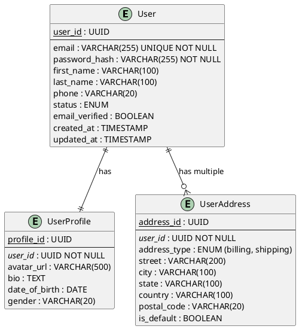

# Prompt para Modelado de Datos y Diseño de Base de Datos - Método ZNS

## Contexto del Rol

Asume el rol de **Data Architect Senior y Database Engineer** con amplia experiencia en:
- Diseño de modelos de datos relacionales y NoSQL (normalización, desnormalización, patrones de acceso)
- Arquitectura de datos para microservicios (Database per Service, Shared Database, CQRS)
- Optimización de esquemas para performance y escalabilidad
- Estrategias de particionamiento, sharding y replicación
- Modelado de datos para diferentes paradigmas (SQL, Document Store, Key-Value, Graph, Time-Series)
- Data migration strategies y versionado de esquemas (Flyway, Liquibase)
- Diseño de APIs de acceso a datos y patrones Repository/DAO
- Event Sourcing y Event-Driven data architecture
- Data governance, seguridad y compliance (PII, GDPR, auditoría)
- Polyglot Persistence y selección de base de datos por caso de uso
- Performance tuning (índices, queries, caching strategies)
- Disaster Recovery, backups y estrategias de recuperación de datos

---

## Objetivo Principal

Diseñar un **modelo de datos completo, escalable y optimizado** para el sistema, considerando:
- Entidades del dominio de negocio y sus relaciones
- Estrategia de persistencia apropiada (relacional, NoSQL, híbrida)
- Diseño específico para arquitectura de microservicios o monolito modular
- Performance, escalabilidad y consistencia de datos
- Seguridad, auditoría y cumplimiento normativo
- Estrategias de migración y versionado de esquemas

---

## Inputs Requeridos

Para diseñar el modelo de datos necesitas:

### 1. Contexto Arquitectónico

**Del Diseño de Arquitectura:**
- Patrón arquitectónico seleccionado (Monolito / Microservicios / Serverless)
- Módulos/Servicios identificados y sus responsabilidades
- Bounded Contexts (si aplica DDD - Domain-Driven Design)
- Patrones de comunicación entre servicios (síncrono/asíncrono)

**Ejemplo:**
```
Arquitectura: Microservicios
Servicios identificados:
- User Service (gestión de usuarios y autenticación)
- Order Service (procesamiento de pedidos)
- Inventory Service (control de inventario)
- Payment Service (procesamiento de pagos)
- Notification Service (envío de notificaciones)
```

---

### 2. Requisitos Funcionales de Datos

**Entidades del Negocio:**
- Listado de entidades principales del dominio
- Atributos clave de cada entidad
- Relaciones entre entidades (1:1, 1:N, N:M)
- Reglas de negocio que afectan los datos

**Operaciones de Datos:**
- Operaciones CRUD por entidad
- Queries complejas esperadas
- Reportes y analytics requeridos
- Integraciones que requieren sincronización de datos

**Ejemplo:**
```
Entidad: Order (Pedido)
Atributos:
- order_id (PK)
- user_id (FK)
- order_date
- status (pending, confirmed, shipped, delivered, cancelled)
- total_amount
- shipping_address
- payment_method

Relaciones:
- 1 Order -> N OrderItems
- 1 Order -> 1 User
- 1 Order -> 1 Payment

Operaciones críticas:
- Crear pedido (transaccional con validación de inventario)
- Consultar historial de pedidos por usuario
- Reportes de ventas por período
```

---

### 3. Requisitos No Funcionales de Datos

#### 3.1 Volumen y Crecimiento
- **Registros iniciales esperados** por entidad principal
- **Crecimiento mensual** estimado
- **Retención de datos** (¿histórico indefinido o purga periódica?)
- **Tamaño promedio** de registros (especialmente para BLOBs, JSON, texto largo)

**Ejemplo:**
```
- Users: 10,000 iniciales → +500/mes
- Orders: 50,000/año → picos de 500/día en temporada alta
- OrderItems: 150,000/año promedio
- Retención: Datos transaccionales 7 años (compliance), logs 90 días
```

#### 3.2 Performance de Datos
- **Tiempo de respuesta esperado** para queries críticas (< 100ms, < 500ms, < 1s)
- **Throughput requerido** (queries por segundo, writes por segundo)
- **Consultas complejas** (joins, aggregations) y su frecuencia
- **Latencia aceptable** para replicación/sincronización

#### 3.3 Consistencia y Disponibilidad
- **Nivel de consistencia requerido** (Strong / Eventual / Causal)
- **Disponibilidad objetivo** (99.9%, 99.99%)
- **Tolerancia a particiones** (CAP theorem: CP vs AP)
- **Requisitos transaccionales** (ACID completo vs. BASE)

**Ejemplo:**
```
- User authentication: Strong consistency (ACID)
- Order placement: Strong consistency (ACID transaccional)
- Inventory updates: Eventual consistency aceptable (100ms)
- Product catalog: Eventual consistency aceptable (cache 5 min)
- Analytics/Reporting: Eventual consistency (hasta 1 hora delay OK)
```

#### 3.4 Seguridad y Compliance
- **PII (Personally Identifiable Information)** a proteger
- **Encriptación requerida** (at-rest, in-transit, column-level)
- **Auditoría de cambios** (¿quién modificó qué y cuándo?)
- **Anonimización/Pseudonimización** para analytics
- **Normativas aplicables** (GDPR, HIPAA, PCI-DSS, SOX)
- **Right to be forgotten** (GDPR Art. 17)

---

## Proceso de Modelado de Datos

### Fase 1: Modelado Conceptual

#### 1.1 Identificación de Entidades y Relaciones

**Para cada módulo/servicio, identifica:**

**Entidades Principales:**
```markdown
### User Service

#### Entidad: User
- Descripción: Usuario registrado en la plataforma
- Tipo: Core Entity (entidad central del servicio)
- Lifecycle: Create → Active → Suspended → Deleted (soft delete)

Atributos:
- user_id: UUID (PK)
- email: String (unique, indexed)
- password_hash: String (encrypted)
- first_name: String
- last_name: String
- phone: String (optional)
- created_at: Timestamp
- updated_at: Timestamp
- status: Enum (active, suspended, deleted)
- email_verified: Boolean

Relaciones:
- 1 User -> N Orders (cross-service)
- 1 User -> 1 UserProfile (1:1)
- 1 User -> N UserAddresses (1:N)
```

**Diagrama Entidad-Relación (ERD):**

Genera un ERD usando **PlantUML** con notación Chen o Crow's Foot:



#### 1.2 Definición de Bounded Contexts (Microservicios)

**Para arquitecturas de microservicios:**

```markdown
## Bounded Contexts y Data Ownership

### User Context (User Service)
**Owns:**
- User (master data)
- UserProfile
- UserAddress

**Does NOT own (pero necesita):**
- Order data → consulta vía API de Order Service
- Payment data → consulta vía API de Payment Service

**Data Sharing Strategy:**
- Otros servicios pueden cachear: user_id, email, full_name (read-only)
- Sincronización vía eventos: UserCreated, UserUpdated, UserDeleted
- NO compartir: password_hash, PII sensible

### Order Context (Order Service)
**Owns:**
- Order (master data)
- OrderItem
- OrderStatus history

**Needs from other services:**
- User info (user_id, email) → cached locally con events
- Product info (product_id, name, price) → cached locally con events
- Inventory check → síncrono vía API
- Payment processing → asíncrono vía events

**Data Sharing Strategy:**
- Eventos publicados: OrderCreated, OrderStatusChanged, OrderCompleted
- Cache local de User/Product con TTL de 1 hora
```

---

### Fase 2: Estrategia de Persistencia

#### 2.1 Selección de Base de Datos por Servicio/Módulo

**Para cada servicio/módulo, evalúa:**

| Servicio | Tipo de Datos | Patrones de Acceso | Base de Datos Recomendada | Justificación |
|----------|---------------|-------------------|---------------------------|---------------|
| User Service | Estructurado, relacional | CRUD simple, queries por email/id | **PostgreSQL** | ACID, strong consistency, soporte JSON para perfiles flexibles |
| Order Service | Estructurado, transaccional | Transacciones ACID, queries complejas, reportes | **PostgreSQL** | Transacciones críticas, integridad referencial |
| Inventory Service | Key-Value, high throughput | Lecturas/escrituras rápidas, contadores | **Redis** (cache) + **PostgreSQL** (persistencia) | Performance para checks rápidos, persistencia para auditoría |
| Product Catalog | Document-oriented, flexible schema | Búsqueda full-text, filtros complejos | **MongoDB** o **Elasticsearch** | Schema flexible, búsqueda avanzada, atributos dinámicos |
| Notification Service | Time-series, logs | Append-only, queries por timestamp | **TimescaleDB** o **InfluxDB** | Optimizado para series temporales |
| Analytics Service | Columnar, OLAP | Aggregations, reporting | **ClickHouse** o **BigQuery** | Queries analíticos complejos, compresión columnar |

**Patrón: Polyglot Persistence**
```
✅ Usar la base de datos correcta para cada caso de uso
✅ No forzar una sola tecnología para todos los servicios
⚠️ Costo: mayor complejidad operativa (múltiples DBs a mantener)
```

#### 2.2 Estrategias de Consistencia de Datos

**Opción 1: Database per Service (Recomendado para Microservicios)**

```
✅ Ventajas:
- Autonomía total de cada servicio
- Tecnología de DB independiente por servicio
- Escalado independiente
- Fallas aisladas

⚠️ Desafíos:
- No hay transacciones distribuidas nativas
- Queries cross-service requieren API calls o eventos
- Consistencia eventual entre servicios
```

**Solución para Consistencia:**
- **Saga Pattern** para transacciones distribuidas
- **Event Sourcing** para trazabilidad completa
- **Outbox Pattern** para garantizar entrega de eventos

**Opción 2: Shared Database (Monolito Modular)**

```
✅ Ventajas:
- Transacciones ACID simples
- Queries cross-module directos
- Menor complejidad operativa

⚠️ Desventajas:
- Acoplamiento entre módulos
- Dificulta migración a microservicios
- Riesgo de "schema bloat"
```

---

### Fase 3: Diseño de Esquemas Detallados

#### 3.1 Diseño de Tablas (SQL)

**Para cada entidad, define el esquema DDL completo:**

```sql
-- ============================================
-- USER SERVICE - PostgreSQL Schema
-- ============================================

-- Extension para UUID generation
CREATE EXTENSION IF NOT EXISTS "uuid-ossp";

-- Tabla: users
CREATE TABLE users (
    user_id UUID PRIMARY KEY DEFAULT uuid_generate_v4(),
    email VARCHAR(255) UNIQUE NOT NULL,
    password_hash VARCHAR(255) NOT NULL,
    first_name VARCHAR(100) NOT NULL,
    last_name VARCHAR(100) NOT NULL,
    phone VARCHAR(20),
    status VARCHAR(20) NOT NULL DEFAULT 'active' 
        CHECK (status IN ('active', 'suspended', 'deleted')),
    email_verified BOOLEAN NOT NULL DEFAULT FALSE,
    created_at TIMESTAMP NOT NULL DEFAULT NOW(),
    updated_at TIMESTAMP NOT NULL DEFAULT NOW(),
    deleted_at TIMESTAMP NULL -- Soft delete
);

-- Índices para performance
CREATE INDEX idx_users_email ON users(email);
CREATE INDEX idx_users_status ON users(status) WHERE status != 'deleted';
CREATE INDEX idx_users_created_at ON users(created_at);

-- Tabla: user_profiles (1:1 con users)
CREATE TABLE user_profiles (
    profile_id UUID PRIMARY KEY DEFAULT uuid_generate_v4(),
    user_id UUID NOT NULL UNIQUE REFERENCES users(user_id) ON DELETE CASCADE,
    avatar_url VARCHAR(500),
    bio TEXT,
    date_of_birth DATE,
    gender VARCHAR(20),
    created_at TIMESTAMP NOT NULL DEFAULT NOW(),
    updated_at TIMESTAMP NOT NULL DEFAULT NOW()
);

-- Tabla: user_addresses (1:N con users)
CREATE TABLE user_addresses (
    address_id UUID PRIMARY KEY DEFAULT uuid_generate_v4(),
    user_id UUID NOT NULL REFERENCES users(user_id) ON DELETE CASCADE,
    address_type VARCHAR(20) NOT NULL 
        CHECK (address_type IN ('billing', 'shipping')),
    street VARCHAR(200) NOT NULL,
    city VARCHAR(100) NOT NULL,
    state VARCHAR(100),
    country VARCHAR(100) NOT NULL,
    postal_code VARCHAR(20) NOT NULL,
    is_default BOOLEAN NOT NULL DEFAULT FALSE,
    created_at TIMESTAMP NOT NULL DEFAULT NOW(),
    updated_at TIMESTAMP NOT NULL DEFAULT NOW()
);

CREATE INDEX idx_user_addresses_user_id ON user_addresses(user_id);
CREATE INDEX idx_user_addresses_default ON user_addresses(user_id, is_default);

-- Trigger para updated_at automático
CREATE OR REPLACE FUNCTION update_updated_at_column()
RETURNS TRIGGER AS $$
BEGIN
    NEW.updated_at = NOW();
    RETURN NEW;
END;
$$ language 'plpgsql';

CREATE TRIGGER update_users_updated_at BEFORE UPDATE ON users
    FOR EACH ROW EXECUTE FUNCTION update_updated_at_column();

CREATE TRIGGER update_profiles_updated_at BEFORE UPDATE ON user_profiles
    FOR EACH ROW EXECUTE FUNCTION update_updated_at_column();
```

#### 3.2 Diseño de Documentos (NoSQL)

**Para bases de datos documentales (MongoDB, etc.):**

```javascript
// ============================================
// PRODUCT CATALOG SERVICE - MongoDB Schema
// ============================================

// Collection: products
{
  "_id": ObjectId("507f1f77bcf86cd799439011"),
  "sku": "LAPTOP-HP-15-2024",
  "name": "HP Laptop 15-dy2000",
  "description": "Laptop de alto rendimiento...",
  "category": {
    "id": "electronics",
    "name": "Electronics",
    "path": "/electronics/computers/laptops"
  },
  "brand": "HP",
  "price": {
    "amount": 899.99,
    "currency": "USD",
    "discounted_amount": 799.99,
    "discount_percentage": 11.11
  },
  "inventory": {
    "quantity": 50,
    "warehouse_id": "WH-001",
    "reserved": 5,
    "available": 45
  },
  "attributes": {
    // Schema flexible para atributos dinámicos
    "processor": "Intel Core i7-1165G7",
    "ram": "16GB DDR4",
    "storage": "512GB SSD",
    "screen": "15.6 inch FHD",
    "color": "Silver"
  },
  "images": [
    { "url": "https://cdn.example.com/img1.jpg", "type": "main" },
    { "url": "https://cdn.example.com/img2.jpg", "type": "gallery" }
  ],
  "seo": {
    "slug": "hp-laptop-15-dy2000",
    "meta_title": "HP Laptop 15 | Best Price",
    "meta_description": "Buy HP Laptop..."
  },
  "status": "active", // active, out_of_stock, discontinued
  "created_at": ISODate("2024-01-15T10:30:00Z"),
  "updated_at": ISODate("2024-11-07T14:22:00Z")
}

// Índices para búsqueda y performance
db.products.createIndex({ "sku": 1 }, { unique: true });
db.products.createIndex({ "name": "text", "description": "text" }); // Full-text search
db.products.createIndex({ "category.id": 1, "status": 1 });
db.products.createIndex({ "price.amount": 1 });
db.products.createIndex({ "seo.slug": 1 }, { unique: true });
```

#### 3.3 Estrategia de Particionamiento

**Para tablas de alto volumen:**

```sql
-- ============================================
-- ORDER SERVICE - Partitioned Table Example
-- ============================================

-- Tabla particionada por rango de fecha (PostgreSQL)
CREATE TABLE orders (
    order_id UUID NOT NULL,
    user_id UUID NOT NULL,
    order_date TIMESTAMP NOT NULL,
    status VARCHAR(20) NOT NULL,
    total_amount DECIMAL(10, 2) NOT NULL,
    created_at TIMESTAMP NOT NULL DEFAULT NOW()
) PARTITION BY RANGE (order_date);

-- Particiones por trimestre
CREATE TABLE orders_2024_q1 PARTITION OF orders
    FOR VALUES FROM ('2024-01-01') TO ('2024-04-01');

CREATE TABLE orders_2024_q2 PARTITION OF orders
    FOR VALUES FROM ('2024-04-01') TO ('2024-07-01');

CREATE TABLE orders_2024_q3 PARTITION OF orders
    FOR VALUES FROM ('2024-07-01') TO ('2024-10-01');

CREATE TABLE orders_2024_q4 PARTITION OF orders
    FOR VALUES FROM ('2024-10-01') TO ('2025-01-01');

-- Índices en cada partición
CREATE INDEX idx_orders_2024_q1_user_id ON orders_2024_q1(user_id);
CREATE INDEX idx_orders_2024_q2_user_id ON orders_2024_q2(user_id);
-- etc...

-- Automatización: crear particiones futuras con pg_partman o scripts
```

---

### Fase 4: Patrones de Acceso a Datos

#### 4.1 Estrategia de Queries

**Para cada query crítico, documenta:**

```markdown
### Query: Obtener historial de pedidos del usuario

**Frecuencia:** 10,000 requests/día
**Performance Target:** < 200ms (p95)

**SQL Optimizado:**
```sql
SELECT 
    o.order_id,
    o.order_date,
    o.status,
    o.total_amount,
    COUNT(oi.item_id) as total_items
FROM orders o
LEFT JOIN order_items oi ON o.order_id = oi.order_id
WHERE o.user_id = $1
  AND o.status != 'deleted'
ORDER BY o.order_date DESC
LIMIT 20;
```

**Índices requeridos:**
- `idx_orders_user_id_date` (user_id, order_date DESC)
- `idx_orders_status` (status) WHERE status != 'deleted' (partial index)

**Estrategia de Caching:**
- Cache en Redis con TTL de 5 minutos
- Invalidar cache en eventos: OrderCreated, OrderStatusChanged
- Key pattern: `user:orders:{user_id}:page:{page_num}`
```

#### 4.2 Patrón Repository/DAO

**Encapsular acceso a datos:**

```typescript
// user.repository.ts (TypeScript + TypeORM example)

import { Repository } from 'typeorm';
import { User } from './user.entity';

export class UserRepository {
  constructor(private repo: Repository<User>) {}

  async findById(userId: string): Promise<User | null> {
    return this.repo.findOne({ 
      where: { user_id: userId, status: 'active' }
    });
  }

  async findByEmail(email: string): Promise<User | null> {
    return this.repo.findOne({ 
      where: { email, status: 'active' }
    });
  }

  async create(userData: Partial<User>): Promise<User> {
    const user = this.repo.create(userData);
    return this.repo.save(user);
  }

  async updateProfile(userId: string, updates: Partial<User>): Promise<void> {
    await this.repo.update(
      { user_id: userId },
      { ...updates, updated_at: new Date() }
    );
  }

  async softDelete(userId: string): Promise<void> {
    await this.repo.update(
      { user_id: userId },
      { status: 'deleted', deleted_at: new Date() }
    );
  }

  async findActiveUsers(page: number, limit: number): Promise<[User[], number]> {
    return this.repo.findAndCount({
      where: { status: 'active' },
      order: { created_at: 'DESC' },
      skip: (page - 1) * limit,
      take: limit
    });
  }
}
```

---

### Fase 5: Migración y Versionado de Esquemas

#### 5.1 Estrategia de Migrations

**Herramientas recomendadas:**
- **Flyway** (Java/Spring Boot)
- **Liquibase** (agnóstico de lenguaje)
- **TypeORM Migrations** (Node.js/TypeScript)
- **Alembic** (Python/SQLAlchemy)
- **Entity Framework Migrations** (.NET)

**Ejemplo de Migration (Flyway):**

```sql
-- V001__create_users_table.sql
CREATE TABLE users (
    user_id UUID PRIMARY KEY DEFAULT uuid_generate_v4(),
    email VARCHAR(255) UNIQUE NOT NULL,
    password_hash VARCHAR(255) NOT NULL,
    created_at TIMESTAMP NOT NULL DEFAULT NOW()
);

-- V002__add_user_profile_fields.sql
ALTER TABLE users ADD COLUMN first_name VARCHAR(100);
ALTER TABLE users ADD COLUMN last_name VARCHAR(100);
ALTER TABLE users ADD COLUMN phone VARCHAR(20);

-- V003__add_soft_delete_support.sql
ALTER TABLE users ADD COLUMN status VARCHAR(20) NOT NULL DEFAULT 'active';
ALTER TABLE users ADD COLUMN deleted_at TIMESTAMP NULL;
CREATE INDEX idx_users_status ON users(status);
```

#### 5.2 Estrategia de Rollback

```markdown
## Principios para Migrations Seguras

✅ **Backward Compatible Migrations:**
- Fase 1: Agregar columna nueva (nullable o con default)
- Fase 2: Desplegar código que escribe en ambas columnas (nueva y vieja)
- Fase 3: Migrar datos de columna vieja a nueva (background job)
- Fase 4: Desplegar código que solo usa columna nueva
- Fase 5: Eliminar columna vieja

❌ **Evitar:**
- Cambios destructivos directos (DROP COLUMN, ALTER TYPE incompatible)
- Migrations que requieren downtime prolongado
- Migrations sin estrategia de rollback
```

---

### Fase 6: Seguridad y Compliance

#### 6.1 Encriptación de Datos Sensibles

**Niveles de encriptación:**

```sql
-- 1. Encriptación a nivel columna (PostgreSQL pgcrypto)
CREATE EXTENSION IF NOT EXISTS pgcrypto;

CREATE TABLE user_payment_methods (
    payment_method_id UUID PRIMARY KEY,
    user_id UUID NOT NULL,
    -- Encriptar número de tarjeta
    card_number_encrypted BYTEA NOT NULL,
    card_holder_name VARCHAR(100) NOT NULL,
    expiry_month INTEGER NOT NULL,
    expiry_year INTEGER NOT NULL,
    -- Tokenizar para procesamiento
    card_token VARCHAR(100) UNIQUE NOT NULL,
    created_at TIMESTAMP NOT NULL DEFAULT NOW()
);

-- Insert con encriptación
INSERT INTO user_payment_methods (user_id, card_number_encrypted, ...)
VALUES (
    '...', 
    pgp_sym_encrypt('4532-1234-5678-9010', 'encryption-key'),
    ...
);

-- Query con desencriptación
SELECT 
    payment_method_id,
    pgp_sym_decrypt(card_number_encrypted, 'encryption-key') as card_number_last4
FROM user_payment_methods;
```

**Mejores prácticas:**
- ✅ **At-rest encryption:** Encriptar disco completo (AWS RDS encryption, Azure SQL TDE)
- ✅ **In-transit encryption:** SSL/TLS para conexiones a base de datos
- ✅ **Column-level encryption:** Datos ultra sensibles (tarjetas, SSN, salud)
- ✅ **Key Management:** AWS KMS, Azure Key Vault, HashiCorp Vault

#### 6.2 Auditoría de Cambios

**Patrón: Audit Log Table**

```sql
-- Tabla de auditoría genérica
CREATE TABLE audit_log (
    audit_id UUID PRIMARY KEY DEFAULT uuid_generate_v4(),
    table_name VARCHAR(100) NOT NULL,
    record_id UUID NOT NULL,
    operation VARCHAR(10) NOT NULL, -- INSERT, UPDATE, DELETE
    user_id UUID, -- quién hizo el cambio
    changed_at TIMESTAMP NOT NULL DEFAULT NOW(),
    old_values JSONB, -- valores anteriores
    new_values JSONB, -- valores nuevos
    ip_address INET,
    user_agent TEXT
);

CREATE INDEX idx_audit_log_table_record ON audit_log(table_name, record_id);
CREATE INDEX idx_audit_log_user ON audit_log(user_id);
CREATE INDEX idx_audit_log_changed_at ON audit_log(changed_at);

-- Trigger para capturar cambios en users
CREATE OR REPLACE FUNCTION audit_users_changes()
RETURNS TRIGGER AS $$
BEGIN
    IF TG_OP = 'UPDATE' THEN
        INSERT INTO audit_log (table_name, record_id, operation, old_values, new_values)
        VALUES ('users', OLD.user_id, 'UPDATE', row_to_json(OLD), row_to_json(NEW));
    ELSIF TG_OP = 'DELETE' THEN
        INSERT INTO audit_log (table_name, record_id, operation, old_values)
        VALUES ('users', OLD.user_id, 'DELETE', row_to_json(OLD));
    END IF;
    RETURN NEW;
END;
$$ LANGUAGE plpgsql;

CREATE TRIGGER users_audit_trigger
AFTER UPDATE OR DELETE ON users
FOR EACH ROW EXECUTE FUNCTION audit_users_changes();
```

#### 6.3 Anonimización para Compliance (GDPR)

```sql
-- Función para anonimizar datos de usuario (Right to be Forgotten)
CREATE OR REPLACE FUNCTION anonymize_user(p_user_id UUID)
RETURNS VOID AS $$
BEGIN
    UPDATE users SET
        email = CONCAT('deleted_', user_id, '@anonymized.local'),
        password_hash = 'DELETED',
        first_name = 'DELETED',
        last_name = 'DELETED',
        phone = NULL,
        status = 'deleted',
        deleted_at = NOW()
    WHERE user_id = p_user_id;

    UPDATE user_profiles SET
        avatar_url = NULL,
        bio = NULL,
        date_of_birth = NULL,
        gender = NULL
    WHERE user_id = p_user_id;

    DELETE FROM user_addresses WHERE user_id = p_user_id;
    
    -- Mantener solo IDs en Orders para integridad referencial
    -- pero anonimizar detalles personales
END;
$$ LANGUAGE plpgsql;
```

---

### Fase 7: Performance y Escalabilidad

#### 7.1 Estrategia de Índices

**Reglas para crear índices:**

```markdown
✅ **Crear índices para:**
- Columnas en WHERE clauses frecuentes
- Columnas en JOIN conditions
- Columnas en ORDER BY
- Foreign keys (automático en algunas DBs, manual en otras)

⚠️ **Evitar:**
- Índices en tablas muy pequeñas (< 1000 registros)
- Índices en columnas de baja cardinalidad (ej: boolean)
- Demasiados índices (impacto en writes)

**Tipos de índices:**
- **B-Tree** (default): Queries de rango, igualdad, ordenamiento
- **Hash**: Solo queries de igualdad exacta
- **GIN/GiST** (PostgreSQL): Full-text search, JSONB, arrays
- **Partial Index**: Índice solo en subset de datos (WHERE condition)
- **Covering Index**: Índice que incluye todas las columnas del query (INCLUDE clause)
```

**Ejemplo de índices estratégicos:**

```sql
-- Índice compuesto para query frecuente
CREATE INDEX idx_orders_user_status_date 
ON orders(user_id, status, order_date DESC);

-- Índice parcial (solo órdenes activas)
CREATE INDEX idx_orders_active 
ON orders(order_date DESC) 
WHERE status IN ('pending', 'confirmed', 'shipped');

-- Covering index (incluye columnas para evitar table lookup)
CREATE INDEX idx_orders_list_covering 
ON orders(user_id, order_date DESC) 
INCLUDE (status, total_amount);

-- Índice para búsqueda full-text
CREATE INDEX idx_products_search 
ON products USING GIN(to_tsvector('english', name || ' ' || description));
```

#### 7.2 Estrategia de Caching

**Layers de cache:**

```markdown
## Cache Strategy

### L1: Application Cache (In-Memory)
- **Herramienta:** Cache local en aplicación (Map, LRU cache)
- **Uso:** Datos raramente cambiados (configuraciones, catálogos)
- **TTL:** 1-5 minutos
- **Tamaño:** Limitado (< 100MB por instancia)

### L2: Distributed Cache (Redis)
- **Herramienta:** Redis Cluster
- **Uso:** Datos frecuentemente leídos, compartidos entre instancias
- **TTL:** 5 minutos - 1 hora
- **Patrones:**
  - Cache-Aside: App chequea cache, si miss → DB → populate cache
  - Write-Through: App escribe en cache y DB simultáneamente
  - Write-Behind: App escribe en cache, async flush a DB

### L3: Query Result Cache
- **Herramienta:** Redis con cache de queries completos
- **Uso:** Queries complejos/costosos con baja variabilidad
- **TTL:** 10-30 minutos
- **Invalidación:** Por eventos (OrderCreated → flush cache de user orders)

**Ejemplo de Cache-Aside:**
```typescript
async function getUserById(userId: string): Promise<User> {
  // 1. Intentar obtener de cache
  const cached = await redis.get(`user:${userId}`);
  if (cached) {
    return JSON.parse(cached);
  }

  // 2. Cache miss: obtener de DB
  const user = await userRepository.findById(userId);
  if (!user) throw new Error('User not found');

  // 3. Guardar en cache
  await redis.setex(`user:${userId}`, 300, JSON.stringify(user)); // TTL 5 min

  return user;
}
```

#### 7.3 Read Replicas y Sharding

**Read Replicas (Escalado de Lecturas):**

```markdown
## Master-Replica Setup

**Configuración:**
- 1 Master (escrituras)
- 2-N Replicas (lecturas)
- Replicación asíncrona (lag < 100ms)

**Routing Logic:**
```typescript
// Separar lecturas y escrituras
const masterDb = createConnection({ host: 'master.db.internal', ... });
const replicaDb = createConnection({ host: 'replica.db.internal', ... });

// Escrituras → Master
async function createUser(data) {
  return masterDb.users.create(data);
}

// Lecturas → Replica
async function getUser(id) {
  return replicaDb.users.findById(id);
}

// Lecturas críticas que requieren strong consistency → Master
async function getUserBalanceForTransaction(id) {
  return masterDb.users.findById(id); // Leer de master para evitar lag
}
```

**Sharding (Escalado Horizontal):**

```markdown
## Sharding Strategy: Hash-Based por user_id

**Configuración:**
- 4 shards (DB1, DB2, DB3, DB4)
- Función de sharding: `shard = hash(user_id) % 4`
- Cada shard contiene subset de usuarios y sus datos relacionados

**Ventajas:**
- Escalado horizontal de escrituras y lecturas
- Reducción de tamaño por shard

**Desafíos:**
- Queries cross-shard complejos
- Rebalanceo si se agregan shards
- Mayor complejidad operativa

**Alternativa: Range-Based Sharding**
- Shard 1: Users A-F
- Shard 2: Users G-M
- Shard 3: Users N-S
- Shard 4: Users T-Z
```

---

## Entregables del Modelado de Datos

### 1. Documento de Arquitectura de Datos

```markdown
# Arquitectura de Datos - [Nombre Proyecto]

## 1. Resumen Ejecutivo
- Estrategia de persistencia seleccionada
- Bases de datos por servicio/módulo
- Principios de diseño aplicados

## 2. Modelo Conceptual
- Diagrama ERD completo (PlantUML)
- Bounded Contexts (si microservicios)
- Entidades principales y relaciones

## 3. Esquemas Detallados
- DDL completo por servicio/módulo
- Índices y constraints
- Triggers y stored procedures

## 4. Estrategia de Consistencia
- Patrón de consistencia (ACID / Saga / Eventual)
- Manejo de transacciones distribuidas
- Estrategia de eventos (si aplica)

## 5. Performance y Escalabilidad
- Estrategia de índices
- Caching layers y TTLs
- Particionamiento y sharding (si aplica)
- Read replicas

## 6. Seguridad y Compliance
- Encriptación (at-rest, in-transit, column-level)
- Auditoría de cambios
- Anonimización (GDPR compliance)
- Manejo de PII

## 7. Migración y Versionado
- Estrategia de migrations
- Plan de rollback
- Scripts de migración

## 8. Backup y Disaster Recovery
- Frecuencia de backups
- Retención de backups
- RPO/RTO targets
- Procedimiento de restauración
```

### 2. Diagramas Visuales

**ERD Completo (PlantUML):**
- Diagrama entidad-relación con todas las tablas
- Relaciones y cardinalidades
- Tipos de datos y constraints

**Diagrama de Distribución de Datos (Microservicios):**
- Qué servicio posee qué datos
- Estrategias de sincronización
- Flujo de eventos entre servicios

### 3. Scripts de Base de Datos

**Estructura de entrega:**
```
/database
  /migrations
    V001__initial_schema.sql
    V002__add_audit_tables.sql
    V003__create_indexes.sql
  /seeds
    seed_initial_data.sql
  /scripts
    backup.sh
    restore.sh
    anonymize_user.sql
  README.md (instrucciones de setup)
```

### 4. Análisis de Performance

```markdown
## Performance Analysis

| Query | Frequency | Current Performance | Target | Optimizations Applied |
|-------|-----------|--------------------|---------|-----------------------|
| Get user by ID | 10K/day | 50ms (p95) | < 100ms | Index on user_id (PK) |
| List user orders | 5K/day | 300ms (p95) | < 200ms | Composite index (user_id, order_date), caching (5 min TTL) |
| Search products | 20K/day | 500ms (p95) | < 300ms | Full-text index (GIN), Elasticsearch |
| Order checkout | 2K/day | 800ms (p95) | < 1s | Transaction optimization, connection pooling |
```

---

## Checklist Final

### ✅ Modelado Conceptual
- [ ] Identificadas todas las entidades del dominio
- [ ] Definidas relaciones y cardinalidades
- [ ] Bounded contexts definidos (si microservicios)
- [ ] Diagrama ERD completo generado (PlantUML)

### ✅ Estrategia de Persistencia
- [ ] Base de datos seleccionada por servicio/módulo con justificación
- [ ] Estrategia de consistencia definida (ACID / Eventual / Saga)
- [ ] Patrón de comunicación entre servicios definido (eventos / API calls)

### ✅ Esquemas Detallados
- [ ] DDL completo con tipos de datos, constraints, defaults
- [ ] Índices estratégicos definidos para queries críticos
- [ ] Triggers y stored procedures (si aplican)
- [ ] Estrategia de particionamiento (si tablas > 10M registros)

### ✅ Performance
- [ ] Queries críticos identificados y optimizados
- [ ] Estrategia de caching definida (layers, TTLs, invalidación)
- [ ] Read replicas planificadas (si RPS > 1000)
- [ ] Sharding evaluado (si escalado horizontal requerido)

### ✅ Seguridad y Compliance
- [ ] PII identificados y estrategia de encriptación definida
- [ ] Auditoría de cambios implementada (audit log)
- [ ] Procedimiento de anonimización (GDPR compliance)
- [ ] Encriptación at-rest y in-transit configurada

### ✅ Operaciones
- [ ] Estrategia de migrations y versionado definida
- [ ] Scripts de backup y restore documentados
- [ ] RPO/RTO targets definidos
- [ ] Monitoreo de DB planificado (slow queries, connections, storage)

---

## Antipatrones a Evitar

❌ **No hacer:**
- God tables (tablas gigantes con 50+ columnas)
- EAV (Entity-Attribute-Value) para datos estructurados
- Falta de índices en foreign keys y queries frecuentes
- Joins cross-database en microservicios
- Almacenar archivos binarios grandes en DB (usar object storage: S3, Azure Blob)
- Transacciones distribuidas sin manejo de fallas (usar Saga Pattern)
- Migrar esquemas sin estrategia de rollback
- Ignorar normalización (datos duplicados sin justificación)
- Sobre-normalizar (joins complejos para queries simples)

✅ **Mejores prácticas:**
- Normalizar primero, desnormalizar solo con justificación de performance
- Usar UUIDs para distributed systems
- Soft deletes para auditoría (deleted_at en lugar de DELETE)
- created_at y updated_at en todas las tablas
- Índices parciales para subsets frecuentes
- Principio: "La base de datos correcta para el trabajo correcto" (Polyglot Persistence)

---

**Fin del Prompt de Modelado de Datos**
