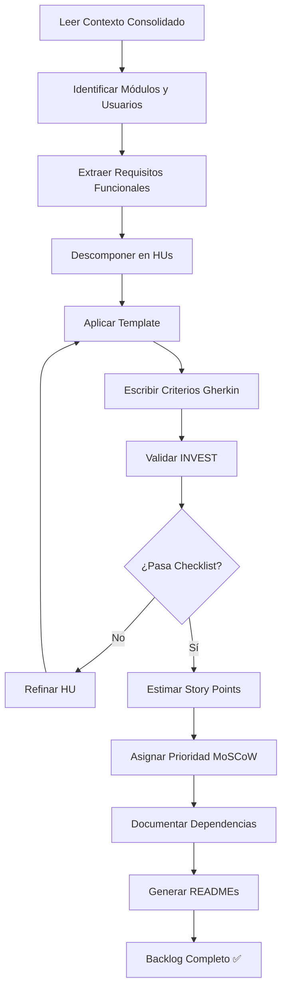

# Agente de Historias de Usuario (User Stories)

**Versión:** 1.0.0  
**Método:** CEIBA v1.2  
**Fase:** 1.5 (Post-Consolidación, Pre-Desarrollo)  
**Última actualización:** 2025-11-08

---

## 📋 Descripción

Este agente es responsable de transformar requisitos funcionales consolidados en un **backlog estructurado de Historias de Usuario** listas para desarrollo, siguiendo estándares internacionales (INVEST, IEEE 29148, Gherkin) y mejores prácticas ágiles.

**Rol del Agente:** Product Owner Senior y Business Analyst

---

## 🎯 Objetivo

Generar historias de usuario de calidad profesional que:

✅ Cumplan criterios **INVEST** (Independent, Negotiable, Valuable, Estimable, Small, Testable)  
✅ Usen formato **Given-When-Then** (Gherkin syntax)  
✅ Tengan **trazabilidad completa** a requisitos funcionales  
✅ Sean **estimables y priorizadas** (Story Points + MoSCoW)  
✅ Incluyan **Definition of Done** y criterios de calidad  
✅ Estén **listas para Sprint Planning** sin ambigüedades

---

## 📂 Estructura de Archivos

```
02-agents/7.user_stories/
│
├── README.md                          # Este archivo
├── mst_historias-usuario.md           # 🔴 PROMPT MAESTRO (ejecutar este)
├── plantilla-historia-usuario.md      # Template con ejemplo completo
├── checklist-calidad-hus.md           # Validación INVEST + calidad
└── ejemplos/
    └── HU-042-buscar-tutores.md       # Ejemplo real completo
```

---

## 🚀 Cómo Usar Este Agente

### Paso 1: Preparar Entradas

**Archivos requeridos:**
- ✅ `01-context-consolidated/01-contexto-negocio.md`
- ✅ `01-context-consolidated/02-requisitos-funcionales.md`
- ✅ `01-context-consolidated/03-requisitos-no-funcionales.md`

**Opcional (recomendado):**
- `04-architecture/specs/modulo-*.md` (si ya existe arquitectura)

---

### Paso 2: Ejecutar Prompt Maestro

1. Abrir **Claude/ChatGPT/Gemini**
2. Cargar el archivo `mst_historias-usuario.md` completo
3. Proporcionar contexto del proyecto:
   ```
   Proyecto: [Nombre]
   Dominio: [E-commerce / FinTech / EdTech / etc.]
   Usuarios: [Roles identificados]
   Módulos: [Listado de módulos]
   ```
4. El agente generará HUs en `05-deliverables/hus/`

---

### Paso 3: Validar Calidad

Usar `checklist-calidad-hus.md` para validar cada HU:

- [ ] 100% cumple INVEST criteria
- [ ] Formato Given-When-Then correcto
- [ ] Trazabilidad completa
- [ ] Estimación asignada
- [ ] Definition of Done presente

**Meta de calidad:** ⭐⭐⭐ (100% criterios obligatorios)

---

### Paso 4: Organizar Backlog

El agente generará:

```
05-deliverables/hus/
│
├── README.md                     # Índice general + estadísticas
│
├── 01-autenticacion/
│   ├── README.md
│   ├── HU-001-registro-estudiante.md
│   ├── HU-002-login-email.md
│   └── HU-003-recuperar-password.md
│
├── 02-marketplace/
│   ├── README.md
│   ├── HU-010-buscar-tutores.md
│   └── ...
│
└── [más módulos...]
```

---

## 📊 Salidas Generadas

### 1. README General (`05-deliverables/hus/README.md`)

Incluye:
- 📊 Estadísticas del backlog (total HUs, story points)
- 🎯 Priorización MoSCoW (MUST/SHOULD/COULD/WON'T)
- 📦 Vista por módulos
- 🗺️ Roadmap de releases
- 🔗 Épicas y story mapping

---

### 2. README por Módulo (`05-deliverables/hus/{modulo}/README.md`)

Incluye:
- Tabla de HUs del módulo (ID, título, prioridad, SP, estado)
- Dependencias del módulo
- Estrategia de testing
- Story points totales

---

### 3. Historias de Usuario (`HU-XXX-{titulo}.md`)

Cada HU incluye:
- 📋 Historia (Como-Quiero-Para)
- 🎯 Valor de negocio
- ✅ Criterios de aceptación (Given-When-Then)
- 🔗 Trazabilidad (módulo, épica, RF, RNF, prioridad)
- 📊 Estimación (story points, complejidad)
- 🔄 Dependencias
- 🧪 Notas de testing
- ✔️ Definition of Done
- 📌 Tags

---

## 🎓 Estándares Aplicados

### 1. INVEST Criteria

| Criterio | Descripción | Validación |
|----------|-------------|------------|
| **I**ndependent | Sin dependencias bloqueantes | ✅ Checklist |
| **N**egotiable | Implementación flexible | ✅ Checklist |
| **V**aluable | Valor de negocio claro | ✅ Checklist |
| **E**stimable | Esfuerzo calculable | ✅ Checklist |
| **S**mall | 1 sprint (3-8 SP) | ✅ Checklist |
| **T**estable | Criterios verificables | ✅ Checklist |

---

### 2. Formato Gherkin (BDD)

```gherkin
### Escenario X: [Nombre descriptivo]

Dado que [precondición/contexto]
Y [contexto adicional si aplica]
Cuando [acción del usuario]
Y [acción adicional si aplica]
Entonces [resultado observable]
Y [resultado adicional si aplica]
```

---

### 3. Priorización MoSCoW

| Categoría | Significado | % del Backlog |
|-----------|-------------|---------------|
| **MUST HAVE** | MVP crítico | 30-40% |
| **SHOULD HAVE** | Importante (v1.1) | 30-40% |
| **COULD HAVE** | Deseable (v1.2+) | 20-30% |
| **WON'T HAVE** | Fuera de alcance | Documentar |

---

### 4. Story Points (Fibonacci)

| SP | Esfuerzo | Tiempo | Complejidad |
|----|----------|--------|-------------|
| 1 | Trivial | 0.5 día | Muy baja |
| 2 | Muy bajo | 1 día | Baja |
| 3 | Bajo | 1-2 días | Baja |
| 5 | Medio | 2-3 días | Media |
| 8 | Alto | 3-5 días | Media-Alta |
| 13 | Muy alto | 5-8 días | Alta |
| 21 | Épica | >8 días | 🔴 Dividir |

---

## ✅ Criterios de Éxito

El agente habrá completado exitosamente cuando:

### Backlog Completo

- [ ] README general con estadísticas
- [ ] 1 directorio por módulo
- [ ] README por módulo
- [ ] 1 archivo .md por HU
- [ ] Numeración secuencial (HU-001, HU-002, etc.)

### Calidad Validada

- [ ] 100% HUs cumplen INVEST
- [ ] 100% usan Given-When-Then
- [ ] 100% tienen trazabilidad a RFs
- [ ] 100% tienen story points asignados
- [ ] Priorización MoSCoW aplicada

### Listo para Desarrollo

- [ ] Backlog priorizado para 2-3 sprints
- [ ] Dependencias identificadas
- [ ] Estimaciones consistentes
- [ ] Definition of Done en todas las HUs

---

## 📈 Métricas de Calidad Esperadas

| Métrica | Meta | Validación |
|---------|------|------------|
| **Criterios INVEST** | 100% | checklist-calidad-hus.md |
| **Formato Gherkin** | 100% | Revisión manual |
| **Trazabilidad a RFs** | 100% | Auditoría de referencias |
| **Estimación asignada** | 100% | Verificar SP en todas |
| **Tamaño (3-8 SP)** | 80%+ | HUs grandes divididas |
| **Cobertura de escenarios** | 3-5 por HU | Happy + error + edge cases |

---

## 🔄 Flujo de Trabajo



---

## 🛠️ Herramientas Complementarias

### Gestión de Backlog
- **Jira** (más usado en empresas)
- **Azure DevOps** (integración con Microsoft)
- **Linear** (moderno, rápido)
- **Shortcut** (ex-Clubhouse)
- **GitHub Projects** (si equipo usa GitHub)

### Story Mapping
- **Miro** (pizarras colaborativas)
- **Mural** (workshops remotos)
- **Figma / FigJam** (diseño + planning)

### Estimación
- **Planning Poker** (app móvil)
- **Scrum Poker Cards** (cartas Fibonacci)
- **Async Poker** (estimación asíncrona)

### BDD / Testing
- **Cucumber** (automatización Gherkin)
- **SpecFlow** (.NET BDD)
- **Behave** (Python BDD)

---

## 📚 Recursos de Aprendizaje

### Libros
- **"User Stories Applied"** - Mike Cohn (Addison-Wesley, 2004)
- **"User Story Mapping"** - Jeff Patton (O'Reilly, 2014)
- **"Specification by Example"** - Gojko Adzic (Manning, 2011)

### Artículos
- [INVEST in Good Stories](https://xp123.com/articles/invest-in-good-stories-and-smart-tasks/) - Bill Wake
- [Splitting User Stories](https://www.humanizingwork.com/the-humanizing-work-guide-to-splitting-user-stories/)
- [Acceptance Criteria 101](https://www.atlassian.com/agile/project-management/user-stories)

### Estándares
- [IEEE 29148:2018 - Requirements Engineering](https://standards.ieee.org/standard/29148-2018.html)
- [SAFe User Stories](https://scaledagileframework.com/story/)
- [Scrum Guide 2020](https://scrumguides.org/)

---

## ❓ Preguntas Frecuentes

### ¿Cuántas HUs debería tener un backlog?

**Depende del tamaño del proyecto:**
- MVP pequeño: 20-40 HUs
- Proyecto mediano: 50-100 HUs
- Proyecto grande: 100-200+ HUs

**Regla práctica:** 6-12 HUs por módulo

---

### ¿Cómo estimo Story Points?

**Planning Poker:**
1. PO lee la HU
2. Equipo hace preguntas
3. Cada dev elige carta (Fibonacci: 1,2,3,5,8,13,21)
4. Todos revelan al mismo tiempo
5. Si hay discrepancia, los extremos explican
6. Re-votan hasta consenso

**Referencia:**
- 1 SP = Cambiar un texto en UI (trivial)
- 3 SP = Formulario simple con validación
- 5 SP = Integración API externa básica
- 8 SP = Flujo complejo con múltiples pantallas
- 13 SP = Feature grande (considerar dividir)

---

### ¿Qué pasa si una HU es muy grande?

**Técnicas de división:**
1. **Por rol:** Estudiante vs. Tutor
2. **Por flujo:** Crear vs. Editar vs. Eliminar
3. **Por UI:** Pantalla principal vs. Modales
4. **Por complejidad:** Versión simple (MVP) vs. Avanzada
5. **Por regla de negocio:** Validación básica vs. Compleja

**Ejemplo:**
```
HU-050: Gestionar perfil de tutor (21 SP - MUY GRANDE)

↓ Dividir en:

HU-050: Crear perfil básico de tutor (5 SP)
HU-051: Subir certificados y documentos (5 SP)
HU-052: Configurar disponibilidad horaria (8 SP)
HU-053: Definir tarifas por materia (3 SP)
```

---

### ¿Cómo manejo historias técnicas?

**Historias técnicas NO son User Stories:**

❌ "Como desarrollador, quiero refactorizar el módulo de auth..."

**Soluciones:**

1. **Spike** (investigación timeboxed):
   ```markdown
   SPIKE: Investigar integración con Agora Video SDK
   Timebox: 8 horas
   Objetivo: Decidir si Agora cumple requisitos de videollamadas
   ```

2. **Tarea técnica** (enabler):
   ```markdown
   TAREA: Configurar pipeline CI/CD con GitHub Actions
   Estimación: 8 horas
   Justificación: Habilita HU-040 a HU-055 (deployment automatizado)
   ```

3. **Incluir en DoD** de HU de negocio:
   ```markdown
   HU-040: Reservar sesión de tutoría
   DoD incluye:
   - Refactorizar AuthService para reutilización ✅
   ```

---

### ¿Qué hago con requisitos no funcionales?

**Incorporarlos en criterios de aceptación:**

```gherkin
HU-042: Buscar tutores por materia

Escenario 1: Búsqueda rápida (RNF-PERF-003)
Dado que hay 1000 tutores en el sistema
Cuando busco por "Matemáticas"
Entonces los resultados se muestran en <2 segundos
Y el sistema no consume >100MB RAM en el cliente

Escenario 2: Búsqueda accesible (RNF-ACC-001)
Dado que uso un lector de pantalla
Cuando navego por los resultados
Entonces cada tutor es anunciado con nombre, rating y precio
Y cumple WCAG 2.1 nivel AA
```

---

## 🤝 Colaboración con Otros Agentes

Este agente **depende de:**
- ✅ **0.consolidation_context** (contexto consolidado)
- ✅ **2.definition_of_architecture** (arquitectura de módulos - opcional)

Este agente **alimenta a:**
- → **Desarrollo** (backlog listo para Sprint Planning)
- → **QA** (base para casos de prueba)
- → **UX** (input para diseño de pantallas)

---

## 📞 Soporte

**Mantenido por:** Método CEIBA - ZENAPSES S.A.S  
**Versión:** 1.0.0  
**Última actualización:** 2025-11-08  
**Licencia:** Uso interno

Para dudas sobre el uso de este agente, consultar:
- `mst_historias-usuario.md` (prompt completo con ejemplos)
- `checklist-calidad-hus.md` (validación paso a paso)
- `plantilla-historia-usuario.md` (template con ejemplo real)
