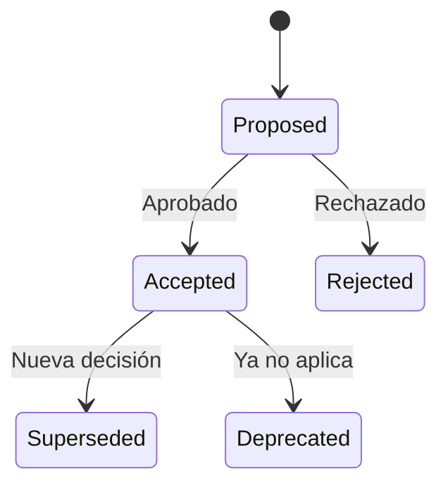

# Architecture Decision Records (ADRs)

## 📁 Propósito

Este directorio contiene los **Architecture Decision Records (ADRs)** que documentan las decisiones arquitectónicas importantes del proyecto.

---

## 🎯 ¿Qué es un ADR?

Un ADR documenta una **decisión arquitectónica significativa** junto con su contexto y consecuencias. Cada ADR debe responder:
- ¿Qué decisión se tomó?
- ¿Por qué se tomó? (contexto, drivers)
- ¿Qué alternativas se consideraron?
- ¿Cuáles son las consecuencias?

---

## 📐 Nomenclatura de Archivos

```
ADR-XXX-titulo-kebab-case.md
```

**Ejemplos:**
```
ADR-001-seleccion-base-datos.md
ADR-002-patron-microservicios.md
ADR-003-estrategia-autenticacion.md
ADR-004-cloud-provider-aws.md
ADR-005-message-queue-rabbitmq.md
```

**Numeración:**
- Secuencial desde 001
- Zero-padded (001, 002, ..., 099, 100)
- Sin reutilizar números

---

## 📋 Plantilla

Usa la plantilla oficial del Método CEIBA:
```
02-agentes/2.definicion_arquitectura/plantilla-adr.md
```

**Secciones obligatorias:**
1. Metadata (ID, título, fecha, estado, autores)
2. Contexto y problema
3. Drivers de decisión
4. Opciones consideradas
5. Decisión seleccionada
6. Pros y Contras
7. Consecuencias
8. Validación y aprobaciones

---

## ✅ Checklist de ADRs Mínimos

Para un proyecto medio, debes tener al menos **5-10 ADRs**:

### Stack Tecnológico
- [ ] ADR-001: Selección de base de datos (SQL vs NoSQL)
- [ ] ADR-002: Lenguaje/framework backend
- [ ] ADR-003: Framework frontend
- [ ] ADR-004: Cloud provider (AWS/Azure/GCP)

### Arquitectura
- [ ] ADR-005: Patrón arquitectónico (Monolito/Microservicios/Serverless)
- [ ] ADR-006: Estrategia de comunicación entre servicios
- [ ] ADR-007: Estrategia de deployment (Blue-Green/Canary/Rolling)

### Seguridad y Data
- [ ] ADR-008: Estrategia de autenticación (JWT/OAuth/SAML)
- [ ] ADR-009: Estrategia de persistencia de datos
- [ ] ADR-010: Estrategia de caching

---

## 🔄 Ciclo de Vida de un ADR



**Estados:**
- **Proposed:** En discusión
- **Accepted:** Aprobado e implementándose
- **Rejected:** Rechazado (documentar por qué)
- **Superseded:** Reemplazado por otro ADR (referenciar)
- **Deprecated:** Ya no aplica al proyecto

---

## 📚 Ejemplos de Buenas Decisiones

### ✅ Decisión Bien Documentada
```markdown
# ADR-001: Selección de PostgreSQL como Base de Datos Principal

## Contexto
Necesitamos una base de datos ACID para transacciones financieras...

## Drivers
- Transacciones complejas con múltiples tablas
- Integridad referencial crítica
- Auditoría completa de cambios
- Presupuesto limitado (open-source preferido)

## Opciones Consideradas
1. PostgreSQL 15
2. MySQL 8
3. MongoDB 6

## Decisión: PostgreSQL 15

## Pros
+ ACID completo, MVCC robusto
+ JSON support para datos flexibles
+ Extensiones (PostGIS, TimescaleDB)
+ Open-source, sin licencias

## Contras
- Curva de aprendizaje vs MySQL
- Requiere más tuning inicial
- Backup/restore más complejo

## Consecuencias
- Equipo debe capacitarse en PG
- Inversión en herramientas de monitoring
- Infraestructura: RDS PostgreSQL en AWS
```

### ❌ Decisión Mal Documentada (evitar)
```markdown
# ADR-001: Base de Datos

Vamos a usar PostgreSQL porque es bueno.

- Es popular
- Funciona bien
```
*(Falta contexto, alternativas, consecuencias)*

---

## 🎓 Mejores Prácticas

### 1. Documentar DURANTE la Decisión
❌ No: Documentar semanas después  
✅ Sí: Documentar cuando se decide, con contexto fresco

### 2. Ser Específico
❌ No: "Usaremos microservicios"  
✅ Sí: "Usaremos microservicios con event-driven architecture usando RabbitMQ..."

### 3. Incluir Trade-offs
❌ No: Solo mencionar ventajas  
✅ Sí: Documentar pros Y contras honestamente

### 4. Referenciar ADRs Relacionados
❌ No: ADRs aislados  
✅ Sí: "Este ADR supersede ADR-003 y se relaciona con ADR-007..."

### 5. Actualizar Estado
❌ No: Dejar ADRs obsoletos como "Accepted"  
✅ Sí: Marcar como "Superseded" o "Deprecated" cuando ya no apliquen

---

## 🔗 Referencias

**Plantilla:** `02-agentes/2.definicion_arquitectura/plantilla-adr.md`  
**Teoría:** https://adr.github.io/  
**Ejemplos:** https://github.com/joelparkerhenderson/architecture-decision-record

---

**Método:** CEIBA v1.2  
**Rol:** Solutions Architect Senior & Cloud Architect
